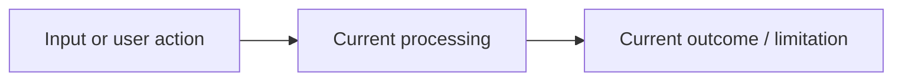
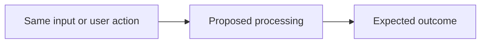

# Inference contributions: implementation plan

For internal contributors proposing major features or structural changes to
Inference. Prepare this plan before substantial implementation, then share it
in `#discuss-inference-release` for asynchronous discussion. See
[AGENTS.md](../AGENTS.md#internal-contributions-roboflow-team-only) for when a
plan is required and the exemptions. External contributors do not need to
follow this internal process.

This is the repository copy of the
[Slab guide](https://roboflow.slab.com/posts/inference-contributions-implementation-plan-1sb5nyqz),
so contributors and agents can draft and review plans without Slab access.
Keep the requirements and template aligned in both locations when updating
the process. Copy the template below into a separate plan, replace the
placeholders, and link it from the discussion thread and eventual PR.

---

## Implementation plan: [Contribution title]

**Author:** [Name]

**Related issue / PR:** [Link]

## 1. What problem are we solving?

Describe the problem or capability in plain language:

- Who needs this, and what are they trying to do?
- What is missing, difficult, or incorrect today?
- What should become possible after this change?

Include one concrete example. Explain the intended outcome before discussing
implementation.

## 2. How will the behaviour change?

Describe **one recommended solution**. Keep the before/after descriptions
focused on the same example so reviewers can compare them directly.

### Before

Explain what happens today, including the relevant limitation.

### After

Explain what will happen with the proposed change and identify which components
need to change.

Replace these Mermaid diagrams with the actual flows. Include enough detail to
show where behaviour changes; omit unrelated components. Briefly explain:

- Why this approach fits the existing system.
- Any effects on existing users or integrations, including compatibility.
- How you will verify that the proposed behaviour works.

## 3. Uncertainties and decisions needing input

Before requesting input, investigate the relevant code, documentation, and
existing examples. Where practical, use a small experiment to test the uncertain
part. For each unresolved question, provide:

- **Question:** What specifically needs clarification or a decision?
- **Investigation:** What did you check or try? Link the relevant evidence and
  summarize what you learned.
- **Recommendation:** What would you choose with the information available,
  and why?
- **Input needed:** What knowledge, constraint, or decision do you need from
  the maintainers? Does it block implementation?

“No unresolved questions” is a valid answer.

### Alternatives — only when a decision is needed

Do not prepare several complete implementation plans for maintainers to choose
from. If investigation leaves two genuinely viable approaches, briefly compare
the trade-off that matters: behaviour, compatibility, complexity, performance,
or maintenance. State your preferred approach and the condition that would make
the other preferable. A second diagram is only needed if it explains a material
difference that text cannot make clear. The request should be specific—for
example: “I recommend A because it preserves compatibility. B is simpler but
changes existing behaviour. Is that compatibility constraint still required?”
