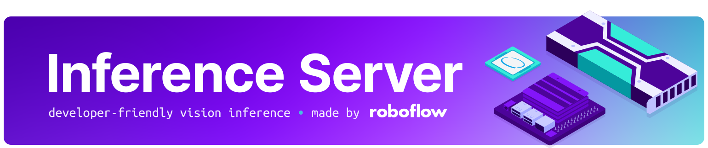

## 👋 hello

[Roboflow](https://roboflow.com) Inference is an opinionated tool for running inference on state-of-the-art computer vision models. With no prior knowledge of machine learning or device-specific deployment, you can deploy a computer vision model to a range of devices and environments.

Inference provides a Python library and Docker interface. Using the Docker interface, you can scale up your inference as needed.


### 📌 Install pip vs Docker:

- **pip**: Installs `inference` into your Python environment. Lightweight, good for Python-centric projects.
- **Docker**: Packages `inference` with its environment. Ensures consistency across setups; ideal for scalable deployments.


## 💻 install

### With ONNX CPU Runtime:
For CPU powered inference:
```bash
pip install inference
```
or
```bash
pip install inference-cpu
```

### With ONNX GPU Runtime:
If you have an NVIDIA GPU, you can accelerate your inference with:
```bash
pip install inference-gpu
```

### Without ONNX Runtime:
Roboflow Inference uses Onnxruntime as its core inference engine. Onnxruntime provides an array of different [execution providers](https://onnxruntime.ai/docs/execution-providers/) that can optimize inference on differnt target devices. If you decide to install onnxruntime on your own, install inference with:
```bash
pip install inference-core
```
Alternatively, you can take advantage of some advanced execution providers using one of our published docker images.

### Extras:
Some functionality requires extra dependancies. These can be installed by specifying the desired extras during installation of Roboflow Inference.
| extra  | description                                      |
|:-------|:-------------------------------------------------|
| `http` | Ability to run the http interface                |

Example install with http dependancies:
```bash
pip install inference[http]
```


## 🐋 docker

You can learn more about Roboflow Inference Docker Image build, pull and run in our [documentation](https://roboflow.github.io/inference/quickstart/docker/).

- Run on x86 CPU:

```bash
docker run --net=host roboflow/roboflow-inference-server-cpu:latest
```
  
- Run on Nvidia GPU:

```bash
docker run --network=host --gpus=all roboflow/roboflow-inference-server-gpu:latest
```
  
<details close>
<summary>👉 more docker run options</summary>

- Run on arm64 CPU:

```bash
docker run -p 9001:9001 roboflow/roboflow-inference-server-arm-cpu:latest
```
  
- Run on Nvidia GPU with TensorRT Runtime:

```bash
docker run --network=host --gpus=all roboflow/roboflow-inference-server-trt:latest
```
  
- Run on Nvidia Jetson with JetPack `4.x`:

```bash
docker run --privileged --net=host --runtime=nvidia roboflow/roboflow-inference-server-trt-jetson:latest
```
  
- Run on Nvidia Jetson with JetPack `5.x`:

```bash
docker run --privileged --net=host --runtime=nvidia roboflow/roboflow-inference-server-trt-jetson-5.1.1:latest
```

</details>

<br/>

## 🔥 quickstart

**Docker Quickstart**:

```python
import requests

dataset_id = "soccer-players-5fuqs"
version_id = "1"
image_url = "https://source.roboflow.com/pwYAXv9BTpqLyFfgQoPZ/u48G0UpWfk8giSw7wrU8/original.jpg"
#Replace ROBOFLOW_API_KEY with your Roboflow API Key
api_key = "ROBOFLOW_API_KEY"
confidence = 0.5

url = f"http://localhost:9001/{dataset_id}/{version_id}"

params = {
    "api_key": api_key,
    "confidence": confidence,
    "image": image_url,
}

res = requests.post(url, params=params)
print(res.json())
```
**Pip Quickstart**:

After installing via pip, you can run a simple inference using:

```python
from inference.core.data_models import ObjectDetectionInferenceRequest
from inference.models.yolov5.yolov5_object_detection import (
    YOLOv5ObjectDetectionOnnxRoboflowInferenceModel,
)

model = YOLOv5ObjectDetectionOnnxRoboflowInferenceModel(
    model_id="soccer-players-5fuqs/1", device_id="my-pc", 
    #Replace ROBOFLOW_API_KEY with your Roboflow API Key
    api_key="ROBOFLOW_API_KEY"
)

request = ObjectDetectionInferenceRequest(
    image={
        "type": "url",
        "value": "https://source.roboflow.com/pwYAXv9BTpqLyFfgQoPZ/u48G0UpWfk8giSw7wrU8/original.jpg",
    },
    confidence=0.5,
    iou_threshold=0.5,
)

results = model.infer(request)

print(results)

```


## 📝 license

The Roboflow Inference code is distributed under an [Apache 2.0 license](https://github.com/roboflow/inference/blob/master/LICENSE.md). The models supported by Roboflow Inference have their own licenses. View the licenses for supported models below.

| model                     |                                       license                                        |
|:--------------------------|:------------------------------------------------------------------------------------:|
| `inference/models/clip`   |               [MIT](https://github.com/openai/CLIP/blob/main/LICENSE)                |
| `inference/models/sam`    | [Apache 2.0](https://github.com/facebookresearch/segment-anything/blob/main/LICENSE) |
| `inference/models/vit`    | [Apache 2.0](https://github.com/roboflow/inference/main/inference/models/vit/LICENSE)|
| `inference/models/yolact` |            [MIT](https://github.com/dbolya/yolact/blob/master/README.md)             |
| `inference/models/yolov5` |        [AGPL-3.0](https://github.com/ultralytics/yolov5/blob/master/LICENSE)         |
| `inference/models/yolov7` |         [GPL-3.0](https://github.com/WongKinYiu/yolov7/blob/main/README.md)          |
| `inference/models/yolov8` |     [AGPL-3.0](https://github.com/ultralytics/ultralytics/blob/master/LICENSE)       |

## 🚀 enterprise

With a Roboflow Inference Enterprise License, you can access additional Inference features, including:

- Server cluster deployment
- Device management
- Active learning
- YOLOv5 and YOLOv8 model sub-license

To learn more, [contact the Roboflow team](https://roboflow.com/sales).

## 📚 documentation

Visit our [documentation](https://roboflow.github.io/inference) for usage examples and reference for Roboflow Inference.

## 🏆 contribution

We would love your input to improve Roboflow Inference! Please see our [contributing guide](https://github.com/roboflow/inference/blob/master/CONTRIBUTING.md) to get started. Thank you to all of our contributors! 🙏

<br>

<div align="center">
  <div align="center">
      <a href="https://youtube.com/roboflow">
          
      </a>
      
      <a href="https://roboflow.com">
          
      </a>
      
      <a href="https://www.linkedin.com/company/roboflow-ai/">
          
      </a>
      
      <a href="https://docs.roboflow.com">
          
      </a>
      
      <a href="https://disuss.roboflow.com">
          
      
      <a href="https://blog.roboflow.com">
          
      </a>
      </a>
  </div>
