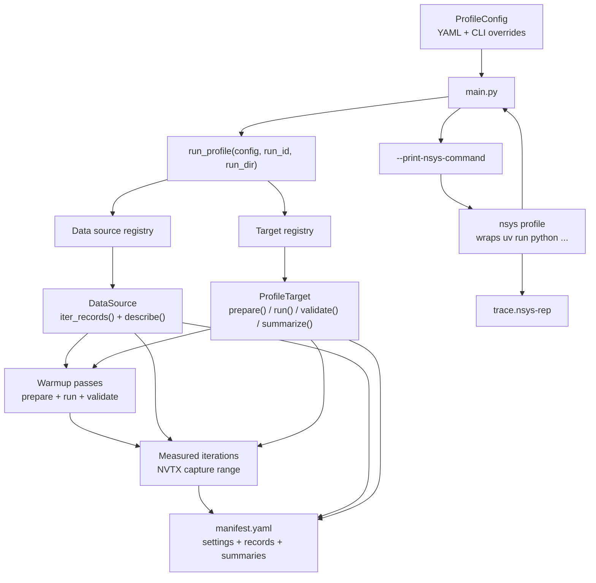

# Development Profiling

Developer-only Nsight Systems profiling helpers live here. The committed tooling
drives focused, isolated profiling targets; generated targets and traces live
under ignored `inference_profiling/`.

## How It Fits Together



## Setup

Use the standard local inference development install from the repository root:

```bash
uv venv --python 3.10
uv pip install -e .
```

This developer-only tooling is supported on Python 3.10+ and is excluded from
package distribution. After setup, run profiling commands through the `uv`
environment.

## Smoke Run

Run the built-in deterministic target without Nsight first:

```bash
PYTHONPATH=./ uv run python development/profiling/main.py \
  --config development/profiling/smoke_config.yaml \
  --run-id smoke-local
```

Print the matching Nsight command:

```bash
PYTHONPATH=./ uv run python development/profiling/main.py \
  --config development/profiling/smoke_config.yaml \
  --run-id smoke-local \
  --print-nsys-command
```

The printed command is intended for copy/paste. The Python entrypoint does not
execute `nsys` itself.

## Docker

From a local GPU-capable Docker environment, mount the repository and run the
same Python or printed `nsys profile` command from the repository root. The
container must include Nsight Systems, PyTorch, and GPU access configured by the
developer.

## Generated Targets

Generated snippets should expose a `target` object or zero-argument factory with
the `ProfileTarget` interface from `development.profiling.registry`. Configure
them with file-path import syntax:

```yaml
target:
  name: my-profile
  import_path: inference_profiling/snippets/my_profile/target.py:target
```

Use `record_loading: eager` when the selected records can be held in memory and
the target should prepare them once before warmup/capture. Use
`record_loading: lazy` for large data sources; lazy mode requires
`target.profile_prepare: true` because records are re-read for each pass instead
of retained.

Set `seed` when the target or data source uses randomness. The runner seeds
Python, PyTorch, CUDA, and NumPy when available.

For local image directories, set `repeat: <n>` in the data source config to cycle
the selected image paths until `n` records are emitted.

Generated snippets may import `development.profiling.*` helpers. Production code
must not import these development-only modules.