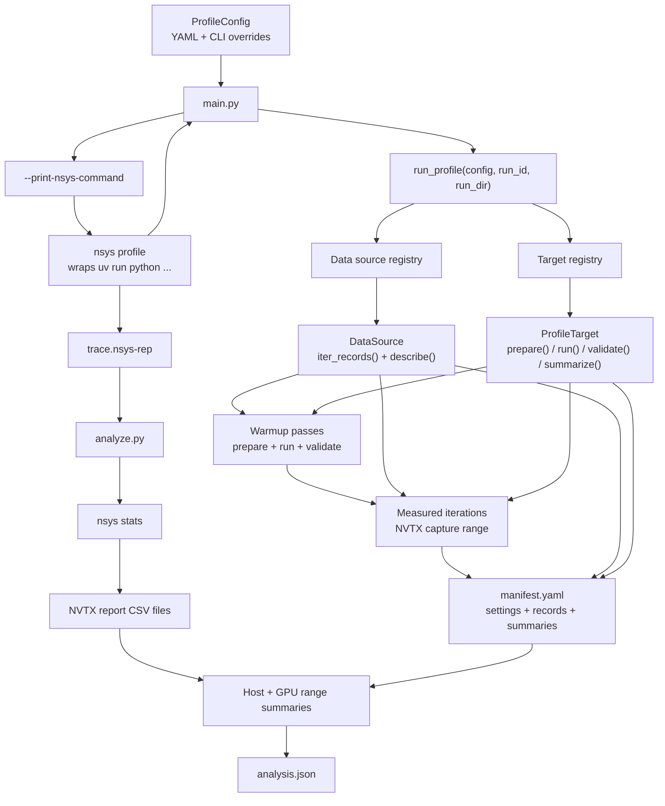

# Development Profiling

Developer-only Nsight Systems profiling helpers live here. The committed tooling
drives focused, isolated profiling targets; generated targets and traces live
under ignored `inference_profiling/`.

## How It Fits Together


```mermaid
flowchart TD
    config["ProfileConfig\nYAML + CLI overrides"]
    main["main.py"]
    runProfile["run_profile(config, run_id, run_dir)"]
    dataRegistry["Data source registry"]
    dataSource["DataSource\niter_records() + describe()"]
    targetRegistry["Target registry"]
    target["ProfileTarget\nprepare() / run() / validate() / summarize()"]
    warmup["Warmup passes\nprepare + run + validate"]
    capture["Measured iterations\nNVTX capture range"]
    manifest["manifest.yaml\nsettings + records + summaries"]
    nsysCommand["--print-nsys-command"]
    nsys["nsys profile\nwraps uv run python ..."]
    trace["trace.nsys-rep"]
    analyze["analyze.py"]
    stats["nsys stats"]
    reports["NVTX report CSV files"]
    summary["Host + GPU range summaries"]
    analysis["analysis.json"]

    config --> main
    main --> runProfile
    main --> nsysCommand
    nsysCommand --> nsys
    nsys --> main
    nsys --> trace

    runProfile --> dataRegistry
    dataRegistry --> dataSource
    runProfile --> targetRegistry
    targetRegistry --> target

    dataSource --> warmup
    target --> warmup
    warmup --> capture
    dataSource --> capture
    target --> capture
    capture --> manifest
    dataSource --> manifest
    target --> manifest

    trace --> analyze
    analyze --> stats
    stats --> reports
    reports --> summary
    manifest --> summary
    summary --> analysis
```

## Setup

Use the standard local inference development install from the repository root:

```bash
uv venv --python 3.10
uv pip install -e .
```

This developer-only tooling is supported on Python 3.10+ and is excluded from
package distribution. After setup, run profiling commands through the `uv`
environment.

## Smoke Run

Run the built-in deterministic target without Nsight first:

```bash
PYTHONPATH=./ uv run python development/profiling/main.py \
  --config development/profiling/smoke_config.yaml \
  --run-id smoke-local
```

Print the matching Nsight command:

```bash
PYTHONPATH=./ uv run python development/profiling/main.py \
  --config development/profiling/smoke_config.yaml \
  --run-id smoke-local \
  --print-nsys-command
```

The printed command is intended for copy/paste. The Python entrypoint does not
execute `nsys` itself. It creates the nested run directory before printing the
command so Nsight can write the trace there.

## Analyze a trace

After `nsys profile` produces `trace.nsys-rep`, export supported NVTX reports
and write a manifest-linked analysis:

```bash
PYTHONPATH=./ uv run python development/profiling/analyze.py \
  --run-dir inference_profiling/snippets/smoke-tensor/runs/smoke-local
```

The command writes:

- `stats/nsys_nvtx_pushpop_trace.csv` with individual host-side NVTX ranges
- `stats/nsys_nvtx_gpu_proj_trace.csv` with per-instance GPU work projected
  into NVTX ranges
- `analysis.json` with run provenance, compact range summaries, iteration
  statistics, and interpretation warnings

The analyzer always reads `manifest.yaml` and `trace.nsys-rep` from the same run
directory. Keep those files together when moving or archiving a run.

The analyzer identifies measured iterations as direct children of the manifest's
capture range and joins their host and GPU records by Nsight range ID. A target
can therefore use a nested range name such as `iteration 0` without being
mistaken for the harness iteration.

Nested target ranges are aggregated by their scope below the harness iteration.
For example, identically named ranges are reported separately as
`preprocessing.resize` and `postprocessing.resize`, while the same scoped range
is aggregated across measured iterations.

`analysis.json` keeps these timing concepts separate:

- **Host-inclusive time** is the CPU time between an NVTX range's push and pop.
  It includes nested child ranges.
- **Host-exclusive time** subtracts the duration of nested child ranges from
  host-inclusive time.
- **GPU-projected time** spans the GPU operations launched by CUDA calls inside
  an NVTX range. It is not the same measurement as host-side range time.

Nsight may produce an empty GPU-projection CSV when no GPU work is attributable
to the measured NVTX ranges. In that case, host measurements remain available,
GPU measurements are `null`, and `analysis.json` records a warning instead of
reporting zero GPU time.

Do not sum host-inclusive timings across nested ranges. A parent's duration
already includes its children. Do not label host-side duration as GPU latency;
CUDA launches are asynchronous unless the workload synchronizes explicitly.

The analyzer does not add pass/fail thresholds or claim performance
regressions. Use its provenance and warnings to decide whether two runs are
comparable before interpreting timing differences.

The parser tests use committed CSV fixtures and do not require Nsight or a GPU.
Generating and validating a real `.nsys-rep` remains a manual integration step
on a supported NVIDIA environment.

The committed report schema is validated against Nsight Systems 2025.1. Other
versions are parsed when their required columns remain compatible and are
reported with a warning in `analysis.json`.

## Docker

From a local GPU-capable Docker environment, mount the repository and run the
same Python or printed `nsys profile` command from the repository root. The
container must include Nsight Systems, PyTorch, and GPU access configured by the
developer.

## Generated Targets

Generated snippets should expose a `target` object or zero-argument factory with
the `ProfileTarget` interface from `development.profiling.registry`. Configure
them with file-path import syntax:

```yaml
target:
  name: my-profile
  import_path: inference_profiling/snippets/my_profile/target.py:target
```

Use `record_loading: eager` when the selected records can be held in memory and
the target should prepare them once before warmup/capture. Use
`record_loading: lazy` for large data sources; lazy mode requires
`target.profile_prepare: true` because records are re-read for each pass instead
of retained.

Set `seed` when the target or data source uses randomness. The runner seeds
Python, PyTorch, CUDA, and NumPy when available.

For local image directories, set `repeat: <n>` in the data source config to cycle
the selected image paths until `n` records are emitted.

Generated snippets may import `development.profiling.*` helpers. Production code
must not import these development-only modules.
