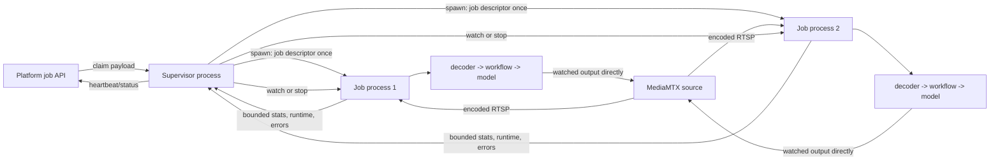

# Per-job process capacity matrix (staging only)

This experiment answers whether the single-interpreter/GIL topology is the
capacity limit observed when several video pipelines share one L40S worker.
Set `PROCESSOR_JOB_EXECUTION_MODE=process` to spawn one real OS process for
each claimed stream job. The existing default is `thread`.

The topology switch is independent of inference/runtime and decoder selection,
so the same child boundary is used for all three comparison legs:

| Leg | Runtime | Decoder/frame representation | Job topology |
|---|---|---|---|
| D | original deployed implementation | PyAV / host image | one spawned process per job |
| E | inference v1.4 tensor-native workflows | PyAV / host image, uploaded to CUDA by workflow | one spawned process per job |
| F | inference v1.4 tensor-native workflows | GStreamer NVDEC / CUDA tensor | one spawned process per job |

Select E/F using the same immutable v1.4 image and change only
`PROCESSOR_VIDEO_INGEST_MODE=pyav|gstreamer_cuda`. F also requires
`ENABLE_TENSOR_DATA_REPRESENTATION=true`. Select D by layering the same worker
files over the immutable original-runtime processor image. The overlay must not
silently upgrade its inference packages.

## Immutable staging artifacts

### Resume rebuild gate

Do not start D/E/F capacity from the historical `1c2b...` or `5cd7...`
overlays. They predate commit
`008d5e64b27d19c7c5da6334ec9497ba756827ad` (`Bound video job cancellation
cleanup`) and can strand a cancelled run as `activeJobs=1` on a detached
`pool=working` pod. Rebuild from that exact commit or a reviewed descendant,
without changing either underlying runtime base.

Record every field below from Artifact Registry and Cloud Build evidence before
rendering a Deployment patch. A tag is never sufficient, and a built image
remains blocked while either smoke gate is pending.

| Use | Rebuilt image | Cloud Build | Exact source | Exact base | State |
|---|---|---|---|---|---|
| D | `video-processor-process@sha256:0e12efc9321dc495540dfa1fda0a2413286df468f2b6c5e8dd869aaf52f1a1bd` | `638f8d41-3984-4a27-85f9-f30a323fed67` | `008d5e64b27d19c7c5da6334ec9497ba756827ad` | legacy A `video-processor-telemetry@sha256:50d4c922f5cd760f43fd982e04819c9a9ad18a1e17a43f67268ff8f917c80e6a` | built with provenance; non-GPU smoke `a33d853b-b970-4a0b-9ccb-850798c1a413` and disposable L40S parent/child smoke pending |
| E/F | `video-processor-process@sha256:4f1767d45ec3d90e07215f377ebbbba21b7c8b1a42ffa8acedf4b6217c06a70c` | `d3f3a1a5-ff33-4944-a443-5db177dd92a2` | `008d5e64b27d19c7c5da6334ec9497ba756827ad` | v1.4 B/C `video-processor-nvdec@sha256:214196ff30e8ac912830617138d32789c08456349528e0dd44e42cba7e8ac326` | built with provenance; non-GPU smoke `6a815bab-7b78-4b31-8ae8-e11371100de8` and disposable L40S parent/child smoke pending |

The rebuilt D and E/F overlays must contain the same processor, process child,
runtime-compatibility, and bounded cleanup files from one exact source SHA.
Verify the image labels/source provenance, base digest, `imageID`, process mode,
spawned-child import, distinct parent/child PIDs, exit zero, and zero restarts.
Delete each disposable pod after collecting evidence. None of these image gates
authorizes a ready-pool rollout.

### Historical smoke artifacts (do not use for resumed capacity)

The controlled images are thin overlays. They change worker files and job
topology while preserving the exact previously tested runtime underneath. E/F
use source `ba0a10f3dcda8e9930e9a4e8c0b86af921c7190d`; corrected D uses source
`080337004be5507cfb2d6e050abf8ad08c1c5389`, whose only runtime-relevant delta
is the guarded inference 1.3.5 compatibility seam.

| Use | Exact image | Cloud Build | Exact base | Purpose |
|---|---|---|---|---|
| D (historical smoke only) | `video-processor-process@sha256:1c2bfea740d41c3440db2b244efd068a2cbf2190c4b27c9eb4e6650a1690c86a` | `8a24fdac-2488-46e9-a442-4c4234e9024c` | legacy A `video-processor-telemetry@sha256:50d4c922f5cd760f43fd982e04819c9a9ad18a1e17a43f67268ff8f917c80e6a` | original runtime plus per-job processes; passed import/spawn smoke but lacks bounded cleanup |
| D (rejected) | `video-processor-process@sha256:debf846be8bc1b329cd15f0e109da9cd3f68a54a49c617c8d5d813d64934249f` | `366987b7-d67c-4a67-bfb9-d105d2ed1bd0` | legacy A `video-processor-telemetry@sha256:50d4c922f5cd760f43fd982e04819c9a9ad18a1e17a43f67268ff8f917c80e6a` | invalid: current worker imported a v1.4-only tensor flag on inference 1.3.5; never deploy |
| E/F (historical smoke only) | `video-processor-process@sha256:5cd7ecada7aba58fafba94aa47e05cce3e39f0e0305d2dbb13f91a226d642bd0` | `7675f50c-9177-4be6-ac2e-f5cf46c043a7` | deployed v1.4 B/C `video-processor-nvdec@sha256:214196ff30e8ac912830617138d32789c08456349528e0dd44e42cba7e8ac326` | v1.4 plus per-job processes; passed import smoke but lacks bounded cleanup |

Credential-free Cloud Build inspection passed for E/F in build
`3d380a9a-b6bc-4516-9bba-660bf17bb668`. Corrected D passed an isolated L40S
import/spawn smoke: the exact `1c2b...` image imported the legacy parent and
spawned child, reported process mode, used distinct supervisor/child PIDs, and
both exited zero; the disposable pod was deleted. These are image/lifecycle
gates only. API claim, cancellation, crash containment, and c1/c2 workload
gates remain required before a capacity run.

A separate full-image validation build, Cloud Build
`68a27111-c69f-481f-8072-8e1e5742f939`, produced
`video-processor-job-process-v14@sha256:85540632e4350c40835be285b32f7a191a489d38895dc028beabc72c79c2cbae`
from the immutable inference v1.4 GPU base
`sha256:61a6d295424d4130cfbd4418719445df234d7f84f3c54dff3aab74a998f69d16`.
It reinstalls the worker's apt and pip integrations, so it introduces package
and image-build variables that the thin E/F overlay avoids. Keep it as a
validation/fallback artifact or an explicitly separate leg; do not substitute
it into D/E/F and call the result apples-to-apples.

Use this common staging configuration for D/E/F:

```text
PROCESSOR_JOB_EXECUTION_MODE=process
PROCESSOR_EXECUTION_DOMAIN_MODE=in_process
VIDEO_SOURCE_ADAPTIVE_BACKPRESSURE=true
ROBOFLOW_RTSP_LATENCY_MS=200
ROBOFLOW_RTSP_PROTOCOLS=tcp
ROBOFLOW_RTSP_VIDEO_CODEC=h264
```

Keep output publishing off for the first capacity pass. For D, select PyAV and
remove the tensor representation, inference-model, CUDA tensor-device, and
video-file rate-limit overrides. For E, select PyAV plus
`ENABLE_TENSOR_DATA_REPRESENTATION=true`, `USE_INFERENCE_MODELS=true`, and
`WORKFLOWS_IMAGE_TENSOR_DEVICE=cuda`. F uses those same v1.4 flags with
`PROCESSOR_VIDEO_INGEST_MODE=gstreamer_cuda`.

Run the identical connector-to-MediaMTX source, workflow, output-watch state,
FPS cap, concurrency steps, dwell time, and repetitions for D/E/F. Record the
exact image digest and child `stats.runtime.processId` for every job. At
concurrency greater than one, distinct child process IDs are a validity gate.

## Process boundary



The child owns decoder, workflow, model, CUDA context, and output publisher.
Neither frames nor CUDA tensors cross the parent/child connection. The
supervisor owns claims, platform heartbeats, cancellation decisions, browser
access tokens, aggregate Prometheus exposition, and durable failure reports.

The initial job descriptor necessarily contains the job's model authorization
and credentialed source/output URLs because execution moved into the child. It
is passed through an anonymous multiprocessing pipe during `spawn`, never in
argv, process names, logs, status, metrics, or child-to-parent events. The child
is exec-spawned with the fleet service secret, supervisor fallback API key, and
Pub/Sub/gateway configuration removed from its initial OS environment; the
supervisor restores them immediately after the serialized spawn window. This is
execution isolation for the capacity experiment; it is not claimed as a
hardened tenant sandbox.

## Bounded IPC contract

- Parent to child: `watch` and `stop`, at most 4 KiB.
- Child to parent: state, bounded job telemetry, safe runtime identity, output
  names, and sanitized failure/log tail, at most 64 KiB.
- No pixels, tensors, predictions, job payload, workflow definition, source URL,
  output URL, or API key has a child-to-parent field.
- The pipe has natural backpressure and the child replaces status snapshots
  rather than queuing frame events.
- Graceful cancellation gets 10 seconds by default, followed by terminate and
  kill. A child crash marks only its job failing; sibling processes continue.

## Known experiment limitations

- Process mode initially supports live stream jobs only. Batch result files and
  the supervisor's debug MJPEG endpoint remain on the thread topology.
- Normal output preview is still supported because the child publishes directly
  to MediaMTX; enabling it can be included as a separate capacity leg.
- Each child currently loads its own model. There is no shared model manager or
  cross-process auto-batching in D/E/F. This intentionally isolates topology,
  tensor-native execution, and NVDEC before adding MMP transport effects.
- Each child has an independent CUDA context. Run MPS as a later, explicit G/H
  comparison rather than changing D/E/F.

## Validity and rollback gates

Before capacity testing, run c1 and c2 and require:

1. supervisor PID differs from every child PID;
2. c2 reports two distinct child PIDs;
3. cancellation removes only the selected child within the grace period;
4. killing one child produces one sanitized failing report and does not stop its
   sibling;
5. F reports `GstreamerCudaVideoFrameProducer`, hardware decode verified, CUDA
   bridge maps advancing, and zero host/device copy counters when output is off;
6. worker and job counters remain monotonic and no credential appears in
   process argv, status, metrics, or logs.

Rollback is an environment-only topology switch back to
`PROCESSOR_JOB_EXECUTION_MODE=thread` plus the previously pinned image digest.
No control-plane schema or job payload change is required.

After building an image, run the credential-free non-GPU inspection before any
staging Pod is created:

```bash
gcloud builds submit --no-source \
  --project=roboflow-staging \
  --config=development/video_poc/processor/cloudbuild.job-process-smoke.yaml \
  --substitutions=_IMAGE=us-central1-docker.pkg.dev/roboflow-staging/video-proc/<package>@sha256:<digest>
```

Use an immutable digest, never a tag. The smoke verifies the image config,
process-mode module/protocol, and required worker files without claiming jobs,
accessing credentials, requesting a GPU, or contacting the cluster.
