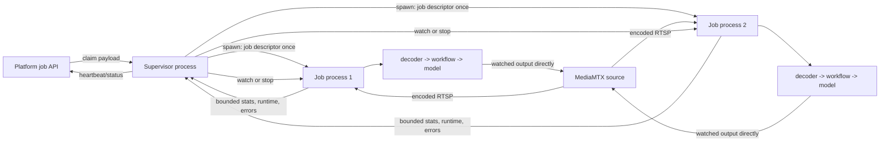

# Per-job process capacity matrix (staging only)

This experiment answers whether the single-interpreter/GIL topology is the
capacity limit observed when several video pipelines share one L40S worker.
Set `PROCESSOR_JOB_EXECUTION_MODE=process` to spawn one real OS process for
each claimed stream job. The existing default is `thread`.

The topology switch is independent of inference/runtime and decoder selection,
so the same child boundary is used for all three comparison legs:

| Leg | Runtime | Decoder/frame representation | Job topology |
|---|---|---|---|
| D | original deployed implementation | PyAV / host image | one spawned process per job |
| E | inference v1.4 tensor-native workflows | PyAV / host image, uploaded to CUDA by workflow | one spawned process per job |
| F | inference v1.4 tensor-native workflows | GStreamer NVDEC / CUDA tensor | one spawned process per job |

Select E/F using the same immutable v1.4 image and change only
`PROCESSOR_VIDEO_INGEST_MODE=pyav|gstreamer_cuda`. F also requires
`ENABLE_TENSOR_DATA_REPRESENTATION=true`. Select D by layering the same worker
files over the immutable original-runtime processor image. The overlay must not
silently upgrade its inference packages.

Run the identical connector-to-MediaMTX source, workflow, output-watch state,
FPS cap, concurrency steps, dwell time, and repetitions for D/E/F. Record the
exact image digest and child `stats.runtime.processId` for every job. At
concurrency greater than one, distinct child process IDs are a validity gate.

## Process boundary

The child owns decoder, workflow, model, CUDA context, and output publisher.
Neither frames nor CUDA tensors cross the parent/child connection. The
supervisor owns claims, platform heartbeats, cancellation decisions, browser
access tokens, aggregate Prometheus exposition, and durable failure reports.

The initial job descriptor necessarily contains the job's model authorization
and credentialed source/output URLs because execution moved into the child. It
is passed through an anonymous multiprocessing pipe during `spawn`, never in
argv, process names, logs, status, metrics, or child-to-parent events. The child
is exec-spawned with the fleet service secret, supervisor fallback API key, and
Pub/Sub/gateway configuration removed from its initial OS environment; the
supervisor restores them immediately after the serialized spawn window. This is
execution isolation for the capacity experiment; it is not claimed as a
hardened tenant sandbox.

## Bounded IPC contract

- Parent to child: `watch` and `stop`, at most 4 KiB.
- Child to parent: state, bounded job telemetry, safe runtime identity, output
  names, and sanitized failure/log tail, at most 64 KiB.
- No pixels, tensors, predictions, job payload, workflow definition, source URL,
  output URL, or API key has a child-to-parent field.
- The pipe has natural backpressure and the child replaces status snapshots
  rather than queuing frame events.
- Graceful cancellation gets 10 seconds by default, followed by terminate and
  kill. A child crash marks only its job failing; sibling processes continue.

## Known experiment limitations

- Process mode initially supports live stream jobs only. Batch result files and
  the supervisor's debug MJPEG endpoint remain on the thread topology.
- Normal output preview is still supported because the child publishes directly
  to MediaMTX; enabling it can be included as a separate capacity leg.
- Each child currently loads its own model. There is no shared model manager or
  cross-process auto-batching in D/E/F. This intentionally isolates topology,
  tensor-native execution, and NVDEC before adding MMP transport effects.
- Each child has an independent CUDA context. Run MPS as a later, explicit G/H
  comparison rather than changing D/E/F.

## Validity and rollback gates

Before capacity testing, run c1 and c2 and require:

1. supervisor PID differs from every child PID;
2. c2 reports two distinct child PIDs;
3. cancellation removes only the selected child within the grace period;
4. killing one child produces one sanitized failing report and does not stop its
   sibling;
5. F reports `GstreamerCudaVideoFrameProducer`, hardware decode verified, CUDA
   bridge maps advancing, and zero host/device copy counters when output is off;
6. worker and job counters remain monotonic and no credential appears in
   process argv, status, metrics, or logs.

Rollback is an environment-only topology switch back to
`PROCESSOR_JOB_EXECUTION_MODE=thread` plus the previously pinned image digest.
No control-plane schema or job payload change is required.
