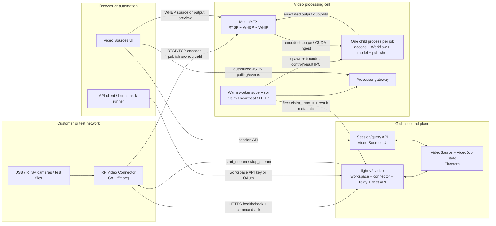
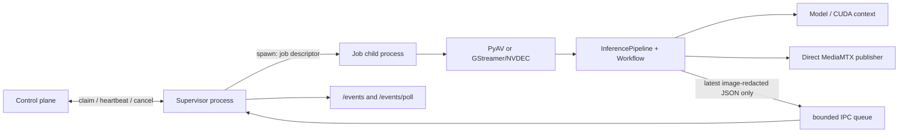

# Hosted video processing architecture

**Status:** Current system context for the deployable processor in inference
[#2800](https://github.com/roboflow/inference/pull/2800).

This document preserves and updates the durable architecture context that began
in the broad video-sources POC in inference
[#2616](https://github.com/roboflow/inference/pull/2616). Benchmark reports,
temporary manifests, and experimental runbooks remain in #2616; the component
contracts and project direction live here.

## Project intent

A **video source** is a platform primitive: a named object representing an
uploaded file, USB camera, RTSP camera, connector file, or eventually another
managed stream. A user registers it once and can then preview it, run one or
more Workflows against it, publish annotated output, and later record or replay
results.

The architecture was chosen to prove several durable properties:

1. Cameras behind customer firewalls can participate through an outbound-only
   connector. No inbound customer-network port or VPN is required.
2. Registered does not mean streaming. Encoded video flows only while a preview
   lease or active job needs it.
3. A warm processor pool removes infrastructure cold starts while allowing
   model and pipeline startup to happen per job.
4. Structured results and pixels use different channels. Base64 images never
   ride the JSON event path.
5. Uploaded-file batch processing and low-latency live processing have distinct
   semantics.
6. Media relay, processing, and placement form a deployable **cell** that can be
   repeated without changing the connector contract.
7. Each video job owns an OS-process boundary. The decoder, workflow, models,
   CUDA context, and output publisher live together; decoded frames do not cross
   IPC.

## Repository and service ownership

| Component | Source of truth | Responsibility |
|---|---|---|
| Connector | [`roboflow/rf-video-connector`](https://github.com/roboflow/rf-video-connector) | Discover local sources, poll for commands, and publish encoded streams on demand. |
| Workspace control API and UI | [`roboflow/roboflow`](https://github.com/roboflow/roboflow), especially [#14376](https://github.com/roboflow/roboflow/pull/14376) | Source/job records, authorization, placement inputs, idempotent job creation, watch leases, claim/status/reaping, relay auth, and browser surfaces. |
| Video processor | This directory in [`roboflow/inference`](https://github.com/roboflow/inference) | Claim jobs and run decoder -> Workflow -> model -> result/publisher pipelines. |
| Cell infrastructure | [`roboflow/roboflow-infra`](https://github.com/roboflow/roboflow-infra), `helm/roboflow-video-proc/` and `crusoe/video-proc` | MediaMTX, ready GPU/CPU pools, gateway, Pub/Sub subscriptions, credentials, networking, and monitoring. |
| Multi-process model manager | Draft inference [#2788](https://github.com/roboflow/inference/pull/2788) and its feature branch | Separate model-service/autobatching experiment; not part of this processor runtime. |

The original POC in #2616 remains useful as a historical decision log and
benchmark archive, but it is not the deployment source.

## Implementation status

| Area | Status |
|---|---|
| Connector discovery, outbound healthcheck/commands, and on-demand RTSP publication | Implemented in `rf-video-connector`; its first PR is merged. |
| Single-cell MediaMTX, ready GPU/CPU pools, gateway, fleet auth, and monitoring | Implemented in roboflow-infra; environment state and applied revisions remain deployment-specific. |
| Source/job UI, connector/relay/fleet routes, claim/reaping, watch leases, and result access | Implemented in the platform; the dedicated external automation surface is pending roboflow #14376. |
| Per-job OS process, bounded JSON bridge, Inference 1.4 tensor switches, and NVDEC selection | Implemented in this PR; merge, image, and staging lifecycle gates remain before it becomes the deployment source. |
| Sticky home cells, cell-aware claims, relay sharding, and workload-aware admission | Proposed only; see the multi-cell RFC. |
| Shared multi-process model manager and raw MPS | Separate experiment; not a dependency of this runtime. |

## End-to-end system map

## Three planes

Keeping the planes separate is load-bearing. It prevents control requests,
structured events, and high-bandwidth video from inheriting one another's
latency and scaling behavior.

| Plane | Main protocols | Carries | Does not carry |
|---|---|---|---|
| Control | HTTPS, Firestore transactions, Pub/Sub wake-ups | Source roster, commands, job ownership, heartbeats, cancellation, watch leases, placement, result locations | Video frames |
| Media | RTSP/TCP, WHEP, WHIP | Encoded source streams and annotated output video | API keys, workflow JSON events |
| Results | Bounded child IPC, HTTP polling/SSE, object storage | Image-redacted per-frame JSON, counters, status, completed batch artifacts | Raw images or decoded tensors over child IPC |

Pub/Sub is a wake-up mechanism, not the job-ownership source of truth. Claiming
is transactional in the control plane; heartbeat/reaping owns long-running job
leases.

## Control-plane entities

The exact schema belongs to `roboflow/roboflow`; these are the cross-component
contracts that the processor and connector depend on.

| Entity | Durable meaning | Important invariants |
|---|---|---|
| `VideoSource` | Workspace-owned uploaded file or connector source | Registration is metadata-only; connector sources can be offline; stream credentials are never public fields. |
| `VideoConnector` | Stable connector identity, roster, last-seen state, and command queue | Commands are acknowledged by ID; a clean shutdown marks the connector offline without waiting for expiry. |
| `VideoJob` | Workspace-owned Workflow lease against one source | State and processor ownership are transactional; stale ownership is reaped; secrets and lock identities are excluded from public serializers. |
| Preview/watch lease | Time-bounded desire for source or result media | Renewal extends but never shortens the lease; expiry stops unnecessary publication. |

Current jobs carry source/workflow identity, `mode`, CPU/GPU tier, optional FPS
and capture controls, selected image output, state/attempts, processor ownership,
heartbeat, bounded stats, and completed result locations. Cell placement fields
are proposed in the multi-cell RFC and must not be assumed to exist yet.

## Source lifecycle

### Registration

There are two source origins:

- An uploaded file creates a platform-owned source backed by object storage.
- The connector healthchecks approximately every two seconds with its enabled
  USB, RTSP, ONVIF, and test-file roster. The platform upserts connector sources
  by connector identity and connector-local source identity.

The connector is outbound-only. It exposes a loopback UI on port `8070` for
local configuration, but the cloud never opens a connection to that UI.
Connector source presence is metadata; it does not imply that media is flowing.

### Preview and on-demand publication

An uploaded file preview uses a signed object-storage URL. A connector source
preview acquires a time-bounded lease in the control plane. Reconciliation then
returns a `start_stream` command containing a full, credentialed ingest URL.
The connector starts ffmpeg and publishes `src-<sourceId>` to MediaMTX. When no
preview or job lease remains, the platform emits `stop_stream`.

The connector receives the complete ingest URL from the platform. It does not
derive cell endpoints, relay shards, or credentials locally; that property is
what allows future cell placement without changing the connector binary.

Current stream names are control-plane contracts:

| Prefix | Publisher | Meaning |
|---|---|---|
| `src-<sourceId>` | Connector | On-demand live source publication |
| `sim-<jobId>` | Processor file replay | Uploaded file being simulated as a live camera |
| `out-<jobId>` | Job child | Selected annotated Workflow output |

## Job lifecycle and ownership

1. A UI or API client creates a job for a source and Workflow. The external API
   in roboflow #14376 requires an idempotency key and supports `mode`, `tier`,
   `maxFps`, `imageOutput`, and capture options.
2. The control plane persists a queued `VideoJob` and publishes a cell-scoped
   wake-up when configured.
3. A fleet worker authenticates with the fleet service secret and attempts a
   transactional claim using its tier and, when implemented, its cell identity.
4. The claim returns the resolved source URL, Workflow specification, the
   workspace API key delivered only for that job, job-specific relay
   credentials, and a processor access token.
5. The supervisor starts a `JobRun`. In `process` mode it spawns one child and
   sends the bounded initial descriptor.
6. The child owns the decoder, `InferencePipeline`, Workflow/model instances,
   CUDA context, and direct output publisher. The supervisor owns the platform
   lease, HTTP surface, aggregate metrics, and durable failure reporting.
7. Status polls carry counters and receive cancellation/watch state. A stale
   worker heartbeat causes the platform to requeue the job up to the configured
   attempt cap.
8. On terminal cleanup, the worker reports the final state, releases the job,
   and retires according to the ready-pool lifecycle.

The job is the execution and failure-containment unit. Workspace identity is
still relevant for authorization, placement policy, quotas, and fair admission,
but it does not require a separate decoder or model copy for every workspace.

## Per-job process boundary

The target hosted topology sets `PROCESSOR_JOB_EXECUTION_MODE=process`.

No image, ndarray, decoded frame, CUDA tensor, or model output image crosses the
process boundary. The child publishes pixels directly to MediaMTX. It forwards
only image-redacted JSON through a latest-value queue with bounded message size;
a slow JSON consumer cannot backpressure inference.

The initial child descriptor contains only job-required data. Supervisor-only
fleet and Pub/Sub credentials are stripped from the serialized spawn
environment. The child never returns tenant credentials in status or errors.

## Decode and tensor configurations

The process topology is independent of the ingest/runtime selection:

| Configuration | Ingest | Workflow values | Use |
|---|---|---|---|
| Compatibility | PyAV/CPU | NumPy or runtime default | Rollback and regression comparison |
| Tensor PyAV | PyAV/CPU then tensor upload | Tensor-native | Isolates tensor/runtime gains from decode changes |
| Tensor NVDEC | GStreamer/NVDEC to CUDA tensor | Tensor-native | Target GPU live-stream path |

`gstreamer_cuda` fails at startup unless tensor representation is enabled. It
must not silently fall back to CPU decode because that would invalidate both
capacity measurements and deployment telemetry.

## File and live-stream semantics

`batch` and `stream` are different products, not interchangeable buffering
settings:

- **Batch** downloads an uploaded file to processor-local storage and processes
  every frame in order. End of file is terminal. Completed artifacts can be
  uploaded to object storage for later review.
- **Stream** prioritizes bounded latency and newest frames. Cameras and connector
  test files use this mode. An uploaded file used to simulate a camera is
  replayed through MediaMTX at native cadence with a low-latency H.264 encoding.

A connector file is always a looping live test stream from the platform's point
of view. It is not a batch file transfer.

## Results and viewing

Workflow output has two independent paths:

### Structured JSON

Image values are replaced by references such as
`{"type":"image_ref","output":"label_visualization_output"}`. In process
mode the child forwards the newest event to the supervisor. Authorized clients
consume the supervisor's event surface through the processor gateway. The
long-term public contract should be job-addressed so a client can follow a job
across worker re-placement.

The deployed browser path uses finite cursor-based `/events/poll` responses.
Cluster ingress buffering can withhold an unbounded SSE response indefinitely;
SSE remains useful for direct/local consumers but is not assumed to survive
every shared ingress middleware. Any future job-addressed event service should
own streaming behavior explicitly rather than proxying through Firebase.

### Annotated video

The job publishes one selected image output as `out-<jobId>` to MediaMTX. A
watch request grants or renews a short lease and may select a different image
output. The UI watches that path with WHEP. Publication stops when the lease
expires, so unwatched output does not consume relay and encoder resources.

The external workspace API returns watch-lease metadata but never relay stream
keys, processor URLs, or processor access tokens.

## Authentication and secret boundaries

| Actor | Credential | Scope |
|---|---|---|
| Connector | Workspace API key | Its workspace's connector/source roster and command acknowledgements |
| UI | Firebase session | Workspace source/job operations and authorized result access |
| Automation | Workspace API key or OAuth | `light-v2-video` list/create/get/cancel/watch routes with video-job scopes |
| Fleet supervisor | `VIDEO_PROC_SERVICE_SECRET` plus the current claim's `processorAccessToken` | Cross-workspace claim/status/result operations; the plaintext claim proof is supervisor-memory-only and never user-facing |
| Job child | Workspace API key from its claim plus job-specific stream credentials | The admitted job's model/workflow and source/output paths; the workspace key is not itself job-scoped, and the child never receives the processor claim proof |
| MediaMTX | External auth callback | Per-source/per-job publish/read authorization |
| Browser media element | Short-lived WHEP/session URL | Selected source or job output only |

General job serializers redact `streamKey`, `processorAccessToken`, workflow
lock identities, and tenant credentials. Managed worker `/status` without a
job token is aggregate-only; per-job HTTP routes require the job access token.
The supervisor stores a separate plaintext claim proof for the current claim
epoch and echoes it only on platform status and result mutations. Its opaque
local handle prevents a late callback from an older same-ID attempt from using
or deleting a replacement claim's token. The proof is removed with the exact
run owner and is never placed in status, metrics, logs, the child environment,
or child IPC.

## Current limits and future seams

- The deployed control and media URLs are still effectively one-cell defaults.
  A second cell is unsafe until source placement, job placement, URL resolution,
  Pub/Sub filtering, and transactional claim filtering agree.
- MediaMTX origins are stateful. Adding identical replicas behind a random
  Service is not relay scaling; sources must be assigned to shards.
- Admission is still primarily a job count. Workflow cost, model affinity,
  workspace fairness, and reserved capacity require measured profiles.
- JSON consumption remains worker-addressed through the gateway. A durable,
  job-addressed event stream is future work.
- Active migration restarts stateful Workflow blocks until their state can be
  externalized and restored.
- The shared multi-process model manager and raw MPS remain separate
  experiments. This runtime neither requires them nor claims tenant isolation
  from them.
- Recording, long-term continuous event storage, and metering are not completed
  by this processor PR.

The next placement and scaling contract is
[MULTI_CELL_SCALING_RFC.md](MULTI_CELL_SCALING_RFC.md).

## Durable decisions carried forward from #2616

- Keep the connector outbound-only.
- Treat registration and streaming as separate state.
- Keep MediaMTX as an independent media plane, not a Python subprocess detail.
- Keep encoded media as the cross-host/cross-cell representation; do not ship
  decoded frames over WAN.
- Split JSON events from pixels.
- Keep Pub/Sub as dispatch and Firestore as ownership.
- Keep the worker warm, but isolate each job's pipeline in its own OS process.
- Keep decode, Workflow execution, model inference, and publishing together in
  the job process so frames do not cross IPC.
- Preserve explicit PyAV/tensor/NVDEC switches for rollback and controlled
  comparisons.
- Derive concurrency, fairness, and cell sizing from evidence rather than one
  fixed global stream count.
