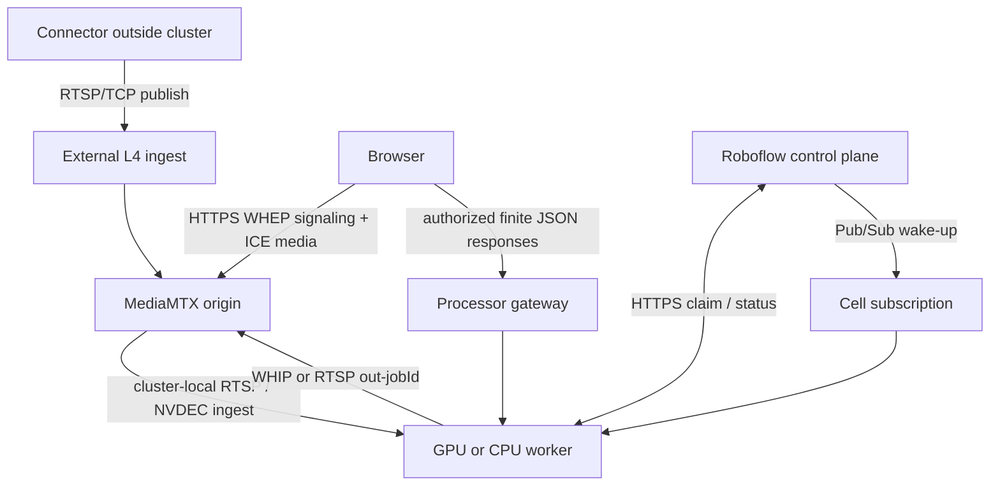
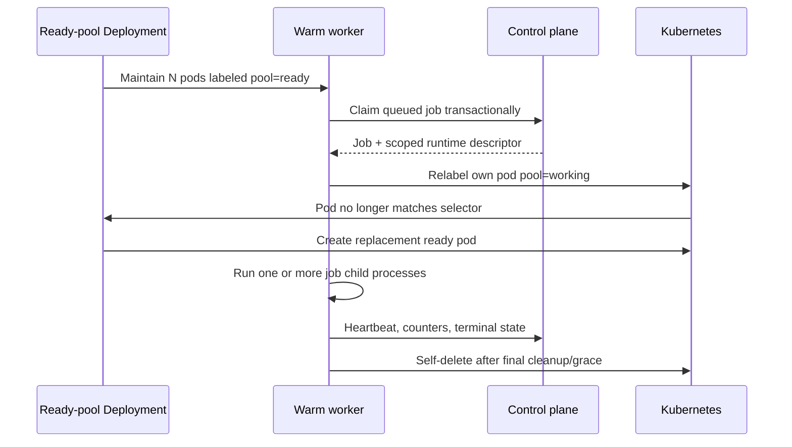

# Video processing cell deployment

This is the deployment contract for the processor runtime in inference #2800.
It replaces the historical first-cell runbook in inference #2616. Exact Helm
and Terraform mechanics remain authoritative in
`roboflow-infra/helm/roboflow-video-proc/` and
`roboflow-infra/crusoe/video-proc/`.

No production deployment is implied by this document. Staging and production
changes require separate plans, approvals, and immutable image references.

## One release, one cell

A cell contains a stateful media origin, warm processor capacity, cell-specific
dispatch, ingest/preview endpoints, and its monitoring boundary.

The deployed Helm release owns at least:

- one pinned MediaMTX Deployment and internal Service;
- an external RTSP ingest LoadBalancer;
- a WHEP IngressRoute and certificate;
- GPU and optional CPU ready-pool Deployments;
- processor RBAC for self-label/self-delete lifecycle;
- an nginx gateway routing to worker pod IPs;
- a janitor for leaked working pods;
- PodMonitors and bounded-cardinality metrics;
- per-cell Pub/Sub subscription and worker credentials through Terraform.

MediaMTX is a stateful origin. Its replica count remains one until source-aware
sharding or an explicit origin/read-replica design exists.

## Why this is a separate cell stack

The processor is not an HTTP request worker and a video job is not a queue
message held until completion. A monitoring job can run for months; queue
delivery only wakes a worker to claim a lease. The cell also owns stateful RTSP
ingest, WHEP/ICE media, and a public L4 endpoint. Those requirements do not fit
the request -> RabbitMQ -> response lifecycle of async inference.

For that reason, `roboflow-infra/crusoe/video-proc` owns a self-contained cell
stack. Pub/Sub is used for cell-agnostic outbound wake-ups, while Firestore
claim/heartbeat state remains authoritative. This does not prevent future reuse
of shared autoscaling or model-serving components.

## Endpoint and protocol contract

The deployed names vary by environment; staging currently follows the
`*.crusoe.roboflow.one` convention.

| Endpoint role | Example staging host | Protocol and owner |
|---|---|---|
| Source ingest | `video-ingest.crusoe.roboflow.one` | RTSP/TCP through the external Crusoe LoadBalancer to MediaMTX |
| Source/output preview | `video-relay.crusoe.roboflow.one` | HTTPS WHEP signaling through Traefik; ICE media terminates at MediaMTX |
| Worker result gateway | `video-processors.crusoe.roboflow.one` | HTTPS finite JSON/SSE/debug media routed to a specific worker pod IP |
| Cell-internal source/output | `mediamtx.video-proc.svc.cluster.local` | RTSP and WHIP between workers and MediaMTX |

MediaMTX receives its own root hostname because WHEP creates session resources
with `Location` headers; path-prefix rewriting is fragile. Traefik carries WHEP
HTTP signaling, not the media itself. The ICE candidate path must be validated
by observing rendered frames, not merely a successful WHEP `POST`.

## Ready-pool lifecycle

The Deployment replica count means **workers ready to accept work**, not total
running processors.

Detached working pods are not replaced in place. If a pod dies, the platform's
heartbeat reaper requeues its jobs up to the retry cap. The ready-pool Deployment
provides replacement capacity; the janitor removes leaked non-running working
pods.

Rolling updates rotate ready workers only. Existing working pods drain on their
current image unless an operator deliberately requeues them.

## Runtime configuration

The target staging GPU configuration is explicit:

| Setting | Target | Notes |
|---|---|---|
| `PROCESSOR_JOB_EXECUTION_MODE` | `process` | One spawned child per job. |
| `ENABLE_TENSOR_DATA_REPRESENTATION` | `true` | Required for tensor-native Workflows and NVDEC ingest. |
| `USE_INFERENCE_MODELS` | `true` | Select Inference 1.4 model implementations. |
| `WORKFLOWS_IMAGE_TENSOR_DEVICE` | `cuda` | Keep compatible image values on the GPU. |
| `PROCESSOR_VIDEO_INGEST_MODE` | `gstreamer_cuda` | Target live-stream path; use `pyav` for controlled rollback/comparison. |
| `VIDEO_SOURCE_ADAPTIVE_BACKPRESSURE` | `true` | Demand-driven live source handling. |
| `MAX_CONCURRENT_JOBS` | evidence-based | Hard ceiling; not a certified capacity statement. |

`PROCESSOR_VIDEO_INGEST_MODE=pyav` remains a supported rollback and diagnostic
configuration. `gstreamer_cuda` must fail loudly if the CUDA producer or tensor
runtime is unavailable.

Infrastructure must inject credential-free provenance such as
`VIDEO_PROC_IMAGE`, `VIDEO_PROC_GIT_SHA`, and
`VIDEO_PROC_RUNTIME_VARIANT`. Status telemetry exposes only an allowlist and
must never echo secrets or workspace identifiers.

## Build and provenance

The processor has two build shapes:

- `Dockerfile` builds the complete worker on an immutable Inference server base.
- `Dockerfile.overlay` supports a worker-only layer on an already-proven base.

For either shape:

1. Build from a clean, exact source revision.
2. Pin the base image by digest.
3. Publish an immutable `linux/amd64` image.
4. Capture the registry digest and build provenance.
5. Smoke the exact digest before changing the ready pool.
6. Deploy `image@sha256:...`, not a mutable tag.

Do not infer deployability from a local unit test or from an image tag that can
move.

The current production-runtime candidate was built from exact revision
`7fc1d0de2ebacbbed0d734e446610ee5616b6613` by staging Cloud Build
`c4e0b84b-7d15-4fe7-83e0-605f0ca6af00` and published as
`video-processor-runtime@sha256:2fb362f24dd23e6a8c928480c97fddec8e92087bd424de9283a460ad43df0e49`.
Credential-free image smoke `5dade8e2-9959-4cfa-84b0-f2dae5b01eaa` passed on
that exact digest. Cluster lifecycle and workload gates remain separate.

## Control-plane functions and routing

The API is intentionally split:

| Surface | Function | Examples |
|---|---|---|
| Video control plane | `light-v2-video` | workspace automation, connector healthcheck/acks, relay auth, fleet claim/status/results |
| Browser session UI | Existing query/session functions | `/query/video-sources*`, `/query/video-jobs/*` |

API Hosting routes workspace and machine-to-machine video paths to
`light-v2-video`. A function deploy and a Hosting deploy are separate artifacts;
both must reference compatible code before automation is considered restored.
`light-v2-device` retains only the RFDM and edge-device management surface.

## Deployment ownership and order

1. **Inference #2800:** merge the processor source and build definitions.
2. **Image build:** build and smoke the exact merged or approved revision;
   capture its digest.
3. **Roboflow #14376:** deploy the dedicated video function and API Hosting;
   verify workspace, connector, relay-auth, and processor-fleet behavior before
   removing the legacy device-function routes.
4. **Roboflow-infra #2454 or successor:** pin the image digest and explicit
   runtime switches in the environment values.
5. Review the staging Spacelift plan. Production plans are not staging approval.
6. Apply staging only and capture the old Deployment revision, image digest,
   rendered environment, and template hash as the rollback anchor.
7. Run the gates below before any capacity or soak campaign.

The order prevents Hosting from targeting a missing function and prevents infra
from deploying an image whose exact runtime has not passed its image gate.

## Required staging gates

### Image and idle-pool gate

- exact image digest and source revision match the build record;
- import succeeds on the intended GPU/CPU node type;
- requested tensor/NVDEC capabilities are present;
- one healthy ready worker and no unexpected working worker exist;
- `/status` reports the expected runtime variant without credentials.

### End-to-end c1 gate

- an authenticated API client lists the intended connected source;
- job creation is idempotent and reaches `running` on the expected worker;
- the supervisor and job child have distinct PIDs;
- source stream metadata matches the intended codec, resolution, and cadence;
- frames and per-frame counters advance;
- annotated output renders through a renewed watch lease;
- image-redacted JSON events advance through `/events` or `/events/poll`;
- raw images, tensors, API keys, stream keys, and processor tokens do not appear
  in the child IPC or report.

### Lifecycle gate

- cancelling one of two jobs stops only the target child;
- the sibling keeps the same supervisor/child ownership and continues frames;
- cleanup reaches `activeJobs=0` and the worker retires or returns to the
  documented state;
- a deliberate child crash is reported with a sanitized structured failure and
  does not silently lose the sibling;
- if bounded containment cannot stop a wedged child, the supervisor fails
  closed so Kubernetes and the platform reaper can re-place all held jobs.

Capacity measurements are invalid until these gates pass. A preview-only pass
does not prove JSON results, and advancing JSON does not prove MediaMTX accepted
the output stream.

## Observability contract

The chart and worker together must expose:

- processor ready/working/retiring state and active-job counts;
- queue-to-claim, pipeline startup, and first-result timing;
- captured, decoded/selected, dropped, inferred, rendered, and published frames;
- fixed-bucket decode-to-result latency;
- child/supervisor topology in credential-free job evidence;
- pod CPU/memory/network and restart/throttle state;
- GPU utilization, VRAM, decoder, encoder, and memory-copy utilization;
- MediaMTX paths/readers, ingress/egress, session loss/errors, CPU/memory, and
  restarts;
- exact image/source/runtime identity.

Prometheus labels must remain bounded and must not expose workspace, source, job,
stream path, remote address, or credential values. Per-run evidence joins those
identities outside metric labels.

## Rollback and blast radius

- A staging apply may update the ready GPU/CPU pools and their runtime flags.
- Existing detached working pods may continue on the old image until drained.
- Capture a precise Deployment revision before each leg; verify the revision is
  still the expected predecessor before rollback.
- Roll back the ready pool first when image readiness, c1, result, or lifecycle
  gates fail.
- Do not apply or inspect production state as a side effect of a staging test.
- Function rollback and processor rollback are separate: restore the exact
  function/Hosting pair or exact image/config pair that previously passed.

## Historical material retained elsewhere

Inference #2616 retains the first-cell rationale, local four-terminal demo,
benchmark matrices, capacity ledgers, fault-injection harnesses, and one-off
operator notes. Those are useful evidence and history, but they are not the
current deployment source. This document and the roboflow-infra chart replace
its `DEPLOY_PLAN_STAGING.md` for active implementation work.
