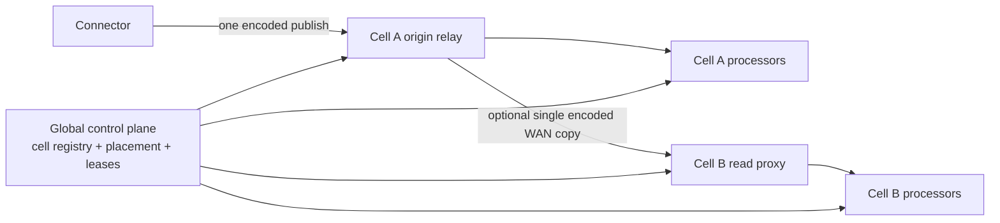

# RFC: multi-cell video processing and workload-aware capacity

**Status:** Draft design; not implemented by inference #2800.

**Last updated:** 2026-08-14

**Scope:** Live connector sources, MediaMTX relay sharding, processor placement,
multi-stream admission, dedicated capacity, and remote execution.

This RFC is the durable successor to the multi-cell design in inference #2616.
The prepared benchmark harnesses remain there until they are extracted into a
focused implementation PR. Nothing in this document authorizes a second cell or
changes current claim behavior.

## Summary

The existing cell shape is:

- an outbound-only connector publishes an encoded source stream;
- one MediaMTX origin fans the source out to previews and processors;
- colocated CPU/GPU ready pools execute jobs;
- the global control plane owns source metadata, job leases, authorization, and
  dispatch.

The next phase must make placement explicit so the same architecture can
support shared regional cells, workspace-dedicated cells, remote processing
experiments, and eventually customer-managed cells.

The central proposal is:

> A live source is lazily assigned to a sticky **home cell** when it first needs
> to stream. Jobs normally execute in that cell. Remote execution is explicit
> placement, never an accidental result of a global queue.

Relay shard size, per-GPU concurrency, workload weights, and operating headroom
must come from capacity curves rather than fixed constants.

## Current boundary

The current implementation is effectively single-cell:

- connector commands contain one resolved ingest URL;
- functions resolve media URLs from environment-level configuration;
- Pub/Sub may carry a cell attribute, but transactional claim filtering and
  persisted source/job placement are not a complete multi-cell boundary;
- a processor consumes its source from cell-local MediaMTX;
- a MediaMTX origin is stateful and cannot be scaled by putting identical
  replicas behind random load balancing;
- worker admission is bounded primarily by job count, not measured Workflow
  resource cost.

These assumptions are safe only while one cell can own every source. With two
cells, a worker in cell B could claim a job whose source exists only in cell A.

## Goals

1. Preserve media/compute locality by default.
2. Make every placement decision durable, inspectable, and enforced at claim.
3. Scale relay origins through explicit sharding and read-replica patterns.
4. Admit streams according to measured workload cost and headroom.
5. Apply workspace fairness and dedicated-capacity policy without conflating a
   workspace with an execution process.
6. Quantify performance and cost when media and compute are not colocated.
7. Introduce cell awareness with one registered cell before adding another.
8. Keep connector networking outbound-only.

## Non-goals for the first iteration

- seamless migration of an active stream;
- checkpoint/restore for every stateful Workflow block;
- per-block remote model execution;
- selecting a final WAN media protocol before measuring RTSP/TCP;
- recording retention and historical playback;
- replacing Firestore job ownership or the ready-pool lifecycle;
- using workspace identity as a physical model-cache key.

## Terminology

**Cell**
: A deployable media-processing location with cell-specific endpoints, relay
  shards, CPU/GPU pools, dispatch subscriptions, monitoring, provider, and
  region.

**Relay shard**
: One stateful MediaMTX origin responsible for a disjoint set of source/output
  paths. It may have read replicas, but a source has one active origin.

**Home cell**
: The sticky cell receiving a live connector source. It is selected lazily on
  first activation and persisted on the source.

**Execution cell**
: The cell containing a job's processor. Live jobs default to the source home
  cell. Uploaded files can be placed independently because object storage is
  their source.

**Placement generation**
: A monotonic source version fencing stale connector commands and reports.

**Workload profile**
: A versioned estimate of resources required by a canonical Workflow, runtime,
  model set, resolution, target FPS, and output mode.

## Placement invariants

1. A live source has at most one active relay origin.
2. Preview and job creation racing on an unassigned source select one home cell
   transactionally.
3. Ordinary live jobs inherit their source's home cell.
4. A worker can claim only jobs assigned to its verified cell and tier.
5. Pub/Sub filters and Firestore claim filters agree; Firestore remains the
   ownership source of truth.
6. Cell-specific URLs come from persisted placement, not one process-global
   default.
7. Active placement is sticky. Initial reassignment is idle-only except for an
   explicit recovery operation.
8. Cross-cell execution is represented on the job and allowed by workspace
   placement policy.
9. Dedicated/residency policy is an authorization boundary, not a preference.

## Proposed architecture



Decoded frames must not become the cross-cell transport. If several remote jobs
need one source, the remote cell should pull one encoded copy and fan out locally
rather than opening one WAN reader per job.

## Source placement lifecycle

### Registration

Connector healthchecks register source metadata without sending video. A new
source has no active home cell. Workspace and connector policy provide eligible
or preferred cells but do not activate a stream.

### First activation

A preview request or first live job performs a placement transaction:

1. Read source, connector, and workspace policy.
2. Reuse an eligible sticky assignment if present.
3. Otherwise select an eligible cell and relay shard.
4. Persist `homeCell`, `relayShard`, `placementGeneration`, and decision reason.
5. Resolve ingest, consume, and WHEP URLs from that placement.
6. Reconcile the connector into publishing the selected generation.
7. Assign ordinary jobs to the same cell.

### Active, idle, and migration

Placement is locked while a preview or job lease depends on it. Additional jobs
reuse the one source publication. When idle, the connector stops publishing but
the assignment remains a preference.

The first migration supports idle reassignment. Active migration requires:

1. fence or stop the old publisher;
2. increment placement generation and issue the new command;
3. confirm publication of the new generation;
4. re-place or reconnect jobs;
5. retire the old path.

Stateful Workflows restart unless their block state can be externalized and
restored.

## Workspace and connector policy

Placement is per source; policy is commonly managed per workspace or connector:

```json
{
  "mode": "shared | dedicated | customer-managed",
  "preferredCells": ["crusoe-use1"],
  "allowedCells": ["crusoe-use1", "crusoe-ussc1"],
  "allowRemoteExecution": false,
  "allowSharedFallback": false,
  "residency": ["US"],
  "reservedCapacity": {"gpuUnits": 100}
}
```

- Sources from one connector normally share a preferred cell.
- Per-source placement still permits large connectors to span shards/cells.
- Strict dedicated work never falls back to shared capacity silently.
- Dedicated compute may share a relay when compute isolation is sufficient.
- A full dedicated cell owns relay, compute, endpoints, and capacity telemetry.
- Customer-managed cells use the same contracts rather than a parallel product
  architecture.

The **job** remains the runtime scheduling and process-isolation unit. The
**workspace** is an authorization, billing, fairness, quota, and placement-policy
aggregate. Two jobs from different workspaces may safely use the same trusted
service or physical model backend after independent admission authorization;
workspace identity must still be carried for policy, metrics, and fair queuing.

## Cell registry and data model

The control plane needs one authoritative registry interface:

```json
{
  "id": "crusoe-use1",
  "provider": "crusoe",
  "region": "us-east1",
  "environment": "production",
  "state": "accepting | draining | unavailable",
  "endpoints": {
    "rtspIngest": "rtsp://video-ingest...:8554",
    "rtspConsumeExternal": "rtsps://...",
    "whep": "https://video-relay...",
    "processorGateway": "https://video-processors..."
  },
  "capabilities": {
    "tiers": ["gpu", "cpu"],
    "remoteSourceRead": false
  }
}
```

Proposed persisted fields:

- `VideoSource`: `homeCell`, `relayShard`, `placementGeneration`, reason, and
  placement timestamps;
- `VideoJob`: `executionCell`, `sourceCell`, `remoteExecution`,
  `workloadProfileId`, and reserved resources;
- worker claim identity: verified cell, tier, runtime/image generation, capacity,
  and cached model affinity;
- connector commands/reports: placement generation.

Missing legacy placement initially maps to the existing default cell. The
cell-aware code must run with only that cell registered before a second cell is
eligible to claim.

## Cell selection

Version one should remain explainable:

1. Filter by environment, health, workspace policy, residency, and required
   capabilities.
2. Reuse an eligible sticky assignment.
3. Prefer workspace/connector preference.
4. Reject cells above conservative relay or processor admission thresholds.
5. Choose among eligible cells using coarse relay headroom, queue delay, and
   available compute.
6. Persist the decision and machine-readable reason.

RTT and upload probes may inform future selection, but hysteresis and minimum
assignment age must prevent oscillation.

## Relay scaling and bandwidth

For source bitrate `B`, `N` processor readers, `V` source viewers, and watched
output bitrates `O[i]`:

```text
source external ingress      ~= B
source relay internal egress ~= N * B
source preview egress        ~= V * B
output internal ingress      ~= sum(O[i])
output viewer egress         ~= sum(O[i] * viewers[i])
```

Scaling rules:

- shard origins by source; do not random-balance identical origins;
- use read replicas/proxies for viewer or remote-cell fan-out;
- keep the relay transcode-free by default;
- prefer connector-side FPS, resolution, or camera substream selection when a
  Workflow does not need the full source rate;
- measure public LB, node NIC, CNI/east-west, WHEP, and inter-cell bandwidth
  independently.

## Workload-aware processor admission

`MAX_CONCURRENT_JOBS` remains a hard safety ceiling, not a resource model.
Profiles should cover delivered FPS/latency at c1, GPU compute, VRAM, CPU,
decode/encode, RAM, model load/cache keys, statefulness, output mode, confidence,
and provenance.

A job fits only if its reservation leaves headroom in every required dimension.
Model affinity may break ties but must not override safety or fairness. When no
worker fits, queue the new job and preserve healthy running streams.

### Workspace fairness

Global FIFO permits one workspace to occupy the entire shared fleet. Admission
should evolve toward:

- per-workspace concurrent resource-unit limits;
- reserved units for dedicated or contracted capacity;
- fair workspace selection, then oldest-job selection within a workspace;
- explicit interactive/background priority;
- no silent dedicated-to-shared spillover.

This is admission fairness, not a claim that CUDA kernels are isolated. Runtime
telemetry is still required for colocated interference.

### Trusted shared model service

A future shared model manager does not need one physical model copy per
workspace. Admission must first authorize `(workspace, model)` and issue an
internal route handle carrying tenant identity for fairness and metrics. The
physical backend can be keyed by immutable model artifact/device/runtime and
shared. Dedicated backends remain available for isolation tiers or noisy/heavy
tenants. Current MMP experiments must not be treated as this authorization
boundary.

## Required observability

Relay/cell evidence includes paths, readers, ingress/egress, protocol sessions,
loss/errors, relay CPU/memory/restarts, LB and node-NIC behavior, and external
versus internal/inter-cell bandwidth.

Processor evidence includes queue/claim/start timing, delivered FPS and drops,
latency histograms, active jobs and reservations, GPU/VRAM/decoder/encoder/copy,
CPU/throttling/RAM, publisher state, runtime identity, and requeue reasons.

Cell control evidence includes accepting/draining state, relay headroom, ready
and working processors, reserved/free units, queue depth and age by policy
class, and placement decisions/rejections.

Customer identifiers must not become high-cardinality Prometheus labels.

## Benchmark and certification program

Before changing production limits:

1. Characterize same-cell relay/network capacity across codecs, resolutions,
   bitrates, source counts, fan-out, previews, and watched outputs.
2. Characterize processor packing for light/medium/heavy Workflows, same/different
   models, target FPS/resolution, output mode, and adversarial arrival order.
3. Compare colocated, direct remote-reader, and one-remote-proxy fan-out paths
   under controlled RTT/loss/bandwidth.
4. Exercise processor/node/relay/connector/cell failures and idle reassignment.
5. Require repeated passing points, repeated next-point failures, exact software
   and infrastructure identities, and soak evidence before certification.

The prepared multi-cell networking harness in #2616 is measurement tooling, not
evidence that a second cell exists or that placement is correct.

## Rollout plan

### Phase 0: architecture, instrumentation, and baseline

- agree on invariants and SLOs;
- preserve exact processor/relay/network telemetry;
- certify the current one-cell topology and workload corpus.

**Gate:** first bottlenecks and conservative one-cell limits are known.

### Phase 1: cell-aware contracts with one cell

- introduce the registry and persisted placement;
- resolve all URLs from placement;
- verify worker cell identity;
- filter claims transactionally by cell/tier;
- align Pub/Sub attributes with placement;
- default missing legacy placement to the existing cell.

**Gate:** a synthetic worker from another cell cannot claim current-cell work.

### Phase 2: second non-production cell

- deploy a second staging/performance cell;
- test connector placement, preview, and processing in each cell;
- verify strict workspace pinning and cell draining;
- measure remote execution without making it the default.

**Gate:** deterministic two-cell operation without cross-cell misclaims.

### Phase 3: workload admission and fairness

- profile the Workflow corpus;
- introduce conservative resource units and fit checks;
- add model affinity and workspace fairness;
- test mixed workloads and higher light-stream concurrency.

**Gate:** new work cannot materially degrade admitted healthy streams.

### Phase 4: sharding and offered placement modes

- shard origins when measured capacity requires it;
- validate read replicas/proxies;
- productionize dedicated/shared policies;
- approve secure WAN/on-prem transport;
- add active migration only after state continuity is supportable.

## Security, privacy, and residency

- Worker identity is verified against its cell; callers cannot self-select a
  privileged cell in a claim body.
- Cross-cell consume access is job-scoped, short-lived, and encrypted before it
  becomes a production path.
- Relay auth remains per source/job.
- Strict residency/dedicated policy never silently falls back.
- Dedicated/customer-managed cells require explicit secret rotation, upgrade,
  draining, and support ownership.
- Metrics avoid customer identifiers and raw remote addresses.

## Open questions

1. Which SLOs define preview startup, delivered FPS, latency, relay loss, and
   recovery?
2. Where should the first second non-production cell run?
3. Where does the initial cell registry live?
4. How is worker cell identity attested?
5. Which workspace placement modes are product commitments?
6. Which provider LB/node/network metrics are authoritative?
7. Which Workflow corpus represents customer monitoring workloads?
8. How are profiles invalidated after Workflow/model/runtime/input changes?
9. When does a source move to a new shard within one cell?
10. Which secure WAN protocol follows the RTSP/TCP baseline?
11. Which stateful blocks need checkpoint/restore before active migration?
12. How are reserved and dedicated capacity metered and billed?

## Documentation ownership

- [ARCHITECTURE.md](ARCHITECTURE.md) owns current end-to-end component contracts.
- [DEPLOYMENT.md](DEPLOYMENT.md) owns the processor/cell rollout contract; exact
  resources remain authoritative in roboflow-infra.
- This RFC owns proposed multi-cell placement and workload-admission design.
- #2616 owns historical experiments and retained benchmark evidence until each
  reusable harness receives a focused home.
