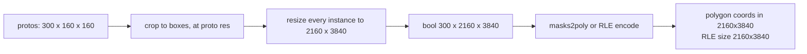
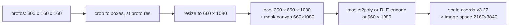

# Implementation plan: honour `tradeoff_factor` for instance segmentation

**Author:** Michał Taraszewski

**Related issue / PR:** _none yet — to be linked from the `#discuss-inference-release` thread_

**Status:** draft. Supersedes `instance-seg-tradeoff-factor.md`, whose headline figures combined two
code paths that never execute together and whose recommended v1 is measurably slower than today.

> **Reviewed by the team 2026-10-01.** The delivery mechanism is settled (new block versions); the
> RLE wire-format decision is deliberately deferred to the end of implementation. §3 records what was
> decided and what is still open.

---

## 1. What problem are we solving?

**Who.** Anyone running instance segmentation on large frames or dense scenes: real-time video, and
Jetson deployments in particular.

**What is missing.** `mask_decode_mode` and `tradeoff_factor` are accepted end to end — SDK entity →
Workflows block → `WorkflowsModelsProvider.run_instance_segmentation` →
`InstanceSegmentationInferenceRequest` — and then ignored. They pass untouched through
`InferenceModelsInstanceSegmentationAdapter.map_inference_kwargs`
(`inference/core/models/inference_models_adapters.py:520`) and are swallowed by `**kwargs` in each
model's `post_process`. No error, no effect. Masks are always produced at full input resolution.
The legacy path (`inference/core/models/instance_segmentation_base.py:143-190`) still implements all
three modes.

**Why it matters: this stage is almost the entire frame.** Measured on one host (M1 Max, 8 torch
threads, fp32, 3840×2160, p50): JPEG decode 59.7 ms, preprocess to 640×640 0.26 ms, JPEG encode
35.1 ms — everything that is *not* mask post-processing sums to roughly **95 ms**. Mask
post-processing at `n=300` is **hundreds of milliseconds to seconds** (tables below). At 4K with a
dense scene this stage is **~90–97% of total frame time**. That, not a stage-relative speedup, is
the argument.

**Two things this plan does not claim.** It is not sufficient on its own — at `n=300`/4K even
`t=0.25` leaves several hundred ms in this stage. And cost is Θ(n·H·W), so **reducing
`max_detections`** (default 300, `inference_models/configuration.py:229`) is a cheaper, lossless
first move that should be evaluated alongside it.

### The published contract

The `inference.roboflow.com` reference site was collapsed to a landing page in `cbdd286c4`, so the
mkdocstrings API pages no longer exist. What remains published:

- `mask_decode_mode` default `accurate`; `tradeoff_factor` default `0`, scale `0='fast'` → `1='accurate'`.
- *"If 'accurate' the mask will be decoded using the original image size. If 'fast' the mask will be
  decoded using the original mask size."* — the only published statement about output resolution,
  and therefore binding.
- `response_mask_format` default `polygon`, `rle` opt-in.

The request schema (`inference/core/entities/requests/inference.py:254-257`) publishes all three
modes. Only the legacy query parameter (`inference/core/interfaces/http/http_api.py:4738`)
enumerates just two, omitting `tradeoff` — worth correcting, but it is a doc fix, not a blocker.

## 2. How will the behaviour change?

One float, `masks_resolution_factor ∈ [0,1]` (named to match the existing `masks_smoothing_enabled`
/ `masks_binarization_threshold` kwargs), resolved in the adapter from the existing enum, and
**carried as explicit metadata** rather than inferred from array shape.

Prior art for exactly this: DeepStream's `NvOSD_MaskParams` carries mask-local `height`/`width`
separately from `rect_params` and rescales on demand
(`_reference/deepstream_python_apps/bindings/docstrings/nvosddoc.h:278-291`;
`apps/deepstream-segmask/deepstream_segmask.py:120-126`).

### Before — 4K frame, 300 instances, 160×160 protos

### After, at `t = 0.25`

Adapter mapping: `accurate → 1.0`, `fast → 0.0`, `tradeoff → tradeoff_factor` (validated, raising
`InvalidMaskDecodeArgument` as the legacy path does). This satisfies the published contract exactly.
Default `1.0` leaves output unchanged.

### Step F is the change. Without it every prediction at `t<1` is wrong.

There is **no mask→image coordinate scaling anywhere** in the `inference_models` response path. The
adapter emits raw `masks2poly` output into `Point(x, y)`
(`inference_models_adapters.py:917-988`, `:1047`) while declaring the image at `original_size`. Two
sites are worse: `bitpacked_masks2poly(..., width=W)` with `W` from `original_size` (`:907`,
`core/utils/postprocess.py:73`) unpacks at the wrong stride and corrupts silently; and
`InstancesRLEMasks` declares `image_size = original_size` while encoding at
`size_after_pre_processing` (`rfdetr/common.py:383`).

The legacy path does this correctly — it tracks `output_mask_shape` per mode and rescales via
`post_process_polygons` (`inference/core/utils/postprocess.py:449`). **The `inference_models`
rewrite dropped that step.** We are restoring a mechanism the codebase already had.

Verified consequences if reduced masks escape unscaled (4 confirmed; a wider sweep is in progress
and will be attached rather than asserted): `visualizations/mask/v1_tensor.py:277-280` raises
outright; `bounding_rect/v1.py:163-177` overwrites `xyxy` from mask contours, so corrupted boxes
reach blocks that never touch masks; `dynamic_zones/v1.py:348-352` emits shrunken zone polygons;
`sinks/dataset_upload/v1_tensor.py:946-951` persists mask-space polygons as permanent labels.
Note `sv.Detections.from_inference` already resizes mismatched RLE
(`supervision/detection/utils/internal.py:125-132`) but not polygons (`:155`).

### Measurements, by path

Two different functions. They are not comparable and must not be combined.

**Dense path** — `align_instance_segmentation_results` (`post_processing.py:395`), chunked,
materialises `n×H×W`. 4K, n=300, chunk 16, fp32, CPU:

| t | resize p50 | peak RSS |
|---|---|---|
| 1.0 | 485–575 ms (3 runs) | 3256 MB |
| 0.25 | 52–65 ms | 595 MB |

**RLE path** — `align_instance_segmentation_results_to_rle_masks` (`post_processing.py:525`), a
**per-instance generator**: no chunking, no `n×H×W` tensor, so the memory figures above do not
apply. This is the default (`v4.py:359`, `:408` hardcode `"rle"`; `GCP_SERVERLESS` forces it,
`inference_models_adapters.py:527`). Encode cost is strongly content-dependent — measured 2933 ms
for smooth blob masks vs 6262 ms for noise masks at n=300, a 2.1× spread from fixture alone.

**Open measurement gaps, to close before implementation.** The polygon-path figure in the superseded
plan did not reproduce (`masks2poly` measured ~1877 ms against ~314 ms implied) and is withdrawn.
All numbers above are single-platform CPU; there is **no CUDA or Jetson measurement**, and the
~40 GB/frame traffic figure for Orin NX is a bandwidth model, not data. The benchmark scripts will
be linked, with fixture content stated.

### How we verify

`align_instance_segmentation_results` and `crop_masks_to_boxes` currently have **no unit tests**
(`inference_models/tests/unit_tests/models/common/roboflow/test_post_processing.py` covers neither),
so a characterization test — fixed-seed protos → golden mask tensor and golden polygons — is
commit zero, before any behaviour claim can be checked in CI.

- Bit-identical output at `t=1.0`.
- **Polygon/RLE coordinate round-trip at `t<1`**: emitted coordinates land on the same image pixels
  as `t=1.0`. Tolerance must scale with `1/t`, since unpad rounding error is amplified as `t` falls.
  Shape-only assertions would not catch the defect above; this is the test that matters.
- RLE invariant: decoded counts sum to the declared size; declared size is the encoded size.
- Non-square fixtures throughout (square images hide axis errors); odd dims; letterbox *and*
  stretch; static crop with offset; `n = 0`.
- Triton gate as a pure-Python unit test on `_unsupported_triton_postprocess_reason`, so it is not a
  GPU-only dead test in x86 CI.
- `AP_mask` 50:95 overall **and by object size**, against `t`, with `AP_box` as control.

Layers: `inference_models/tests/unit_tests/models/common/roboflow/test_post_processing.py`;
`tests/inference/models_predictions_tests`; `tests/workflows/unit_tests/.../instance_segmentation/`
for any new block version **and its `_tensor` sibling**.

### Implementation surface

Not one function. The alignment logic is duplicated across two functions, reached from six model
families on both the dense and RLE routes — `models/{yolov5,yolov7,yolov8,yolo26,yolact}/common.py`
× {dense, rle} = 10 call sites, plus `models/rfdetr/common.py:369` and
`models/rfdetr/triton_postprocess.py` — plus the new kwarg threaded through every
`*_instance_segmentation_{onnx,trt,torch_script}.py`. Roughly 12 sites beyond the two core
functions.

### Out of scope, as its own plan

Four independent performance and correctness changes, measured and bit-identical except the last,
belong in a separate PR and are deliberately not bundled here: `torch.gt(out=)` in place of
`.gt_()` + assignment; separable `crop_masks_to_boxes`; resizing directly into the static-crop
canvas; and deriving `crop_masks_to_boxes(scaling=0.25)` per-axis (wrong whenever
`mask_w/inference_w ≠ 0.25`, e.g. YOLACT 138/550 — and the only one of the four that changes
`t=1.0` output). Also out of scope: batching the per-instance RLE encode, measured 1.4× at `t=1.0`
and 2.5× at `t=0.25`, lossless and with no API change.

## 3. Decisions taken, and what remains

### Settled by team review, 2026-10-01

Question numbers below are those of the reviewed draft, so the thread stays traceable.

**(Q1) New block versions are the delivery mechanism.** Changes of this kind have always shipped as
new block versions to minimise breakage — *even when the change is a fix to an earlier bug* — and
code duplication across versions is explicitly acceptable. This removes the main compatibility
objection: a new version means no existing pipeline changes under upgrade. Both the `vN` and
`vN_tensor` siblings are in scope.

**(Q2) `mask_size` as metadata carried with the prediction: accepted in principle.** Two
sub-decisions remain, below.

**(Q3) The RLE wire-format decision is deferred to the end of implementation**, for wider team
discussion. The reasoning, which changes this plan's shape: *with new block versions this is not
breaking for Workflows at all.* The breaking surface is narrower than the reviewed draft assumed —
it is the **model endpoints**, where a direct integrator would suddenly see mask-scaling parameters
respected. That is a bug fix, and it is breaking, and those are not in conflict. Implementation
should proceed without settling it.

**(Q4) The chunk byte budget is a follow-up, not part of this work.** It addresses an extremum of
the resolution range; it can land later purely as serving-latency optimisation.

**(Q5) The accuracy/latency curve may be worth writing up publicly** — a blog post rather than a
docs change.

### Still open

**O1 — Explicit field, or a key-value entry in the image metadata?**
*Question:* does `mask_size` become a sanctioned field on the prediction/response types, or ride as
a KV pair in the existing image metadata?
*Trade-off:* an explicit field is self-documenting, type-checked and greppable, but is a public API
addition to a separately-versioned package with a consumer sweep attached. A metadata KV is cheaper
to add and easier to ignore, at the cost of being unvalidated and easy to drop silently in a
transform.
*Recommendation:* explicit field, matching the DeepStream convention cited in §2, because ~15 sites
currently read `image_size` as the canvas and an unvalidated KV will be missed by some of them.
*Input needed:* which. **Blocking for implementation.**

**O2 — Remote execution across mixed backend versions.** *(raised in review; not in the reviewed draft)*
*Question:* a client may talk to either a new server that returns `mask_size` or an old one that does
not. What does the client do?
*Investigation:* the response shape itself is the version signal — presence of the new field
distinguishes a new server from an old one, with no version negotiation needed.
*Recommendation:* absent field ⇒ assume the old contract and default `mask_size` to the input size;
present ⇒ use the explicit value. This must hold for both remote Workflows execution and the SDK.
*Input needed:* confirmation that response-shape sniffing is acceptable rather than an explicit
version field. **Blocking for the remote path.**

**O3 — Evidence for the deferred Q3 decision.** The team asked how badly RLE decoding actually
breaks under a reduced `size`. That is answerable now and cheaply: decode a reduced-`size` RLE with
`pycocotools` and with `supervision` both before and after
`detection/utils/internal.py:125-132`, and record the failure mode — exception, silent truncation,
or correct resize. *Action:* produce that evidence during implementation so the end-of-project
decision is made on data. Non-blocking.

**O4 — The GPU path: gate the fused kernel, or teach it `t`?**
*Investigation:* `models/rfdetr/triton_postprocess.py` already implements a **lossless** version of
this optimisation — *"asks Triton to interpolate only the active mask region and emit sparse RLE run
records directly"* — and already parameterises resize tables by `output_size` (`:273-285`). Forcing
its eager fallback leaves the production GPU path unimproved and emits a `RuntimeWarning` **per
image** (`:253-258`), i.e. per-frame log spam. The fused path already bails on
`padding_unsupported`, `static_crop_unsupported`, `resize_metadata_unsupported` and `>4096 px`
(`:921-983`), so letterboxed 4K, static crops and Jetson-without-triton already fall through to the
slow path — which is the real justification for this feature and belongs in §1.
*Recommendation:* pass the reduced `output_height/width` into the kernel. If too large for v1, add
`t != 1.0` to `_unsupported_triton_postprocess_reason` so the fallback is quiet, and state plainly
that the GPU fast path is unimproved in v1.
*Input needed:* scope call. Non-blocking for the dense path; blocking for any Jetson claim.

**O5 — Legacy-path parity.** After this change `mask_decode_mode="tradeoff"` returns transposed
masks under `USE_INFERENCE_MODELS=False` — `process_mask_tradeoff` passes `(h, w)` where
`cv2.resize` wants `(width, height)` (`core/utils/postprocess.py:353`; verified by execution,
1920×1080 at `t=1.0` returns `(n, 1920, 1080)`) — and correct masks under the default. A
flag-dependent geometry divergence. *Recommendation:* fix the transpose in the same PR; it is four
lines. Non-blocking.

**O6 — Stream behaviour.** `tradeoff_factor` is bindable to `$inputs.*`, so `t` can change between
frames of one session, while `stabilize_detections/v1_tensor.py:447-451` and tracker caches derive
empty-mask shapes from `template.mask.shape[1:]`. *Recommendation:* treat `t` as session-fixed and
reject mid-stream changes. Non-blocking.

### Follow-ups, not decisions

Recommend a default `t` once the `AP_mask` curve exists; the chunk byte budget (dense path only —
the RLE generator has no chunking); batching the per-instance RLE encode (measured 1.4× at `t=1.0`,
2.5× at `t=0.25`, lossless, no API change); fixing the `Defaults to 0.5` docstring at
`instance_segmentation_base.py:78` against `DEFAULT_TRADEOFF_FACTOR = 0.0` on line 33; adding
`tradeoff` to the legacy query-param description at `http_api.py:4738`.

**Closed by investigation.** `fast` needs no separate code path: `t=0.0` *is* legacy
`process_mask_fast` semantics, because the crop already happens at proto resolution before
`align_instance_segmentation_results` (`models/yolov8/common.py:32`) and `t=0` skips the resize.
