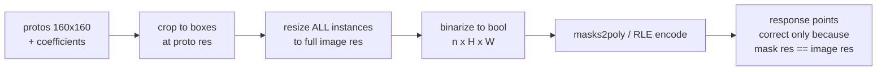

# Implementation plan: honour `tradeoff_factor` for instance segmentation

**Branch:** `feat/instance-seg-tradeoff-factor` (off `main` @ `23a01eb3a`)
**Status:** draft for `#discuss-inference-release` — not yet agreed

Follows [`.github/implementation-plan-template.md`](../../.github/implementation-plan-template.md), required by
[`AGENTS.md`](../../AGENTS.md#internal-contributions-roboflow-team-only) for a major feature, and separately
because this touches shared infrastructure, compatibility and package dependencies.

---

## 1. What problem are we solving?

**Who.** Anyone running instance segmentation on large frames or dense scenes — real-time video especially, and
Jetson deployments above all.

**What is missing.** `mask_decode_mode` and `tradeoff_factor` are accepted end to end (SDK entity → Workflows
block → `WorkflowsModelsProvider.run_instance_segmentation` → `InstanceSegmentationInferenceRequest`) and then
ignored. They pass untouched through
`InferenceModelsInstanceSegmentationAdapter.map_inference_kwargs` (`inference/core/models/inference_models_adapters.py:520`)
and are swallowed by `**kwargs` in each model's `post_process`. No error, no effect. Masks are always produced
at full input resolution. The legacy path (`inference/core/models/instance_segmentation_base.py:143-190`) still
implements all three modes.

**Concrete example.** A 3840×2160 frame with 300 instances, 160×160 prototypes, on CPU:

| stage | today (`t=1.0`) | at `t=0.25` |
|---|---|---|
| resize | 575 ms | 53 ms |
| → polygon path total (`masks2poly`) | **889 ms** | **92 ms** (9.7×) |
| → RLE path total (`rle` encode = 2531 ms) | **3107 ms** | **271 ms** (11.5×) |
| peak RSS | 3256 MB | 595 MB (5.5×) |

Measured on Apple M1 Max, torch 2.14.1, 8 threads, fresh process per cell, warm-up 3, 15 iterations, p50.
The timed code is a verbatim copy of `post_processing.py:469-483`.

**Note which path dominates.** On the **default** v4 path the masks are RLE, and **RLE encoding costs 4.4× the
resize**. The saving is therefore larger than a "faster resize" framing suggests, and any claim that the resize
alone is the bottleneck is wrong.

**Edge.** At `t=1.0` this stage moves ~40 GB of memory traffic per 4K frame. On Jetson Orin NX (102 GB/s,
shared with the TRT engine) that is ~392 ms of post-processing per frame. Here the knob is not a tuning option;
it is the difference between shipping and not.

**What should become possible.** A caller chooses mask resolution per request. Default `1.0` keeps today's
behaviour byte-for-byte.

### The published contract this must honour

Only four statements are published (the `inference.roboflow.com` reference site was collapsed to a landing page
in `cbdd286c4`, so the mkdocstrings API pages are gone):

- `mask_decode_mode` default `accurate`.
- *"If 'accurate' the mask will be decoded using the original image size. If 'fast' the mask will be decoded
  using the original mask size. 'accurate' is slower but more accurate."* — the only published statement about
  output resolution, and therefore binding.
- `tradeoff_factor` default `0`, scale `0='fast'` → `1='accurate'`.
- `response_mask_format` default `polygon`, `rle` opt-in.

Two gaps worth fixing alongside: the published description enumerates only `accurate` and `fast`, so **the
`tradeoff` mode this feature exists to serve is undocumented**; and the docstring at
`instance_segmentation_base.py:78` says "Defaults to 0.5" where line 33 says `0.0` — source-only, no longer
published, but visible in IDEs and to agents.

## 2. How will the behaviour change?

One new float, `mask_resolution_factor ∈ [0,1]`, resolved in the adapter from the existing enum + float, and
**carried as explicit metadata** alongside the masks rather than inferred from array shape.

### Before

Masks are resized to full image resolution, so `mask.shape[1:]` *is* the image canvas. Every downstream
consumer relies on that coincidence, and nothing scales mask coordinates into image space.

### After

```mermaid
flowchart LR
    A[protos + coefficients] --> B[crop to boxes<br/>at proto res]
    B --> C[resize to t-scaled target<br/>h = mh + t*&#40;H-mh&#41;]
    C --> D[bool n x h x w<br/>+ explicit mask canvas]
    D --> E[masks2poly / RLE encode<br/>at reduced res]
    E --> F[scale coords by<br/>image/mask ratio]
    F --> G[response points<br/>in image space]
```

Adapter mapping: `accurate → 1.0`, `fast → 0.0`, `tradeoff → tradeoff_factor` (validated, raising
`InvalidMaskDecodeArgument` as the legacy path does). This satisfies the published contract exactly.

**Why this fits.** The legacy ONNX path already does precisely this: it tracks `output_mask_shape` per mode and
rescales via `post_process_polygons` (`inference/core/utils/postprocess.py:449`). The `inference_models`
rewrite dropped that step. We are restoring a mechanism the codebase already had, not inventing one.

### Effects on existing users

**Step F is the whole change.** Without it every prediction at `t<1` is silently wrong. A review found no
mask→image scaling anywhere in the new response path: the adapter emits raw `masks2poly` output straight into
`Point(x,y)` (`inference_models_adapters.py:917-988`, `:1047`) while declaring the image at `original_size`.
Two sites are worse — `bitpacked_masks2poly(..., width=W)` with `W` from `original_size`
(`:907`, `core/utils/postprocess.py:73`) unpacks at the wrong stride and corrupts silently, and
`InstancesRLEMasks` declares `image_size = original_size` while encoding at `size_after_pre_processing`
(`rfdetr/common.py:383`), which breaks COCO decode.

A blast-radius sweep found **20 silent-corruption sites and 13 hard crashes** if reduced masks escape unscaled.
Worst of each: dataset upload persists mask-space polygons as **permanent labels**
(`sinks/dataset_upload/v1_tensor.py:971`); Dynamic Zones emits shrunken zone polygons that corrupt every
downstream count (`transformations/dynamic_zones/v1.py:348`); several blocks overwrite `xyxy` from mask
contours (`bounding_rect/v1.py:163`), so corrupted boxes reach blocks that never touch masks; and Mask
Visualization raises outright (`visualizations/mask/v1_tensor.py:278`, verified).

Two useful facts: `sv.Detections.from_inference` **already** resizes mismatched RLE
(`supervision/detection/utils/internal.py:126-132`) but not polygons (`:155`); and `Detections` never validates
mask shape against an image, only cardinality — so it cannot catch this for us.

**Default `1.0` is byte-identical.** `round(mh*(1-t) + H*t)` at `t=1.0` is exactly `H`.

### How we verify

- Bit-identical output at `t=1.0` (regression guard).
- **Polygon/RLE coordinate round-trip at `t<1`** — assert emitted coordinates land on the same image pixels as
  `t=1.0` within tolerance. Shape-only tests would not catch the defect above; this is the test that matters.
- RLE invariant: decoded counts sum to the declared size, and the declared size is the encoded size.
- Non-square fixtures throughout (a square image hides axis errors); odd dims; letterbox *and* stretch;
  static crop with offset; `n = 0`.
- Triton gate: RF-DETR-seg has a fused CUDA post-process that bypasses this function entirely
  (`models/rfdetr/triton_postprocess.py`); `t != 1.0` must force its eager fallback.
- Benchmark sweeping `t × n`, reporting p50/p95 of post-processing in isolation, with hardware stated.
- `AP_mask` 50:95 overall **and by object size**, against `t`, with `AP_box` as control. Deliverable is the
  curve; the recommended default follows from it.

### Scope and sequencing

Four of these are independent of the feature and should land first as separate, bit-identical commits — they
are measured, low-risk, and make the feature's own diff reviewable:

1. `torch.gt(..., out=)` instead of `.gt_()` + assignment — removes two full-size passes; 1.07–1.51×.
2. Separable `crop_masks_to_boxes` — the four broadcast comparisons each materialise `[n,h,w]`; keeping them
   at `[n,1,w]`/`[n,h,1]` is 1.9–2.2×, `torch.equal`-identical.
3. Resize directly into the static-crop canvas — removes a second full `n×H×W` bool buffer.
4. `crop_masks_to_boxes(scaling=0.25)` — one hardcoded scalar where per-axis values derived from
   `masks.shape` and `inference_size` are correct. Wrong for YOLACT (138/550 = 0.2509) and for any non-square
   inference size, and it ignores letterbox padding while `align_instance_segmentation_results` twenty lines
   later derives the same ratio properly. Correctness, not performance — and it changes `t=1.0` output, so it
   must not be bundled with the byte-identity claim.

Then the feature: `mask_resolution_factor` + canvas metadata + coordinate scaling + RLE parity.

Explicitly **out of scope**, as its own later design: box-resolution (compact) masks, Θ(Σ box areas),
measured 7.6–11.2× at full fidelity. The naive per-box `grid_sample` implementation is 2.7–8.8× *slower* than
today; it needs batched `roi_align`. Worth doing, not here.

## 3. Uncertainties and decisions needing input

**Q1 — Does `tradeoff_factor`'s default of `0.0` stand once the parameter is honoured?**
*Investigation:* `DEFAULT_TRADEOFF_FACTOR = 0.0` (`instance_segmentation_base.py:33`), all 8 block versions
declare `default=0.0`, published OpenAPI says `0`. So `mask_decode_mode="tradeoff"` with an untouched factor
means `t=0.0` — identical to `fast`, maximum degradation. Any existing workflow that set `tradeoff` and left
the factor alone (the natural case, since it had no effect) lands there on upgrade.
*Recommendation:* honour the parameter in a **new block version** rather than in place, so no existing workflow
changes behaviour on upgrade. Separately make `tradeoff` with a default factor an explicit error or clamp it,
rather than silently meaning `fast`.
*Input needed:* is a new block version acceptable, or is in-place with a migration note preferred? **Blocking.**

**Q2 — Where does the mask canvas live?**
*Investigation:* `InstancesRLEMasks.image_size` is read as "the image canvas" at ~15 sites; for dense masks,
`mask.shape[1:]` *is* the canvas definition at `bounding_rect/v1_tensor.py:211`,
`dataset_upload/v1_tensor.py:990`, `stabilize_detections/v1_tensor.py:448`. Changing either meaning silently
is what produces the 20 corruption sites.
*Recommendation:* keep `image_size` meaning the image and add a sibling `mask_size`; add an explicit
mask-canvas field to `InstanceDetections`. Both are public dataclasses in a separately-versioned package →
changelog and consumer sweep.
*Input needed:* agreement on the field names and on accepting the `inference_models` API addition. **Blocking.**

**Q3 — Does the RLE wire format change, or do we upscale before encoding?**
*Investigation:* `rle["size"] ≠ image` is a breaking change for any external client that is not
`supervision ≥` the version carrying `internal.py:126`. v4 hardcodes `response_mask_format="rle"`
(`v4.py:357`, `:468`) and `GCP_SERVERLESS` forces it (`inference_models_adapters.py:527`), so this is the
default path, not an edge case.
*Recommendation:* for v1 of the feature, upscale before RLE encoding — correct on the wire, and the compute
saving is still taken. Revisit when compact masks land.
*Input needed:* accept the reduced saving on the RLE path, or version the response? **Blocking.**

**Q4 — Should `mask_chunk_size` become a byte budget?**
*Investigation:* the optimal chunk size moves *inversely* to `t`. At 4K/`n=300`/`t=1.0` the optimum is 32; at
`t=0.1` it is unchunked, where the fixed 16 is 1.43× off (1.70× at 1080p). Per-chunk overhead is ~0.25 ms, i.e.
22% of the whole budget at `t=0.1` versus <1% at `t=1.0`. Chunking bounds the float temporary only; it never
shrinks the bool output, so it is orthogonal to this feature, not a substitute.
*Recommendation:* express it as `chunk = max(1, min(n, BUDGET_BYTES // (h*w*4)))` with a ~512 MiB budget,
keeping the env var as the budget. Reproduces today's 16 at 4K/`t=1.0` and the measured optimum at low `t`.
*Input needed:* in scope here, or a follow-up? Non-blocking, but leaves 1.2–1.7× unclaimed at exactly the
settings this feature enables.

**Q5 — Recommended value and documentation.**
*Investigation:* the knee is at `t ≈ 0.25–0.3`, capturing ~90% of the achievable latency saving and 5.5× of the
memory. Below 0.15 the gain flattens while resolution keeps falling.
*Recommendation:* keep the default at `1.0`; document `0.25` as the recommended setting for real-time and
edge, and `t < 0.15` as diagnostic only. Also document `tradeoff` as a legal `mask_decode_mode` — it currently
is not — and fix the `0.5` docstring.
*Input needed:* confirmation once the `AP_mask` curve exists. Non-blocking.

**Closed by investigation.** Does `fast` need a separate code path? No — `t=0.0` *is* legacy
`process_mask_fast` semantics, because the crop already happens at proto resolution before
`align_instance_segmentation_results` (`models/yolov8/common.py:32`) and `t=0` skips the resize.

**Not porting `process_mask_tradeoff`.** It passes `(h, w)` where `cv2.resize` wants `dsize=(width, height)`
(`core/utils/postprocess.py:353`), so it transposes masks on non-square images — verified by execution,
1920×1080 at `t=1.0` returns `(n, 1920, 1080)` — and `scale_bboxes` then derives crop scaling from the swapped
dims. `process_mask_fast` has a related defect on letterboxed input (`:394`). Invisible on square images,
which is why it survived.
