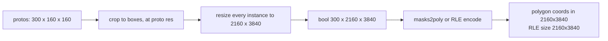
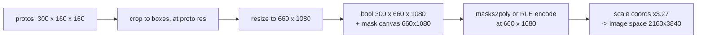

# Implementation plan: honour `tradeoff_factor` for instance segmentation

**Author:** Michał Taraszewski

**Related issue / PR:** _none yet — to be linked from the `#discuss-inference-release` thread_

**Status:** draft. Supersedes `instance-seg-tradeoff-factor.md`, whose headline figures combined two
code paths that never execute together and whose recommended v1 is measurably slower than today.

> **Reviewed by the team 2026-10-01.** The delivery mechanism is settled (new block versions); the
> RLE wire-format decision is deliberately deferred to the end of implementation. §3 records what was
> decided and what is still open.

---

## 1. What problem are we solving?

**Who.** Anyone running instance segmentation on large frames or dense scenes: real-time video, and
Jetson deployments in particular.

**What is missing.** `mask_decode_mode` and `tradeoff_factor` are accepted end to end — SDK entity →
Workflows block → `WorkflowsModelsProvider.run_instance_segmentation` →
`InstanceSegmentationInferenceRequest` — and then ignored. They pass untouched through
`InferenceModelsInstanceSegmentationAdapter.map_inference_kwargs`
(`inference/core/models/inference_models_adapters.py:520`) and are swallowed by `**kwargs` in each
model's `post_process`. No error, no effect. Masks are always produced at full input resolution.
The legacy path (`inference/core/models/instance_segmentation_base.py:143-190`) still implements all
three modes.

**Why it matters: this stage is almost the entire frame.** Measured on one host (M1 Max, 8 torch
threads, fp32, 3840×2160, p50): JPEG decode 59.7 ms, preprocess to 640×640 0.26 ms, JPEG encode
35.1 ms — everything that is *not* mask post-processing sums to roughly **95 ms**. Mask
post-processing at `n=300` is **hundreds of milliseconds to seconds** (tables below). At 4K with a
dense scene this stage is **~90–97% of total frame time**. That, not a stage-relative speedup, is
the argument.

**Two things this plan does not claim.** It is not sufficient on its own — at `n=300`/4K even
`t=0.25` leaves several hundred ms in this stage. And cost is Θ(n·H·W), so **reducing
`max_detections`** (default 300, `inference_models/configuration.py:229`) is the obvious
alternative. It was measured, and it is the weaker lever: halving it saves 55% where the resolution
factor saves 90% — **~4.6× less effective** — and it cannot reach real-time at 4K at any realistic
value. It is also **not lossless**: capping at 150 in a scene with 300 objects deletes 150 real
detections, a recall cliff rather than the uniform boundary-fidelity cost that reducing resolution
carries. See E1.

### The published contract

The `inference.roboflow.com` reference site was collapsed to a landing page in `cbdd286c4`, so the
mkdocstrings API pages no longer exist. What remains published:

- `mask_decode_mode` default `accurate`; `tradeoff_factor` default `0`, scale `0='fast'` → `1='accurate'`.
- *"If 'accurate' the mask will be decoded using the original image size. If 'fast' the mask will be
  decoded using the original mask size."* — the only published statement about output resolution,
  and therefore binding.
- `response_mask_format` default `polygon`, `rle` opt-in.

The request schema (`inference/core/entities/requests/inference.py:254-257`) publishes all three
modes. Only the legacy query parameter (`inference/core/interfaces/http/http_api.py:4738`)
enumerates just two, omitting `tradeoff` — worth correcting, but it is a doc fix, not a blocker.

## 2. How will the behaviour change?

One float, `masks_resolution_factor ∈ [0,1]` (named to match the existing `masks_smoothing_enabled`
/ `masks_binarization_threshold` kwargs), resolved in the adapter from the existing enum, and
**carried as explicit metadata** rather than inferred from array shape.

Prior art for exactly this: DeepStream's `NvOSD_MaskParams` carries mask-local `height`/`width`
separately from `rect_params` and rescales on demand
(`_reference/deepstream_python_apps/bindings/docstrings/nvosddoc.h:278-291`;
`apps/deepstream-segmask/deepstream_segmask.py:120-126`).

### Before — 4K frame, 300 instances, 160×160 protos



### After, at `t = 0.25`



Adapter mapping: `accurate → 1.0`, `fast → 0.0`, `tradeoff → tradeoff_factor` (validated, raising
`InvalidMaskDecodeArgument` as the legacy path does). This satisfies the published contract exactly.
Default `1.0` leaves output unchanged.

### Step F is the change. Without it every prediction at `t<1` is wrong.

There is **no mask→image coordinate scaling anywhere** in the `inference_models` response path. The
adapter emits raw `masks2poly` output into `Point(x, y)`
(`inference_models_adapters.py:917-988`, `:1047`) while declaring the image at `original_size`. Two
sites are worse: `bitpacked_masks2poly(..., width=W)` with `W` from `original_size` (`:907`,
`core/utils/postprocess.py:73`) unpacks at the wrong stride and corrupts silently; and
`InstancesRLEMasks` declares `image_size = original_size` while encoding at
`size_after_pre_processing` (`rfdetr/common.py:383`).

The legacy path does this correctly — it tracks `output_mask_shape` per mode and rescales via
`post_process_polygons` (`inference/core/utils/postprocess.py:449`). **The `inference_models`
rewrite dropped that step.** We are restoring a mechanism the codebase already had.

Verified consequences if reduced masks escape unscaled (4 confirmed; a wider sweep is in progress
and will be attached rather than asserted): `visualizations/mask/v1_tensor.py:277-280` raises
outright; `bounding_rect/v1.py:163-177` overwrites `xyxy` from mask contours, so corrupted boxes
reach blocks that never touch masks; `dynamic_zones/v1.py:348-352` emits shrunken zone polygons;
`sinks/dataset_upload/v1_tensor.py:946-951` persists mask-space polygons as permanent labels.
Note `sv.Detections.from_inference` already resizes mismatched RLE
(`supervision/detection/utils/internal.py:133-138`, supervision 0.30.6) but not polygons,
which are rasterised as given onto an image-size canvas (`:430`).

> Supervision citations in this document are against **0.30.6**, the version this branch pins
> (`supervision>=0.30.6,<0.31.0`). The 0.29 line numbers differ; 0.30 changed `__setitem__`
> validation, `from_inference` polygon skips, PolygonZone anchors, CompactMask degeneracy and NMM
> tie-breaks, so references taken from a 0.29 checkout do not transfer.

### Measurements, by path

Two different functions. They are not comparable and must not be combined.

**Dense path** — `align_instance_segmentation_results` (`post_processing.py:395`), chunked,
materialises `n×H×W`. 4K, n=300, chunk 16, fp32, CPU:

| t | resize p50 | peak RSS |
|---|---|---|
| 1.0 | 485–575 ms (3 runs) | 3256 MB |
| 0.25 | 52–65 ms | 595 MB |

**RLE path** — `align_instance_segmentation_results_to_rle_masks` (`post_processing.py:525`), a
**per-instance generator**: no chunking, no `n×H×W` tensor, so the memory figures above do not
apply. This is the default (`v4.py:359`, `:408` hardcode `"rle"`; `GCP_SERVERLESS` forces it,
`inference_models_adapters.py:527`). Encode cost is strongly content-dependent — measured 2933 ms
for smooth blob masks vs 6262 ms for noise masks at n=300, a 2.1× spread from fixture alone.

**Open measurement gaps, to close before implementation.** The polygon-path figure in the superseded
plan did not reproduce (`masks2poly` measured ~1877 ms against ~314 ms implied) and is withdrawn.
All numbers above are single-platform CPU; there is **no CUDA or Jetson measurement**, and the
~40 GB/frame traffic figure for Orin NX is a bandwidth model, not data. The benchmark scripts will
be linked, with fixture content stated.

### How we verify

`align_instance_segmentation_results` and `crop_masks_to_boxes` currently have **no unit tests**
(`inference_models/tests/unit_tests/models/common/roboflow/test_post_processing.py` covers neither),
so a characterization test — fixed-seed protos → golden mask tensor and golden polygons — is
commit zero, before any behaviour claim can be checked in CI.

- Bit-identical output at `t=1.0`.
- **Polygon/RLE coordinate round-trip at `t<1`**: emitted coordinates land on the same image pixels
  as `t=1.0`. Tolerance must scale with `1/t`, since unpad rounding error is amplified as `t` falls.
  Shape-only assertions would not catch the defect above; this is the test that matters.
- RLE invariant: decoded counts sum to the declared size; declared size is the encoded size.
- Non-square fixtures throughout (square images hide axis errors); odd dims; letterbox *and*
  stretch; static crop with offset; `n = 0`.
- Triton gate as a pure-Python unit test on `_unsupported_triton_postprocess_reason`, so it is not a
  GPU-only dead test in x86 CI.
- `AP_mask` 50:95 overall **and by object size**, against `t`, with `AP_box` as control.

Layers: `inference_models/tests/unit_tests/models/common/roboflow/test_post_processing.py`;
`tests/inference/models_predictions_tests`; `tests/workflows/unit_tests/.../instance_segmentation/`
for any new block version **and its `_tensor` sibling**.

### Implementation surface

Not one function. The alignment logic is duplicated across two functions, reached from six model
families on both the dense and RLE routes — `models/{yolov5,yolov7,yolov8,yolo26,yolact}/common.py`
× {dense, rle} = 10 call sites, plus `models/rfdetr/common.py:369` and
`models/rfdetr/triton_postprocess.py` — plus the new kwarg threaded through every
`*_instance_segmentation_{onnx,trt,torch_script}.py`. Roughly 12 sites beyond the two core
functions.

### Out of scope, as its own plan

Four independent performance and correctness changes, measured and bit-identical except the last,
belong in a separate PR and are deliberately not bundled here: `torch.gt(out=)` in place of
`.gt_()` + assignment; separable `crop_masks_to_boxes`; resizing directly into the static-crop
canvas; and deriving `crop_masks_to_boxes(scaling=0.25)` per-axis (wrong whenever
`mask_w/inference_w ≠ 0.25`, e.g. YOLACT 138/550 — and the only one of the four that changes
`t=1.0` output). Also out of scope: batching the per-instance RLE encode, measured 1.4× at `t=1.0`
and 2.5× at `t=0.25`, lossless and with no API change.

## 2b. Sequencing from here

### What is already done

The **dense / polygon path works end to end**: request → `map_inference_kwargs` collapses the enum
onto one factor → `align_instance_segmentation_results` interpolates the resize target →
`mask_size` travels with the prediction → polygons are scaled back into image space before being
reported. Coverage on these functions went from 31 tests to 77 in `inference_models` plus 37 in the
adapter, including characterization tests that pin geometry the previous suite structurally could
not detect.

Everything that remains is gated on the deferred RLE wire-format decision (Q3).

### The decision is narrower than three options

Measurement has already eliminated one, and the remaining two are not equally viable:

| option | outcome |
|---|---|
| upscale before encode | 814 ms against today's 485 ms, encode unchanged. **A net regression.** |
| dense-only in v1 | Safe, but `v4.py` hardcodes `response_mask_format="rle"` and `GCP_SERVERLESS` forces it, so the feature is **unreachable for most traffic** — it would work only with `enforce_dense_masks_in_inference_models=True`. |
| reduced RLE `size` | The only option that delivers the saving on the path that is actually used. |

So the question to put to the team is not "which of three" but: **are we willing to change the RLE
`size` field, given that otherwise the feature is inert for most users?**

Client exposure is narrower than it first appears. `sv.Detections.from_inference` already resizes a
mismatched RLE (`supervision/detection/utils/internal.py:133-138`, 0.30.6), so supervision-based
consumers are unaffected. Direct `pycocotools` integrators are the exposed group, which is what the
O3 experiment below quantifies.

### Phase 6, in dependency order

1. Thread `masks_resolution_factor` into `align_instance_segmentation_results_to_rle_masks`,
   mirroring the dense path. The per-instance generator has no chunking, so it is the simpler of
   the two.
2. `to_coco_rle_masks()` emits `mask_size` as the COCO `size`. One line, and the point of no
   return — everything before it is reversible.
3. **Teach the Triton kernel the factor rather than gating it.** `triton_postprocess.py` already
   parameterises its resize tables by `output_size` (`:273-285`), so passing a reduced size through
   is close to free. Gating instead leaves the production GPU path — the entire edge argument —
   unimproved, and emits a `RuntimeWarning` per image. Gate only as a fallback if this overruns.
4. New block version (`vN` **and** `vN_tensor`), per the team's standing mechanism.
5. Version skew: an absent `mask_size` in a response means an old server, so default to the input
   size. Treat the factor as a **performance hint, never an error**, so a new block version still
   works against an older backend.

Note the Triton gate deliberately belongs here and not earlier: until step 1 lands, the fused and
eager paths both ignore the factor and behave identically, so a gate added now would guard against
a divergence that does not yet exist and its test would assert a fallback that changes nothing.

### Unblocked work that should not wait

A separate PR, mergeable today, independent of the decision:

- `torch.gt(..., out=)` in place of `.gt_()` plus assignment — 1.07–1.51×, bit-identical.
- Separable `crop_masks_to_boxes` — 1.9–2.2×, `torch.equal`-identical.
- Resize directly into the static-crop canvas — removes a full `n×H×W` bool buffer.
- **Batched RLE encode** — 1.4× at `t=1.0`, 2.5× at `t=0.25`, lossless, no API change, and it
  removes roughly 300 device synchronisations per frame. This is the standout: it attacks the
  2531 ms encode directly and helps whichever way Q3 is decided.
- `crop_masks_to_boxes(scaling=0.25)` derived per axis — correctness; changes `t=1.0` output, so it
  needs its own commit and must not be bundled with any bit-identity claim.

### Recommended order of work

**Before the decision.** Run the O3 decode experiment, then send the team the plan with that
evidence and the question framed as above. In parallel, open the refactors PR.

**After the decision.** Phase 6 as sequenced; steps 1–2 are roughly a day, step 3 longer.

**Independently.** The `AP_mask`-against-`t` curve and one CUDA measurement. Neither blocks
implementation; both block the *recommendation*, and without them there is no defensible default
to ship.

## 3. Decisions taken, and what remains

### Settled by team review, 2026-10-01

Question numbers below are those of the reviewed draft, so the thread stays traceable.

**(Q1) New block versions are the delivery mechanism.** Changes of this kind have always shipped as
new block versions to minimise breakage — *even when the change is a fix to an earlier bug* — and
code duplication across versions is explicitly acceptable. This removes the main compatibility
objection: a new version means no existing pipeline changes under upgrade. Both the `vN` and
`vN_tensor` siblings are in scope.

**(Q2) `mask_size` as metadata carried with the prediction: accepted in principle.** Two
sub-decisions remain, below.

**(Q2a) The carrier is an explicit field, not a metadata key.** Decided 2026-10-01.

```
InstancesRLEMasks:  image_size: tuple[int, int]            # unchanged - the image
                    mask_size:  tuple[int, int] = image_size   # new, defaults to today's meaning

InstanceDetections: mask_size:  tuple[int, int] = mask.shape[1:]   # new, defaults to today's meaning
```

*Why.* The default is what makes this cheap: every existing construction stays valid, every reader
that ignores `mask_size` gets today's behaviour, and the changelog entry is an addition rather than
a change. The public-API cost is paid once, in a package that is versioned separately anyway.

*Why not a metadata key.* The failure mode this whole plan exists to prevent is silent corruption,
and an unvalidated metadata key is exactly the thing a generic transform drops without anyone
noticing. A sibling field sits next to `image_size`, where all ~15 readers already look; a key sits
somewhere they do not. And `InstanceDetections` has no metadata carrier for dense masks at all, so
the key route means inventing one — strictly more work than adding the field.

*Corroborating signal.* The team's own (Q1) answer accepts duplicated block versions to avoid
breakage. That is a preference for explicit and slightly verbose over clever and implicit.

**(Q3) The RLE wire-format decision is deferred to the end of implementation**, for wider team
discussion. The reasoning, which changes this plan's shape: *with new block versions this is not
breaking for Workflows at all.* The breaking surface is narrower than the reviewed draft assumed —
it is the **model endpoints**, where a direct integrator would suddenly see mask-scaling parameters
respected. That is a bug fix, and it is breaking, and those are not in conflict. Implementation
should proceed without settling it.

**(Q4) The chunk byte budget is a follow-up, not part of this work.** It addresses an extremum of
the resolution range; it can land later purely as serving-latency optimisation.

**(Q5) The accuracy/latency curve may be worth writing up publicly** — a blog post rather than a
docs change.

### Still open

**O2 — Remote execution across mixed backend versions.** *(raised in review; not in the reviewed draft)*
*Question:* a client may talk to either a new server that returns `mask_size` or an old one that does
not. What does the client do?
*Investigation:* the response shape itself is the version signal — presence of the new field
distinguishes a new server from an old one, with no version negotiation needed.
*Recommendation:* absent field ⇒ assume the old contract and default `mask_size` to the input size;
present ⇒ use the explicit value. This must hold for both remote Workflows execution and the SDK.
*Input needed:* confirmation that response-shape sniffing is acceptable rather than an explicit
version field. **Blocking for the remote path.**

**O3 — Evidence for the deferred Q3 decision: measured, and it inverts the risk.**
The team asked how badly RLE decoding breaks under a reduced `size`. Measured on
supervision 0.30.6 and pycocotools:

| case | result |
|---|---|
| `pycocotools.decode` on an **honest** reduced `size` | decodes cleanly to the reduced canvas. No exception, correct mask. |
| `pycocotools.decode` on a **lying** `size` (reduced counts, image size declared) | decodes **silently wrong**. No exception. |
| `sv.Detections.from_inference` on an honest reduced `size` | **auto-resizes to the image.** Mask arrives at `(1, 400, 600)` as if nothing happened. |

The conclusion is the opposite of the intuition the question was built on. Emitting an honest
reduced `size` is the **safe** option: supervision consumers are transparently unaffected, and a
direct `pycocotools` consumer gets a correct mask on a smaller canvas, which is exactly what the
published contract already promises for `fast` ("decoded using the original mask size").

The dangerous case is the one **currently in the code**: `InstancesRLEMasks` declares
`image_size = original_size` while encoding at `size_after_pre_processing`. The moment those
differ, that is the lying case — silent corruption with no exception. Honesty about the size is
therefore not just safe, it is the fix.

*Caveat on fidelity:* the round-trip IoU of 1.0 in this experiment used an axis-aligned rectangle
on an exact 4× grid, so it understates boundary loss. A real contour will lose fidelity; that is
what the `AP_mask` curve measures, and it is a separate question from whether decoding breaks.

**O4 — The GPU path: gate the fused kernel, or teach it `t`?**
*Investigation:* `models/rfdetr/triton_postprocess.py` already implements a **lossless** version of
this optimisation — *"asks Triton to interpolate only the active mask region and emit sparse RLE run
records directly"* — and already parameterises resize tables by `output_size` (`:273-285`). Forcing
its eager fallback leaves the production GPU path unimproved and emits a `RuntimeWarning` **per
image** (`:253-258`), i.e. per-frame log spam. The fused path already bails on
`padding_unsupported`, `static_crop_unsupported`, `resize_metadata_unsupported` and `>4096 px`
(`:921-983`), so letterboxed 4K, static crops and Jetson-without-triton already fall through to the
slow path — which is the real justification for this feature and belongs in §1.
*Recommendation:* pass the reduced `output_height/width` into the kernel. If too large for v1, add
`t != 1.0` to `_unsupported_triton_postprocess_reason` so the fallback is quiet, and state plainly
that the GPU fast path is unimproved in v1.
*Input needed:* scope call. Non-blocking for the dense path; blocking for any Jetson claim.

**O5 — Legacy-path parity.** After this change `mask_decode_mode="tradeoff"` returns transposed
masks under `USE_INFERENCE_MODELS=False` — `process_mask_tradeoff` passes `(h, w)` where
`cv2.resize` wants `(width, height)` (`core/utils/postprocess.py:353`; verified by execution,
1920×1080 at `t=1.0` returns `(n, 1920, 1080)`) — and correct masks under the default. A
flag-dependent geometry divergence. *Recommendation:* fix the transpose in the same PR; it is four
lines. Non-blocking.

**O6 — Stream behaviour.** `tradeoff_factor` is bindable to `$inputs.*`, so `t` can change between
frames of one session, while `stabilize_detections/v1_tensor.py:447-451` and tracker caches derive
empty-mask shapes from `template.mask.shape[1:]`. *Recommendation:* treat `t` as session-fixed and
reject mid-stream changes. Non-blocking.

### Unmeasured — evidence gaps

Neither of these blocks implementation. Both block the plan's *justification*, and the first could
reduce its scope substantially.

**E1 — `max_detections` measured; it does not reframe the plan.**
4K, 300 instances, 160×160 prototypes, M1 Max CPU fp32, chunk 16, fresh process per configuration,
warm-up 2, 10 iterations, p50 ms:

| n | t=0.25 | t=0.5 | t=1.0 | RSS at t=1.0 |
|---|---|---|---|---|
| 75 | 16.4 | 45.7 | 140.1 | 1632 MB |
| 150 | 29.1 | 79.0 | 260.5 | 2474 MB |
| 300 | 56.1 | 155.1 | 576.4 | 3522 MB |

From the same starting point (n=300, t=1.0, 576.4 ms): halving `max_detections` gives 260.5 ms
(55% saved); dropping `t` to 0.25 gives 56.1 ms (90% saved). The resolution lever is ~4.6× more
effective, and the ordering holds for memory (1.4× against 4.8×). **No realistic `max_detections`
reaches real-time**: a 30 fps budget is ~33 ms for the whole frame, and at `t=1.0` even n=75 costs
140 ms in this stage alone — you would need n≈18.

The accuracy argument also runs the other way. "Lossless on the top 150" is tautological: in a scene
with 300 real objects, capping at 150 removes 150 real detections. Reducing resolution costs every
object some boundary fidelity; reducing `n` costs you half the objects. They compose
(n=150, t=0.25 → 29.1 ms) but they are not substitutes.

**E2 — Fidelity against `t` measured; true `AP_mask` still outstanding, and why.**

**What was measured.** Divergence of the output at `t<1` from the output at `t=1.0`, on 300
synthetic instances spanning the COCO size strata, 1920×1080, 160×160 prototypes:

| t | mask IoU | boundary IoU | small | medium | large |
|---|---|---|---|---|---|
| 0.10 | 0.869 | 0.514 | **0.659** | 0.888 | 0.969 |
| 0.25 | 0.908 | 0.654 | **0.754** | 0.925 | 0.980 |
| 0.50 | 0.933 | 0.737 | 0.822 | 0.945 | 0.985 |
| 0.75 | 0.938 | 0.759 | 0.832 | 0.950 | 0.986 |

Three findings worth carrying into any default:

- **Aggregate mask IoU hides the cost.** At `t=0.25` it reads 0.908, which sounds harmless, while
  boundary IoU is 0.654 at the same point. The interior dominates the aggregate and the boundary is
  precisely what resolution reduction damages. Evaluating this change on mask IoU alone will reach
  the wrong conclusion.
- **Small objects pay roughly 5× what large ones do.** At `t=0.25`, large objects lose 2% and small
  objects lose 25%. A single recommended default is therefore workload-dependent, not universal.
- **The curve flattens above `t=0.5`.** Going 0.5 → 0.75 buys 0.004 mask IoU for about 3× the
  compute, so 0.5 is the sensible ceiling when fidelity matters.

**What was NOT measured, and cannot be here: true `AP_mask` against ground truth.**
That requires a labelled dataset — images with annotated instance masks — run through a real model.
This workspace has neither a labelled set nor model weights, so no AP figure of any kind can be
produced from it. The table above is a *self-consistency* measurement: it compares the pipeline
against its own full-resolution output on synthetic blobs. That is the right quantity for choosing a
default whose baseline is today's behaviour, and it is **not** a substitute for AP, because it
cannot see:

- whether a reduced mask crosses a detection's IoU threshold and changes a true positive into a
  false one, which is what AP actually scores;
- how real object shapes — thin structures, concavities, occlusion boundaries — degrade compared
  with the smooth synthetic lobes used here, which almost certainly understates the loss;
- any interaction with NMS, where reduced masks change overlap and therefore which detections
  survive.

*Action before any default is documented publicly:* run `AP_mask` 50:95, by object size, with
`AP_box` as an untouched control, on a fixed labelled set with a real segmentation model, sweeping
`t`. Until then the feature ships as a knob with a measured fidelity curve and no recommended value,
which is honest; publishing a default on this evidence would not be.

**E3 — There is no CUDA or Jetson measurement anywhere in this plan.**
Every figure is single-platform CPU (Apple M1 Max, 8 threads, fp32). The ~40 GB-per-4K-frame traffic
figure and the derived ~392 ms on Orin NX are a **bandwidth model, not data** — and that estimate is
simultaneously the strongest claim in §1 and the weakest evidence in the document.
Two CUDA-specific risks are also unverified: a per-request factor makes the post-process output
shape request-dependent, which may fragment the caching allocator on an 8 GB Orin and defeats the
pinned staging buffer that `triton_postprocess.py:191-218` keys on source shape. The likely
mitigation — quantise `t` to a small set, e.g. steps of 0.125, so the shape space stays bounded — is
untested.
*Action:* one end-to-end frame-time profile on an Orin NX, or failing that one discrete NVIDIA GPU,
measuring the function that actually runs on that path rather than its dense sibling.
*Why it matters:* "Jetson deployments above all" currently rests on arithmetic. One run converts the
plan's weakest evidence into its best.

### Follow-ups, not decisions

Recommend a default `t` once the `AP_mask` curve exists; the chunk byte budget (dense path only —
the RLE generator has no chunking); batching the per-instance RLE encode (measured 1.4× at `t=1.0`,
2.5× at `t=0.25`, lossless, no API change); fixing the `Defaults to 0.5` docstring at
`instance_segmentation_base.py:78` against `DEFAULT_TRADEOFF_FACTOR = 0.0` on line 33; adding
`tradeoff` to the legacy query-param description at `http_api.py:4738`.

**Closed by investigation.** `fast` needs no separate code path: `t=0.0` *is* legacy
`process_mask_fast` semantics, because the crop already happens at proto resolution before
`align_instance_segmentation_results` (`models/yolov8/common.py:32`) and `t=0` skips the resize.

---

## Appendix — TDD sequence

Each phase is red → green → commit.

### Existing coverage, measured not assumed

`inference_models/tests/unit_tests/models/common/roboflow/test_post_processing.py` (28 tests) **does**
cover `align_instance_segmentation_results`, via `test_chunked_resize_matches_monolithic` (:502) and
`..._with_static_crop_canvas`. But both are **invariance** tests — they assert chunked output equals
monolithic output. Change the resize target and both sides move together, so **both still pass**.

Nothing pins output *geometry*: not the shape relative to the image, not coordinate correctness.
`crop_masks_to_boxes` is not imported and has no tests at all.

So phase 0 is not optional ceremony — it is the only thing that would catch a geometry regression.

---

### Phase 0 — characterization (GREEN on current code)

Pin today's behaviour before touching anything. These must pass unchanged at `t=1.0` forever after.

```python
class TestCurrentMaskGeometry:
    """Characterization. These encode today's contract; they must not change at t=1.0."""

    def test_masks_are_image_sized(self) -> None:
        _, masks = self._run()
        assert masks.shape[1:] == (self.size_after_pre_processing.height,
                                   self.size_after_pre_processing.width)

    def test_masks_are_bool(self) -> None:
        _, masks = self._run()
        assert masks.dtype == torch.bool

    def test_golden_output_for_fixed_seed(self) -> None:
        # seeded protos -> exact tensor. Any geometry change breaks this loudly.
        torch.manual_seed(0)
        _, masks = self._run()
        assert masks.sum().item() == GOLDEN_SET_PIXELS      # fill from first run
        assert masks[0, :8, :8].tolist() == GOLDEN_CORNER   # fill from first run

    def test_non_square_image_preserves_aspect(self) -> None:
        # the axis-swap guard. Square fixtures hide transposes.
        _, masks = self._run(image=(1080, 1920))
        assert masks.shape[1] == 1080 and masks.shape[2] == 1920
```

And the first tests `crop_masks_to_boxes` has ever had:

```python
class TestCropMasksToBoxes:
    def test_zeroes_outside_box(self) -> None: ...
    def test_scaling_default_is_proto_stride(self) -> None: ...
    def test_non_square_inference_size(self) -> None:
        # documents that a single scalar `scaling` is wrong when mask_w/inference_w != 0.25
        ...
```

**Commit 0.** No production change.

### Phase 1 — RED: the coordinate-scaling gap

The prerequisite from §2 of the plan. This test fails today and proves the gap exists.

```python
def test_polygon_coords_are_image_space_when_mask_is_smaller(self) -> None:
    # given: a mask deliberately smaller than the declared image
    masks = make_masks(n=2, h=540, w=960)          # half of 1080x1920
    meta = make_metadata(original_size=(1080, 1920))

    # when
    response = build_instance_segmentation_response(masks, meta)

    # then: coordinates must span the IMAGE, not the mask
    xs = [p.x for pred in response.predictions for p in pred.points]
    assert max(xs) > 960, "polygon coords left in mask space"
```

RED today — `inference_models_adapters.py:917` emits raw `masks2poly` output. Green once scaling is
applied at the mask→polygon boundary, mirroring legacy `post_process_polygons`
(`inference/core/utils/postprocess.py:449`).

**Commit 1.** Coordinate scaling only. No new parameter yet — and it is a latent-correctness fix on
its own merits.

### Phase 2 — RED: the parameter

```python
@pytest.mark.parametrize("t", [0.0, 0.1, 0.25, 0.5, 1.0])
def test_resolution_factor_interpolates_shape(self, t: float) -> None:
    _, masks = self._run(masks_resolution_factor=t)        # TypeError today -> RED
    mh, mw = PROTO_UNPADDED
    assert masks.shape[1] == max(1, round(mh * (1 - t) + 1080 * t))
    assert masks.shape[2] == max(1, round(mw * (1 - t) + 1920 * t))

def test_t1_is_bit_identical_to_baseline(self) -> None:
    _, ref = self._run()                                  # no kwarg
    _, out = self._run(masks_resolution_factor=1.0)
    assert torch.equal(out, ref)

def test_t0_is_proto_resolution(self) -> None:
    _, masks = self._run(masks_resolution_factor=0.0)
    assert masks.shape[1:] == PROTO_UNPADDED

@pytest.mark.parametrize("t", [0.1, 0.25, 0.5])
def test_coords_round_trip_against_t1(self, t: float) -> None:
    ref = polygons_from(self._run())
    out = polygons_from(self._run(masks_resolution_factor=t))
    # unpad rounding error is amplified as t falls, so tolerance scales with 1/t
    assert_polygons_close(out, ref, tol_px=2.0 / t)

def test_zero_instances(self) -> None:
    _, masks = self._run(n=0, masks_resolution_factor=0.25)
    assert masks.shape[0] == 0

@pytest.mark.parametrize("mode", ["letterbox", "stretch"])
def test_both_resize_modes(self, mode: str) -> None: ...

def test_static_crop_offset_is_scaled(self) -> None: ...
```

The `t=1.0` bit-identity test is the safety net for every later phase.

**Commit 2.** Dense path only.

### Phase 3 — RED: `mask_size` metadata (plan O1)

```python
def test_mask_size_defaults_to_image_size(self) -> None:
    # back-compat: existing construction sites must not change
    m = InstancesRLEMasks.from_coco_rle_masks(image_size=(1080, 1920), masks=[...])
    assert m.mask_size == (1080, 1920)

def test_mask_size_reflects_reduced_resolution(self) -> None:
    dets = self._run_full_pipeline(masks_resolution_factor=0.25)
    assert dets.mask_size == (270, 480)
    assert dets.image_size == (1080, 1920)      # unchanged meaning
```

**Commit 3.**

### Phase 4 — RED: adapter mapping

```python
@pytest.mark.parametrize("mode,expected", [("accurate", 1.0), ("fast", 0.0)])
def test_enum_maps_to_factor(self, mode: str, expected: float) -> None: ...

def test_tradeoff_reads_the_factor(self) -> None: ...

@pytest.mark.parametrize("bad", [-0.1, 1.1])
def test_out_of_range_raises(self, bad: float) -> None:
    with pytest.raises(InvalidMaskDecodeArgument):
        ...

def test_source_keys_do_not_leak_to_model_call(self) -> None:
    # map_inference_kwargs must consume both, not forward them
    mapped = adapter.map_inference_kwargs({"mask_decode_mode": "fast", "tradeoff_factor": 0.0})
    assert "mask_decode_mode" not in mapped and "tradeoff_factor" not in mapped
    assert mapped["masks_resolution_factor"] == 0.0
```

**Commit 4.**

### Phase 5 — RED: version skew (plan O2) and the Triton gate

```python
def test_absent_mask_size_defaults_to_input_size(self) -> None:
    # old server: field missing -> client assumes today's contract
    dets = parse_response(response_without_mask_size())
    assert dets.mask_size == dets.image_size

def test_unhonoured_hint_does_not_raise(self, caplog) -> None:
    # old server ignores the parameter: correct output, just slower
    dets = run_remote(masks_resolution_factor=0.25, server=OldServerStub())
    assert dets.mask_size == dets.image_size
    assert "not honoured" in caplog.text        # logged once, never raised


def test_reduced_resolution_forces_eager_fallback(self) -> None:
    # pure-python: no GPU, so it runs in x86 CI instead of being a dead GPU-only test
    reason = _unsupported_triton_postprocess_reason(..., masks_resolution_factor=0.25)
    assert reason is not None
```

**Commit 5.**

### Phase 6 — RLE parity

Blocked on the deferred wire-format decision. Until then the RLE path keeps `t=1.0` and phase 0's
characterization tests guard it. The evidence experiment (plan O3) belongs here:

```python
@pytest.mark.parametrize("decoder", ["pycocotools", "supervision"])
def test_reduced_size_rle_decode_behaviour(self, decoder: str) -> None:
    # not an assertion of correctness - a recorded observation of the failure mode,
    # to inform the deferred decision: raises? truncates silently? resizes cleanly?
    ...
```

### Running

```bash
cd inference_models && python -m pytest tests/unit_tests/models/common/roboflow/test_post_processing.py -v
python -m pytest tests/inference/models_predictions_tests
python -m pytest tests/workflows/unit_tests/
```

### Order and why

Phase 0 before everything, because the existing invariance tests would not catch a geometry
regression. Phase 1 before phase 2, because coordinate scaling is a correctness fix that stands
alone and must be in place before any reduced mask can exist. Phase 6 last, because it is the only
part gated on a decision the team deferred.
