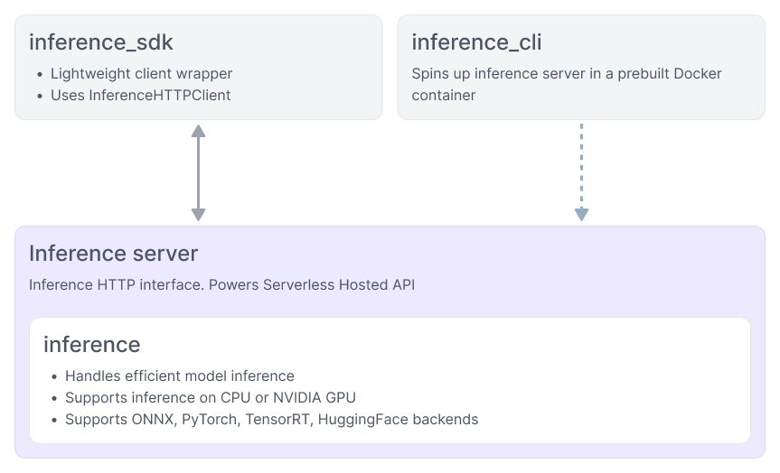

# Reference Overview

Inference has several components that work together to serve computer vision models. The diagram below shows how they fit together.

- **[inference-sdk](../inference_helpers/inference_sdk.md)** - Lightweight Python client for communicating with the Inference Server.
- **[inference-cli](../inference_helpers/inference_cli.md)** - Command-line tool for managing the Inference Server and running common tasks.
- **[Inference Server](../quickstart/docker.md)** - HTTP server (Docker) that wraps the `inference` package as a REST API.
- **[inference](../using_inference/about.md)** - Core Python package for model loading, inference, and Workflows execution.

