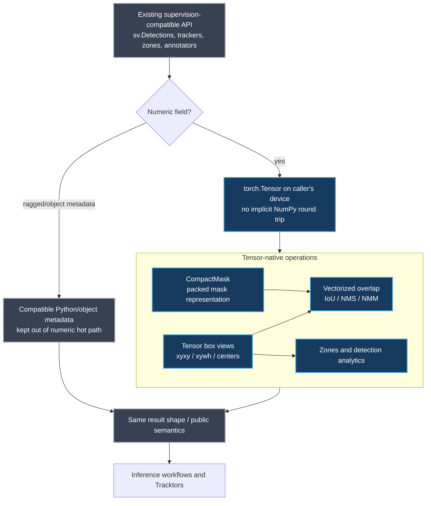
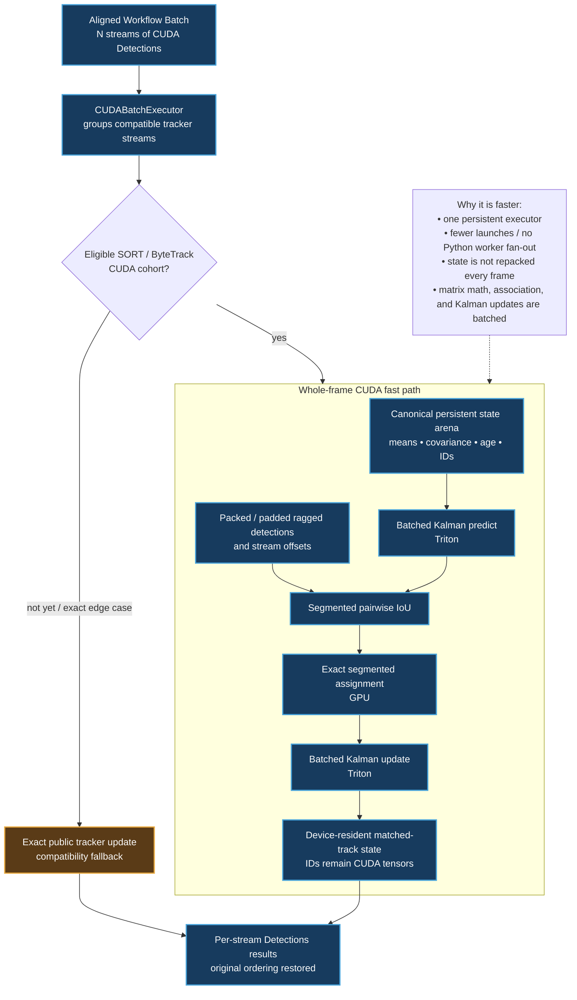
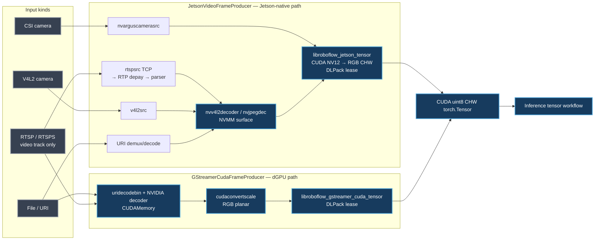

# Tensor-native video, detection, and tracking architecture

This document describes the production path added around Superiorvision,
Tracktors, and the hardware video consumers. It is deliberately a data-flow
description: the compatible public APIs remain, while numeric work stays on
the CUDA device until a caller explicitly asks for an external representation.

## One device-resident path

```mermaid
flowchart LR
    camera["Camera / file / RTSP\ncompressed video"] --> decode

    subgraph decode["Hardware video consumer"]
        gst["GStreamer / FFmpeg source"] --> hw["NVIDIA hardware decode\nNVMM or CUDAMemory"]
        hw --> bridge["Native bridge\nCUDA surface → DLPack"]
    end

    bridge --> frame["torch.Tensor\nCUDA • uint8 • CHW"]
    frame --> model["TensorRT / CUDA model"]
    model --> detections["Detection tensors\nxyxy • confidence • class • masks"]

    subgraph sv["Superiorvision — API-compatible tensor layer"]
        detections --> views["Detections / tensor views"]
        views --> geometry["IoU • box transforms • NMS/NMM\nzones • CompactMask"]
    end

    geometry --> tracktors
    subgraph tracktors["Tracktors — batched tracker execution"]
        executor["CUDABatchExecutor"] --> engines["SORT / ByteTrack whole-frame engines"]
        engines --> state["Persistent CUDA state arena"]
        state --> association["Batched IoU + assignment\nTriton Kalman predict/update"]
        association --> ids["CUDA tracker IDs + tracked tensors"]
    end

    ids --> workflow["Tensor-native Workflow blocks"]
    workflow --> boundary["Optional boundary only\nrender • serialization • external API"]

    classDef device fill:#173b5e,color:#fff,stroke:#46a2da,stroke-width:2px;
    classDef boundary fill:#5a3b17,color:#fff,stroke:#e7a73d,stroke-width:2px;
    class frame,detections,views,geometry,executor,engines,state,association,ids,workflow device;
    class boundary boundary;
```

The orange endpoint is intentional. Rendering, strings, ragged metadata,
dataset/video I/O, and serialization may need CPU-facing objects; numeric
frames, detections, association, Kalman state, and tracker IDs do not.

## Superiorvision: preserve the interface, replace the numeric substrate

The speedup is mostly not a new box formula: it removes repeated device↔host
conversion and lets all per-detection operations use vectorized Torch kernels
on tensors that the model already produced.

## Tracktors: from independent Python updates to one CUDA transaction

The fast path preserves scalar Trackers semantics. Less regular lifecycle
events (mixed confidence, spawning, retirement, or unsupported combinations)
retain an exact fallback while their device-resident plans are expanded.

## Video consumers replacing jetson-utils

The explicit Jetson RTSP chain only links the camera's video track, uses TCP by
default, queues compressed data, decodes to NVMM, and performs the NV12→RGB
conversion in CUDA. That avoids jetson-utils, avoids OpenCV's CPU frame path,
and avoids an extra VIC conversion/buffer pool. The native bridges expose
timeouts, interruption, pipeline-factory checks, and counters for host pixel
maps, host/device copies, and CUDA synchronization so the zero-copy claim is
testable rather than aspirational.
