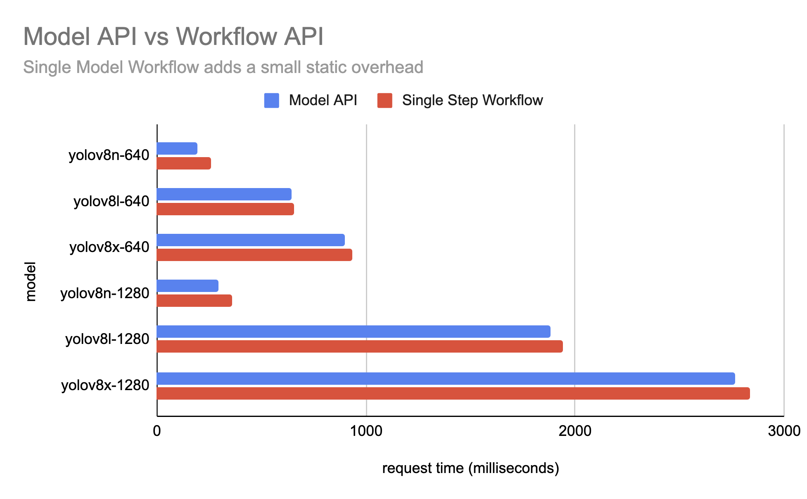

# Workflows Benchmarks

This page compares **direct** [model inference](quickstart/inference_101.md) latency versus **Workflow-wrapped inference** latency for popular detection models. The goal is to quantify the overhead introduced by the Workflows execution engine.

## Self-Hosted Results

All times are in **milliseconds**. Benchmarks were run on a server-grade NVIDIA GPU using TensorRT-optimized models, called directly via the `inference` Python package. Each model was warmed up before timing, then measured over 10 iterations.

| Model | Avg Direct (ms) | Avg Workflow (ms) | Workflow Overhead (ms) |
|-------|-----------------|-------------------|------------------------|
| rfdetr-nano | 2.65 | 4.40 | 1.75 |
| rfdetr-small | 3.17 | 4.62 | 1.45 |
| rfdetr-medium | 3.79 | 5.38 | 1.59 |
| rfdetr-large | 4.87 | 7.46 | 2.59 |
| rfdetr-xlarge | 8.44 | 10.65 | 2.21 |
| yolo26n-640 | 2.42 | 4.07 | 1.65 |
| yolo26s-640 | 3.25 | 5.48 | 2.23 |
| yolo26m-640 | 4.56 | 6.29 | 1.73 |
| yolo26l-640 | 5.76 | 8.01 | 2.25 |
| yolo26x-640 | 7.75 | 9.36 | 1.61 |

### Key Takeaways

- **Workflow overhead is minimal** — typically 1.5–2.6 ms on top of direct inference, regardless of model size.
- For larger models (e.g. `rfdetr-xlarge`), the workflow overhead is small relative to model inference time (~26%).
- For smaller, faster models (e.g. `yolo26n-640`), the overhead is proportionally larger but still under 2 ms in absolute terms.
- Workflow overhead is CPU-bound (graph scheduling, input preparation, output routing), while model inference itself typically runs on the GPU (when available). As a result, the overhead stays relatively constant regardless of GPU speed.

### Methodology

- GPU-accelerated inference (results will vary by hardware).
- Warmup: Each model and workflow engine is warmed up with one inference call before timing begins.
- Iterations: 10 timed iterations per method, per model.
- Direct inference: Uses `get_model()` and calls `model.infer()` directly.
- Workflow inference: Wraps the same model in a minimal single-step workflow and runs it through the [Execution Engine](workflows_execution_engine.md).

??? note "Click to expand benchmark script"

    ```python
    import os
    import statistics
    import time
    import argparse
    import csv
    import requests
    import numpy as np
    from PIL import Image
    from io import BytesIO

    from inference import get_model
    from inference.core.env import WORKFLOWS_MAX_CONCURRENT_STEPS, MAX_ACTIVE_MODELS
    from inference.core.managers.base import ModelManager
    from inference.core.managers.decorators.fixed_size_cache import WithFixedSizeCache
    from inference.core.registries.roboflow import RoboflowModelRegistry
    from inference.core.workflows.core_steps.common.entities import StepExecutionMode
    from inference.core.workflows.execution_engine.core import ExecutionEngine
    from inference.models.utils import ROBOFLOW_MODEL_TYPES


    def build_workflow(model_id: str) -> dict:
        """Build a minimal workflow definition for a given model (detection or classification)."""
        if "classifiers" in model_id or "classification" in model_id:
            step_type = "RoboflowClassificationModel"
        else:
            step_type = "RoboflowObjectDetectionModel"

        return {
            "version": "1.0",
            "inputs": [
                {"type": "WorkflowImage", "name": "image"},
            ],
            "steps": [
                {
                    "type": step_type,
                    "name": "model_step",
                    "image": "$inputs.image",
                    "model_id": model_id,
                }
            ],
            "outputs": [
                {
                    "type": "JsonField",
                    "name": "predictions",
                    "selector": "$steps.model_step.predictions",
                },
            ],
        }


    def main():
        parser = argparse.ArgumentParser(description="Benchmark direct inference vs. Workflow inference latency.")
        parser.add_argument("--iterations", type=int, default=10, help="Number of timed iterations per method (default: 10)")
        args = parser.parse_args()

        # Models, same list as benchmark.py
        models = [
            "classifiers/3",
            "yolo26n-640", "yolo26s-640", "yolo26m-640", "yolo26l-640", "yolo26x-640",
            "rfdetr-nano", "rfdetr-small", "rfdetr-medium", "rfdetr-large", "rfdetr-xlarge", "rfdetr-2xlarge",
        ]

        # Download the test image once
        print("Downloading test image...")
        url = "https://media.roboflow.com/inference/people-walking.jpg"
        response = requests.get(url)
        image = Image.open(BytesIO(response.content)).convert("RGB")
        image_np = np.array(image)
        print("Image ready.")

        # Initialize shared model manager for Workflow engine (reused across models)
        model_registry = RoboflowModelRegistry(ROBOFLOW_MODEL_TYPES)
        model_manager = ModelManager(model_registry=model_registry)
        model_manager = WithFixedSizeCache(model_manager, max_size=MAX_ACTIVE_MODELS)

        workflow_init_parameters = {
            "workflows_core.model_manager": model_manager,
            "workflows_core.step_execution_mode": StepExecutionMode.LOCAL,
        }

        results_file = os.path.join(os.path.dirname(os.path.abspath(__file__)), "benchmark_inference_vs_workflows.csv")
        fieldnames = [
            "model_id",
            "avg_latency_direct_ms", "min_direct_ms", "max_direct_ms", "stddev_direct_ms",
            "avg_latency_workflow_ms", "min_workflow_ms", "max_workflow_ms", "stddev_workflow_ms",
        ]

        with open(results_file, "w", newline="") as f:
            writer = csv.DictWriter(f, fieldnames=fieldnames)
            writer.writeheader()

        print(f"\nRunning {args.iterations} iterations per method for {len(models)} models...\n")

        for model_id in models:
            print(f"--- Model: {model_id} ---")

            # ── 1. Direct inference ──────────────────────────────────────────────
            direct_latencies = None
            try:
                model = get_model(model_id=model_id)

                # warmup
                model.infer(image_np)

                direct_latencies = []
                for i in range(args.iterations):
                    t0 = time.perf_counter()
                    model.infer(image_np)
                    t1 = time.perf_counter()
                    ms = (t1 - t0) * 1000.0
                    direct_latencies.append(ms)
                    print(f"  Direct   [{i+1:>2}/{args.iterations}]: {ms:.2f} ms")

                avg = statistics.mean(direct_latencies)
                mn  = min(direct_latencies)
                mx  = max(direct_latencies)
                sd  = statistics.stdev(direct_latencies) if len(direct_latencies) > 1 else 0.0
                print(f"  Direct   → avg={avg:.2f}  min={mn:.2f}  max={mx:.2f}  stddev={sd:.2f} ms")

            except Exception as e:
                print(f"  Direct FAILED: {e}")

            # ── 2. Workflow inference ────────────────────────────────────────────
            workflow_latencies = None
            try:
                workflow_def = build_workflow(model_id)

                engine = ExecutionEngine.init(
                    workflow_definition=workflow_def,
                    init_parameters=workflow_init_parameters,
                    max_concurrent_steps=WORKFLOWS_MAX_CONCURRENT_STEPS,
                )

                # warmup
                engine.run(runtime_parameters={"image": [image_np]})

                workflow_latencies = []
                for i in range(args.iterations):
                    t0 = time.perf_counter()
                    engine.run(runtime_parameters={"image": [image_np]})
                    t1 = time.perf_counter()
                    ms = (t1 - t0) * 1000.0
                    workflow_latencies.append(ms)
                    print(f"  Workflow [{i+1:>2}/{args.iterations}]: {ms:.2f} ms")

                avg = statistics.mean(workflow_latencies)
                mn  = min(workflow_latencies)
                mx  = max(workflow_latencies)
                sd  = statistics.stdev(workflow_latencies) if len(workflow_latencies) > 1 else 0.0
                print(f"  Workflow → avg={avg:.2f}  min={mn:.2f}  max={mx:.2f}  stddev={sd:.2f} ms")

            except Exception as e:
                print(f"  Workflow FAILED: {e}")

            # ── Write row ────────────────────────────────────────────────────────
            def fmt(vals, fn):
                return round(fn(vals), 2) if vals else "FAIL"

            row = {
                "model_id": model_id,
                "avg_latency_direct_ms":  fmt(direct_latencies,   statistics.mean),
                "min_direct_ms":          fmt(direct_latencies,   min),
                "max_direct_ms":          fmt(direct_latencies,   max),
                "stddev_direct_ms":       fmt(direct_latencies,   lambda v: statistics.stdev(v) if len(v) > 1 else 0.0),
                "avg_latency_workflow_ms": fmt(workflow_latencies, statistics.mean),
                "min_workflow_ms":         fmt(workflow_latencies, min),
                "max_workflow_ms":         fmt(workflow_latencies, max),
                "stddev_workflow_ms":      fmt(workflow_latencies, lambda v: statistics.stdev(v) if len(v) > 1 else 0.0),
            }

            with open(results_file, "a", newline="") as f:
                writer = csv.DictWriter(f, fieldnames=fieldnames)
                writer.writerow(row)

            print(f"  Saved.\n")

        print(f"All done! Results: {results_file}")


    if __name__ == "__main__":
        main()

    ```

## Cloud-Hosted Results

The following results were benchmarked on the hosted [Serverless API](https://docs.roboflow.com/deploy/serverless-hosted-api-v2). Some notes:

- Compared to self-hosted results, Serverless server also needs to fetch the Workflow schema and model weights (whereas Serverless model inference only fetches weights)
- There's a static 10-50ms latency overhead for Workflows


