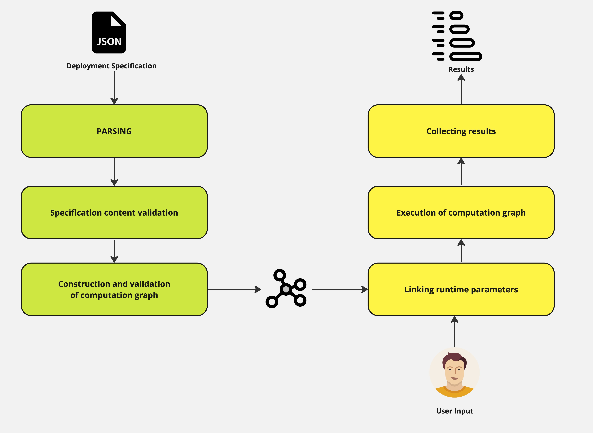
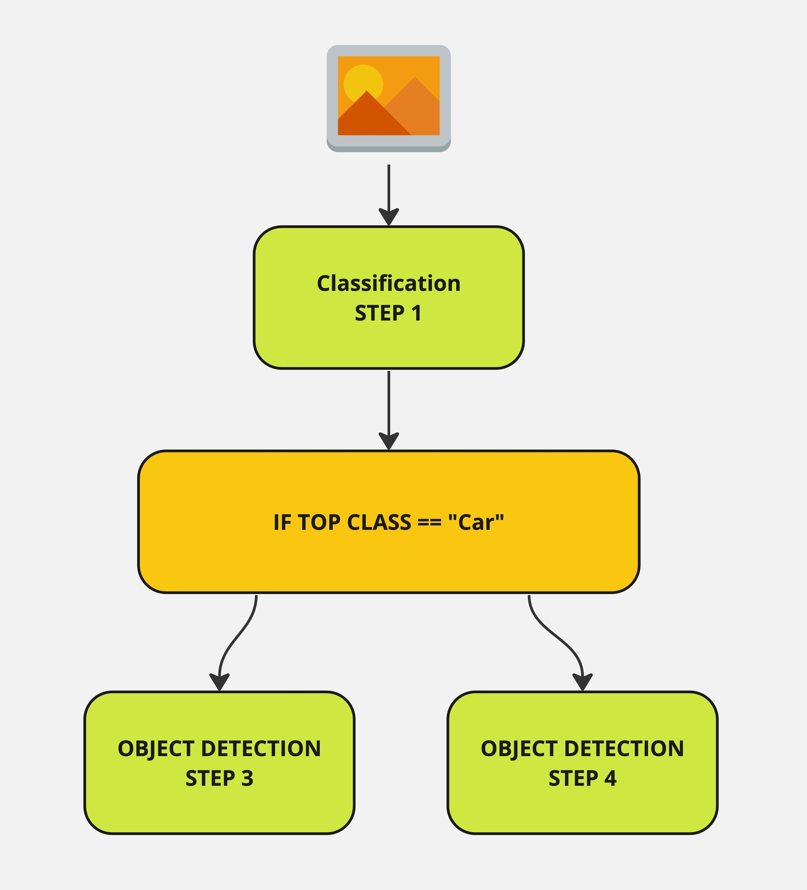

# Workflows compiler

> [!IMPORTANT] 
> We require a Roboflow Enterprise License to use this in production. See inference/enterpise/LICENSE.txt for details.


## Overview
We are under development of new feature that would allow clients to define the ML workflow in a declarative form
(JSON configuration or WYSIWYG UI) and let the `inference` care about all required computations. That goal can be
achieved thanks to the compilation and runtime engine that is created here.

The `workflows` module contains components capable to:
* parse the workflow specification (see: [schemas of configuration entities](./entities))
* validate the correctness of workflows specification (see: [validator module](./complier/validator.py))
* construct computational graph and validate its consistency prior to any computations (see: [graph parser](./complier/graph_parser.py))
* analyse runtime input parameter and link them with graph placeholders (see: [input validator](./complier/runtime_input_validator.py))
* execute the computation workflow (see: [execution engine](./complier/execution_engine.py))



## How `workflows` can be used?

### Behind Roboflow hosted API
```python
from inference_sdk import InferenceHTTPClient

client = InferenceHTTPClient(
    api_url="https://detect.roboflow.com",
    api_key="YOUR_API_KEY"
)

client.infer_from_workflow(
    specification={},  # workflow specification goes here
    images={},  # input images goes here
    parameters={},  # input parameters other than image goes here
)
```

### Behind `inference` HTTP API

Use `inference_cli` to start server
```bash
inference server start
```

```python
from inference_sdk import InferenceHTTPClient

client = InferenceHTTPClient(
    api_url="http://127.0.0.1:9001",
    api_key="YOUR_API_KEY"
)

client.infer_from_workflow(
    specification={},  # workflow specification goes here
    images={},  # input images goes here
    parameters={},  # input parameters other than image goes here
)
```

### Integration with Python code

```python
from inference.enterprise.workflows.complier.core import compile_and_execute

IMAGE = ...
result = compile_and_execute(
    workflow_specification={},
    runtime_parameters={
        "image": IMAGE,
    },
    api_key="YOUR_API_KEY",
)
```

## How to create workflow specification?

### Workflow specification basics

Workflow specification is defined via a JSON document in the following format:
```json
{
  "specification": {
    "version": "1.0",
    "inputs": [],
    "steps": [],
    "outputs": []
  }
}
```

In general, we have three main elements of specification:
* `inputs` - the section where we define all parameters that can be passed in the execution time by `inference` user
* `steps` - the section where we define computation steps, their interconnections, connections to `inputs` and `outputs`
* `outputs` - the section where we define all fields that needs to be rendered in the final result

### How can we refer between elements of specification?
To create a graph of computations, we need to define links between steps - in order to do it - we need to have a 
way to refer to specific elements. By convention, the following references are allowed: 
`${type_of_element}.{name_of_element}` and `${type_of_element}.{name_of_element}.{property}`.
Examples:
* `$inputs.image` - reference to an input called `image`
* `$steps.my_step.predictions` - reference to a step called `my_step` and its property `predictions`
Additionally, defining **outputs**, it is allowed (since `v0.9.14`) to use wildcard selector
(`${type_of_element}.{name_of_element}.*`) with intention to extract all properties of given step.

In the code, we usually call references **selectors**.

### How can we define `inputs`?
At the moment, the compiler supports two types of inputs `InferenceParameter` and `InferenceImage`.

#### `InferenceImage`
This input is reserved to represent image or list of images. Definition format:
```json
{"type": "InferenceImage", "name": "my_image"}
```
When creating `InferenceImage` you do not point a specific image - you just create a placeholder that will be linked
with other element of the graph. This placeholder will be substituted with actual image when you run the workflow 
graph and provide input parameter called `my_image` that can be `np.ndarray` or other formats that `inference` support,
like:
```json
{
  "type": "url",
  "value": "https://here.is/my/image.jpg"
}
```

### `InferenceParameter`
Similar to `InferenceImage` - `InferenceParameter` creates a placeholder for a parameters that can be used in runtime 
to alter execution of workflow graph.
```json
{"type": "InferenceParameter", "name": "confidence_threshold", "default_value": 0.5}
```
`InferenceParameters` may be optionally defined with default values that will be used, if no actual parameter 
of given name is present in user-defined input while executing the workflow graph. Type of parameter is not 
explicitly defined, but will be checked in runtime, prior to execution based on types of parameters that 
steps using this parameters can accept.

### How can we define `steps`?
Compiler supports multiple type of steps (that will be described later), but let's see how to define a simple one,
that would be responsible for making prediction from object-detection model:
```json
{
    "type": "ObjectDetectionModel",
    "name": "my_object_detection",
    "image": "$inputs.image",
    "model_id": "yolov8n-640"
}
```
You can see that the step must have its type associated (that's how we link JSON document elements into code definitions)
and name (unique within all steps). Another required parameters are `image` and `model_id`.
In case of `image` - we use reference to the input - that's how we create a link between parameter that will be provided
in runtime and computational step. Steps parameters can be also provided as predefined values (like `model_id` in this 
case). Majority of parameters can be defined both as references to inputs (or outputs of other steps) and predefined
values.

### How can we define `outputs`?
Definition of single output looks like that:
```json
{"type": "JsonField", "name": "predictions", "selector": "$steps.step_1.predictions"}
```
it defines a single output dictionary key (of name `predictions`) that will be created. `selector` field creates a
link between step output and result. In this case, selector points `step_1` and its property - `predictions`.

Additionally, optional parameter `coordinates_system` can be defined with one of two values (`"own", "parent"`).
This parameter defaults to `parent` and describe the coordinate system of detections that should be used.
This setting is only important in case of more complicated graphs (where we crop based on predicted detections and
later on make another detections on each and every crop).

### Example
In the following example, we create a pipeline that at first makes classification first. Based on results
(the top class), `step_2` decides which object detection model to use (if model predicts car, `step_3` will be executed,
`step_4` will be used otherwise).
Result is build from the outputs of all models. Always one of field `step_3_predictions` and `step_4_predictions` will
be empty due to conditional execution.

```json
{
    "specification": {
        "version": "1.0",
        "inputs": [
            {"type": "InferenceImage", "name": "image"}
        ],
        "steps": [
            {
                "type": "ClassificationModel",
                "name": "step_1",
                "image": "$inputs.image",
                "model_id": "vehicle-classification-eapcd/2",
                "confidence": 0.4
            },
            {
                "type": "Condition",
                "name": "step_2",
                "left": "$steps.step_1.top",
                "operator": "equal",
                "right": "Car",
                "step_if_true": "$steps.step_3",
                "step_if_false": "$steps.step_4"
            },
            {
                "type": "ObjectDetectionModel",
                "name": "step_3",
                "image": "$inputs.image",
                "model_id": "yolov8n-640",
                "confidence": 0.5,
                "iou_threshold": 0.4
            },
            {
                "type": "ObjectDetectionModel",
                "name": "step_4",
                "image": "$inputs.image",
                "model_id": "yolov8n-1280",
                "confidence": 0.5,
                "iou_threshold": 0.4
            }
        ],
        "outputs": [
            {"type": "JsonField", "name": "top_class", "selector": "$steps.step_1.top"},
            {"type": "JsonField", "name": "step_3_predictions", "selector": "$steps.step_3.predictions"},
            {"type": "JsonField", "name": "step_4_predictions", "selector": "$steps.step_4.predictions"}
        ]  
    }
}
```

### The notion of parents in `workflows`
Let's imagine a scenario when we have a graph definition that requires inference from object detection model on input 
image. For each image that we have as an input - there will be most likely several detections. There is nothing that
prevents us to do something with those detections. For instance, we can crop original image to extract RoIs with objects
that the model detected. For each crop, we may then apply yet another, specialised object detection model to 
detect lower resolution details. As you probably know, when `inference` makes prediction, it outputs the coordinates
of detections scaled to the size of input image. But in this example, the input image is unknown when we start the 
process - those will be inferred by first model. To make it possible to combine predictions, we introduced `parent_id`
identifier of prediction. It will be randomly generated string or name of input element that is responsible for 
certain prediction. 

In our example, each detection from first model will be assigned unique identifier (`detection_id`). This identifier 
will be a `parent_id` for each prediction that is made based on the crop originated in detection. What is more,
each output can be `coordinates_system` parameter deciding how to present the result. If `parent` coordinates 
mode is selected - detections made against crop will be translated to the coordinates of original image that was
submitted. Thanks to that, results can be easily overlay on the input image (for instance using `supervision` library). 

### What kind of steps are available?

#### `ClassificationModel`
This step represents inference from multi-class classification model.

##### Step parameters
* `type`: must be `ClassificationModel` (required)
* `name`: must be unique within all steps - used as identifier (required)
* `model_id`: must be either valid Roboflow model ID or selector to  input parameter (required)
* `image`: must be a reference to input of type `InferenceImage` or `crops` output from steps executing cropping (
`Crop`, `AbsoluteStaticCrop`, `RelativeStaticCrop`) (required)
* `disable_active_learning`: optional boolean flag to control Active Learning at request level - can be selector to 
input parameter 
* `confidence`: optional float value in range [0, 1] with threshold - can be selector to 
input parameter 
* `active_learning_target_dataset`: optional name of target dataset (or reference to `InferenceParemeter`) 
dictating that AL should collect data to a different dataset than the one declared with model

##### Step outputs:
* `predictions` - details of predictions
* `top` - top class
* `confidence` - confidence of prediction
* `parent_id` - identifier of parent image / associated detection that helps to identify predictions with RoI in case
of multi-step pipelines
* `prediction_type` - denoting `classification` model

#### `MultiLabelClassificationModel`
This step represents inference from multi-label classification model.

##### Step parameters
* `type`: must be `MultiLabelClassificationModel` (required)
* `name`: must be unique within all steps - used as identifier (required)
* `model_id`: must be either valid Roboflow model ID or selector to  input parameter (required)
* `image`: must be a reference to input of type `InferenceImage` or `crops` output from steps executing cropping (
`Crop`, `AbsoluteStaticCrop`, `RelativeStaticCrop`) (required)
* `disable_active_learning`: optional boolean flag to control Active Learning at request level - can be selector to 
input parameter 
* `confidence`: optional float value in range [0, 1] with threshold - can be selector to 
input parameter 
* `active_learning_target_dataset`: optional name of target dataset (or reference to `InferenceParemeter`) 
dictating that AL should collect data to a different dataset than the one declared with model

##### Step outputs:
* `predictions` - details of predictions
* `predicted_classes` - top classes
* `parent_id` - identifier of parent image / associated detection that helps to identify predictions with RoI in case
of multi-step pipelines
* `prediction_type` - denoting `classification` model

#### `ObjectDetectionModel`
This step represents inference from object detection model.

##### Step parameters
* `type`: must be `ObjectDetectionModel` (required)
* `name`: must be unique within all steps - used as identifier (required)
* `model_id`: must be either valid Roboflow model ID or selector to  input parameter (required)
* `image`: must be a reference to input of type `InferenceImage` or `crops` output from steps executing cropping (
`Crop`, `AbsoluteStaticCrop`, `RelativeStaticCrop`) (required)
* `disable_active_learning`: optional boolean flag to control Active Learning at request level - can be selector to 
input parameter 
* `confidence`: optional float value in range [0, 1] with threshold - can be selector to 
input parameter 
* `class_agnostic_nms`: optional boolean flag to control NMS - can be selector to 
input parameter 
* `class_filter`: optional list of classes using as filter - can be selector to 
input parameter 
* `iou_threshold`: optional float value in range [0, 1] with NMS IoU threshold - can be selector to 
input parameter. Default: `0.3`.
* `max_detections`: optional integer parameter of NMS - can be selector to input parameter 
* `max_candidates`: optional integer parameter of NMS - can be selector to input parameter 
* `active_learning_target_dataset`: optional name of target dataset (or reference to `InferenceParemeter`) 
dictating that AL should collect data to different dataset that the one declared with model

##### Step outputs:
* `predictions` - details of predictions
* `image` - size of input image, that `predictions` coordinates refers to 
* `parent_id` - identifier of parent image / associated detection that helps to identify predictions with RoI in case
of multi-step pipelines
* `prediction_type` - denoting `object-detection` model

#### `KeypointsDetectionModel`
This step represents inference from keypoints detection model.

##### Step parameters
* `type`: must be `KeypointsDetectionModel` (required)
* `name`: must be unique within all steps - used as identifier (required)
* `model_id`: must be either valid Roboflow model ID or selector to  input parameter (required)
* `image`: must be a reference to input of type `InferenceImage` or `crops` output from steps executing cropping (
`Crop`, `AbsoluteStaticCrop`, `RelativeStaticCrop`) (required)
* `disable_active_learning`: optional boolean flag to control Active Learning at request level - can be selector to 
input parameter 
* `confidence`: optional float value in range [0, 1] with threshold - can be selector to 
input parameter 
* `class_agnostic_nms`: optional boolean flag to control NMS - can be selector to 
input parameter 
* `class_filter`: optional list of classes using as filter - can be selector to 
input parameter 
* `iou_threshold`: optional float value in range [0, 1] with NMS IoU threshold - can be selector to 
input parameter. Default: `0.3`.
* `max_detections`: optional integer parameter of NMS - can be selector to input parameter 
* `max_candidates`: optional integer parameter of NMS - can be selector to input parameter 
* `keypoint_confidence`: optional float value in range [0, 1] with keypoints confidence threshold - can be selector to 
input parameter 
* `active_learning_target_dataset`: optional name of target dataset (or reference to `InferenceParemeter`) 
dictating that AL should collect data to different dataset that the one declared with model

##### Step outputs:
* `predictions` - details of predictions
* `image` - size of input image, that `predictions` coordinates refers to 
* `parent_id` - identifier of parent image / associated detection that helps to identify predictions with RoI in case
of multi-step pipelines
* `prediction_type` - denoting `keypoint-detection` model

#### `InstanceSegmentationModel`
This step represents inference from instance segmentation model.

##### Step parameters
* `type`: must be `InstanceSegmentationModel` (required)
* `name`: must be unique within all steps - used as identifier (required)
* `model_id`: must be either valid Roboflow model ID or selector to  input parameter (required)
* `image`: must be a reference to input of type `InferenceImage` or `crops` output from steps executing cropping (
`Crop`, `AbsoluteStaticCrop`, `RelativeStaticCrop`) (required)
* `disable_active_learning`: optional boolean flag to control Active Learning at request level - can be selector to 
input parameter 
* `confidence`: optional float value in range [0, 1] with threshold - can be selector to 
input parameter 
* `class_agnostic_nms`: optional boolean flag to control NMS - can be selector to 
input parameter 
* `class_filter`: optional list of classes using as filter - can be selector to 
input parameter 
* `iou_threshold`: optional float value in range [0, 1] with NMS IoU threshold - can be selector to 
input parameter. Default: `0.3`.
* `max_detections`: optional integer parameter of NMS - can be selector to input parameter 
* `max_candidates`: optional integer parameter of NMS - can be selector to input parameter 
* `mask_decode_mode`: optional parameter of post-processing - can be selector to input parameter 
* `tradeoff_factor`: optional parameter of post-processing - can be selector to 
input parameter 
* `active_learning_target_dataset`: optional name of target dataset (or reference to `InferenceParemeter`) 
dictating that AL should collect data to different dataset that the one declared with model

##### Step outputs:
* `predictions` - details of predictions
* `image` - size of input image, that `predictions` coordinates refers to 
* `parent_id` - identifier of parent image / associated detection that helps to identify predictions with RoI in case
of multi-step pipelines
* `prediction_type` - denoting `instance-segmentation` model

#### `OCRModel`
This step represents inference from OCR model.

##### Step parameters
* `type`: must be `OCRModel` (required)
* `name`: must be unique within all steps - used as identifier (required)
* `image`: must be a reference to input of type `InferenceImage` or `crops` output from steps executing cropping (
`Crop`, `AbsoluteStaticCrop`, `RelativeStaticCrop`) (required)

##### Step outputs:
* `result` - details of predictions
* `parent_id` - identifier of parent image / associated detection that helps to identify predictions with RoI in case
of multi-step pipelines
* `prediction_type` - denoting `ocr` model

#### `Crop`
This step produces **dynamic** crops based on detections from detections-based model.

##### Step parameters
* `type`: must be `Crop` (required)
* `name`: must be unique within all steps - used as identifier (required)
* `image`: must be a reference to input of type `InferenceImage` or `crops` output from steps executing cropping (
`Crop`, `AbsoluteStaticCrop`, `RelativeStaticCrop`) (required)
* `detections`: must be a reference to `predictions` property of steps: [`ObjectDetectionModel`, 
`KeypointsDetectionModel`, `InstanceSegmentationModel`, `DetectionFilter`, `DetectionsConsensus`, `YoloWorld`] (required)

##### Step outputs:
* `crops` - `image` cropped based on `detections`
* `parent_id` - identifier of parent image / associated detection that helps to identify predictions with RoI in case
of multi-step pipelines

#### `QRCodeDetection`
This step represents inference from QR Code Detection.

##### Step parameters
* `type`: must be `QRCodeDetection` (required)
* `name`: must be unique within all steps - used as identifier (required)
* `image`: must be a reference to input of type `InferenceImage` or `crops` output from steps executing cropping (
`Crop`, `AbsoluteStaticCrop`, `RelativeStaticCrop`) (required)

##### Step outputs:
* `predictions` - details of predictions
    * Note: `predictions.data` is a string which is populated with the data contents of the QR code.
* `image` - size of input image, that `predictions` coordinates refers to
* `parent_id` - identifier of parent image / associated detection that helps to identify predictions with RoI in case
of multi-step pipelines
* `prediction_type` - denoting `qrcode-detection` model

#### `BarcodeDetection`
This step represents inference from barcode Detection.

##### Step parameters
* `type`: must be `BarcodeDetection` (required)
* `name`: must be unique within all steps - used as identifier (required)
* `image`: must be a reference to input of type `InferenceImage` or `crops` output from steps executing cropping (
`Crop`, `AbsoluteStaticCrop`, `RelativeStaticCrop`) (required)

##### Step outputs:
* `predictions` - details of predictions
    * Note: `predictions.data` is a string which is populated with the data contents of the QR code.
* `image` - size of input image, that `predictions` coordinates refers to
* `parent_id` - identifier of parent image / associated detection that helps to identify predictions with RoI in case
of multi-step pipelines
* `prediction_type` - denoting `barcode-detection` model


#### `Condition`
This step is responsible for flow-control in execution graph based on the condition defined in its body.
As for now, only capable to make conditions based on output of binary operators that takes two operands.

**IMPORTANT NOTE:** `Condition` step is only capable to operate, when single image is provided to the 
input of the `workflow` (or more precisely, both `left` and `right` if provided with reference, then
the reference can only hold value for a result of operation made against single input). This is to 
prevent situation when evaluation of condition for multiple images yield different execution paths.  

##### Step parameters
* `type`: must be `Condition` (required)
* `name`: must be unique within all steps - used as identifier (required)
* `left`: left operand of `operator`, can be actual value, reference to input or step output (required)
* `right`: left operand of `operator`, can be actual value, reference to input or step output (required)
* `operator`: one of `equal`, `not_equal`, `lower_than`, `greater_than`, `lower_or_equal_than`, `greater_or_equal_than`, 
`in`, `str_starts_with` (meaning `left` ends with `right`), `str_ends_with` (meaning `left` starts with `right`), 
`str_contains` (meaning `left` contains `right`) (required)
* `step_if_true`: reference to the step that will be executed if condition is true (required)
* `step_if_false`: reference to the step that will be executed if condition is false (required)


#### `DetectionFilter`
This step is responsible for filtering detections based predictions based on conditions defined.

##### Step parameters
* `type`: must be `DetectionFilter` (required)
* `name`: must be unique within all steps - used as identifier (required)
* `predictions`: reference to `predictions` output of the detections model: [`ObjectDetectionModel`, 
`KeypointsDetectionModel`, `InstanceSegmentationModel`, `DetectionFilter`, `DetectionsConsensus`, `DetectionOffset`, `YoloWorld`] (required)
* `filter_definition`: definition of the filter (required)

Filter definition can be either `DetectionFilterDefinition`
```json
{
  "type": "DetectionFilterDefinition",
  "field_name": "confidence",
  "operator": "greater_or_equal_than",
  "reference_value": 0.2
}
```
or `CompoundDetectionFilterDefinition`
```json
{
    "type": "CompoundDetectionFilterDefinition",
    "left": {
        "type": "DetectionFilterDefinition",
        "field_name": "class_name",
        "operator": "equal",
        "reference_value": "car"
    },
    "operator": "and",
    "right": {
        "type": "DetectionFilterDefinition",
        "field_name": "confidence",
        "operator": "greater_or_equal_than",
        "reference_value": 0.2
    }
}
```

where `DetectionFilterDefinition` uses binary operator and the left operand is detection field pointed by `field_name`
and right operand is `reference_value`. `"operaror"` can be filled with values:
* `equal` (field value equal to `reference_value`)
* `not_equal`
* `lower_than`
* `greater_than`
* `lower_or_equal_than`
* `greater_or_equal_than`
* `in` (field value in range of `reference_value`)
* `str_starts_with` (field value - string - starts from `reference_value`)
* `str_ends_with` (field value - string - ends with `reference_value`)
* `str_contains` (field value - string - contains substring pointed in `reference_value`)

In case if `CompoundDetectionFilterDefinition`, logical operators `or`, `and` can be used to combine simple filters.
This let user define recursive structure of filters.

##### Step outputs:
* `predictions` - details of predictions
* `image` - size of input image, that `predictions` coordinates refers to 
* `parent_id` - identifier of parent image / associated detection that helps to identify predictions with RoI in case
of multi-step pipelines
* `prediction_type` - denoting parent model type

#### `DetectionOffset`
This step is responsible for applying fixed offset on width and height of detections.


##### Step parameters
* `type`: must be `DetectionOffset` (required)
* `name`: must be unique within all steps - used as identifier (required)
* `predictions`: reference to `predictions` output of the detections model: [`ObjectDetectionModel`, 
`KeypointsDetectionModel`, `InstanceSegmentationModel`, `DetectionFilter`, `DetectionsConsensus`, `DetectionOffset`, `YoloWorld`] (required)
* `offset_x`: reference to input parameter of integer value for detection width offset (required)
* `offset_y`: reference to input parameter of integer value for detection height offset (required)

##### Step outputs:
* `predictions` - details of predictions
* `image` - size of input image, that `predictions` coordinates refers to 
* `parent_id` - identifier of parent image / associated detection that helps to identify predictions with RoI in case
of multi-step pipelines
* `prediction_type` - denoting parent model type


#### `AbsoluteStaticCrop` and `RelativeStaticCrop`
Responsible for cropping RoIs from images - using absolute coordinates (integer pixel values) or relative coordinates
(fraction of width and height in range [0.0, 1.0]) respectively.

##### Step parameters
* `type`: must be `AbsoluteStaticCrop` / `RelativeStaticCrop` (required)
* `name`: must be unique within all steps - used as identifier (required)
* `image`: must be a reference to input of type `InferenceImage` or `crops` output from steps executing cropping (
`Crop`, `AbsoluteStaticCrop`, `RelativeStaticCrop`) (required)
* `x_center`: OX center coordinate of crop or reference to `InputParameter` - must be integer for `AbsoluteStaticCrop`
or float in range [0.0, 1.0] in case of `RelativeStaticCrop`
* `y_center`: OY center coordinate of crop or reference to `InputParameter` - must be integer for `AbsoluteStaticCrop`
or float in range [0.0, 1.0] in case of `RelativeStaticCrop`
* `width`: width of crop or reference to `InputParameter` - must be integer for `AbsoluteStaticCrop`
or float in range [0.0, 1.0] in case of `RelativeStaticCrop`
* `height`: height of crop or reference to `InputParameter` - must be integer for `AbsoluteStaticCrop`
or float in range [0.0, 1.0] in case of `RelativeStaticCrop`

##### Step outputs:
* `crops` - `image` cropped based on step parameters
* `parent_id` - identifier of parent image / associated detection that helps to identify predictions with RoI in case
of multi-step pipelines

#### `ClipComparison`
Step to execute comparison of Clip embeddings between image and text.

##### Step parameters
* `type`: must be `ClipComparison` (required)
* `name`: must be unique within all steps - used as identifier (required)
* `image`: must be a reference to input of type `InferenceImage` or `crops` output from steps executing cropping (
`Crop`, `AbsoluteStaticCrop`, `RelativeStaticCrop`) (required)
* `text`: reference to `InputParameter` of list of texts to compare against `image` using Clip model

##### Step outputs:
* `similarity` - for each element of `image` - list of float values representing similarity to each element of `text`
* `parent_id` - identifier of parent image / associated detection that helps to identify predictions with RoI in case
of multi-step pipelines


#### `DetectionsConsensus`
Step that is meant to combine predictions from potentially multiple detections models. 
Steps checks for object presence (according to configurable criteria), combines detections and
decides on requested objects presence (based on overlap of predictions from different models). It works for 
`object-detection`, `instance-segmentation` and `keypoint-detection` models, but consensus output is only
applied at detections level. 

Step executes following operations (in order):
* get only the predictions from `classes_to_consider` (if specified)
* for every prediction finds predictions with max overlap from all other sources (at most one per source) that reaches 
`iou_threshold` 
* for each group of overlapping predictions from different sources - if the size of group is at least
`required_votes` and merged boxe meet `confidence` threshold - those are discarded from the pool of detections to be 
picked up and are merged into element of `predictions` output that can be called consensus output. 
`class_aware` parameter decides if class names matter while merging - should be `False` when different class names are 
produced by different models  but the visual concept that models predict is the same.
* merge is done based on `detections_merge_confidence_aggregation` and `detections_merge_coordinates_aggregation` 
parameters that control how to pick the merged box class, confidence and box coordinates
* once all elements of consensus outputs are ready, the step prepares `object_present` status
and `presence_confidence` that form a summary of consensus output. One may state `required_objects`
as integer or dict mapping class name to required instance of objects. In the final state, the step
logic will check if required number of objects (possibly from different classes) are detected in consensus
output. If that's the case - `object_present` field will be `True` and `presence_confidence` will be calculated
(using `presence_confidence_aggregation` method). Otherwise - `presence_confidence` will be an empty dict.
In the case of `class_aware=False`:
  * when `required_objects` is dict with class to count mapping - effective `required_objects` will be sum of dictionary 
  values
  * the `presence_confidence` will hold `any_object` key with confidence aggregated among all merged detections. 


##### Step parameters
* `type`: must be `DetectionsConsensus` (required)
* `name`: must be unique within all steps - used as identifier (required)
* `predictions`: list of selectors pointing to outputs of detections models output of the detections model: [`ObjectDetectionModel`, 
`KeypointsDetectionModel`, `InstanceSegmentationModel`, `DetectionFilter`, `DetectionsConsensus`, `YoloWorld`] (required, must contain at least 2 elements)
* `required_votes`: number of models that must agree on the detection - integer or selector pointing at
`InferenceParameter` (required)
* `class_aware`: flag deciding if class names are taken into account when finding overlapping bounding boxes
from multiple models and object presence check. Can be `bool` or selector to `InferenceParameter`. Default: `True`
* `iou_threshold`: optional float value in range [0, 1] with IoU threshold that must be meet to consider
two bounding boxes overlapping. Can be float or selector to `InferenceParameter`. Default: `0.3`.
* `confidence`: optional float value in range [0, 1] minimal confidence of **aggregated** detection that must be met to 
be taken into account in presence assessment and consensus procedure. For prior-consensus filtering - use
confidence threshold at model level or `DetectionsFilter`. Default: `0.0`.
* `classes_to_consider`: Optional list of classes to consider in consensus procedure.
Can be list of `str` or selector to `InferenceParameter`. Default: `None` - in this case 
classes filtering of predictions will not be enabled.
* `required_objects` - If given, it holds the number of objects that must be present in merged results, to assume that 
object presence is reached. Can be selector to `InferenceParameter`, integer value or dictionary with mapping of class name into
minimal number of merged detections of given class to assume consensus.
* `presence_confidence_aggregation` - mode dictating aggregation of confidence scores
and classes both in case of object presence deduction procedure. One of `average`, `max`, `min`. Default: `max`.
* `detections_merge_confidence_aggregation` - mode dictating aggregation of confidence scores
and classes both in case of boxes consensus procedure. 
One of `average`, `max`, `min`. Default: `average`. While using for merging overlapping boxes, 
against classes - `average` equals to majority vote, `max` - for the class of detection with max confidence,
`min` - for the class of detection with min confidence.
* `detections_merge_coordinates_aggregation` - mode dictating aggregation of bounding boxes. One of `average`, `max`, `min`. 
Default: `average`. `average` means taking mean from all boxes coordinates, `min` - taking smallest box, `max` - taking 
largest box.

##### Step outputs:
* `predictions` - details of predictions
* `image` - size of input image, that `predictions` coordinates refers to 
* `parent_id` - identifier of parent image / associated detection that helps to identify predictions with RoI in case
of multi-step pipelines (can be `undefined` if all sources of predictions give no prediction)
* `object_present` - for each input image, boolean flag with information whether or not
objects specified in config are present
* `presence_confidence` - for each input image, for each present class - aggregated confidence indicating presence
of objects
* `prediction_type` - denoting `object-detection` prediction (as this format is effective even if other detections 
models are combined)

#### `ActiveLearningDataCollector`
Step that is supposed to be a solution for anyone who wants to collect data and predictions that flow through the 
`workflows`. The block is build on the foundations of Roboflow Active Learning capabilities implemented in 
[`active_learning` module](../../core/active_learning/README.md) - so all the capabilities should be preserved.
There are **very important** considerations regarding collecting data with AL at the `workflows` level and in 
scope of specific models. Read `important notes` section to discover nuances.
General use-cases for this block:
* grab data and predictions from single model / ensemble of models
* posting the data in different project that the origin of models used in `workflow` - in particular **one may now use
open models - like `yolov8n-640` and start sampling data to their own project!**
* defining multiple different sampling strategies for different `workflows` (step allows to provide custom config of AL
data collection - so you are not bounded to configuration of AL at the project level - and multiple instances of 
configs can co-exist)

##### Step parameters
* `type`: must be `ActiveLearningDataCollector` (required)
* `name`: must be unique within all steps - used as identifier (required)
* `image`: must be a reference to input of type `InferenceImage` or `crops` output from steps executing cropping (
`Crop`, `AbsoluteStaticCrop`, `RelativeStaticCrop`) (required)
* `predictions` - selector pointing to outputs of detections models output of the detections model: [`ObjectDetectionModel`, 
`KeypointsDetectionModel`, `InstanceSegmentationModel`, `DetectionFilter`, `DetectionsConsensus`, `YoloWorld`] (then use `$steps.<det_step_name>.predictions`)
or outputs of classification [`ClassificationModel`] (then use `$steps.<cls_step_name>.top`) (required)
* `target_dataset` - name of Roboflow dataset / project to be used as target for collected data (required)
* `target_dataset_api_key` - optional API key to be used for data registration. This may help in a scenario when data
are to be registered cross-workspaces. If not provided - the API key from a request would be used to register data (
applicable for Universe models predictions to be saved in private workspaces and for models that were trained in the same 
workspace (not necessarily within the same project)).
* `disable_active_learning` - boolean flag that can be also reference to input - to arbitrarily disable data collection
for specific request - overrides all AL config. (optional, default: `False`)
* `active_learning_configuration` - optional configuration of Active Learning data sampling in the exact format provided
in [`active_learning` docs](../../core/active_learning/README.md)

##### Step outputs
No outputs are declared - step is supposed to cause side effect in form of data sampling and registration. 

##### Important notes
* this block is implemented in non-async way - which means that in certain cases it can block event loop causing
parallelization not feasible. This is not the case when running in `inference` HTTP container. At Roboflow 
hosted platform - registration cannot be executed as background task - so its duration must be added into expected 
latency
* **important :exclamation:** be careful in enabling / disabling AL at the level of steps - remember that when 
predicting from each model, `inference` HTTP API tries to get Active Learning config from the project that model
belongs to and register datapoint. To prevent that from happening - model steps can be provided with 
`disable_active_learning=True` parameter. Then the only place where AL registration happens is `ActiveLearningDataCollector`.
* **important :exclamation:** be careful with names of sampling strategies if you define Active Learning configuration - 
you should keep them unique not only within a single config, but globally in project - otherwise limits accounting may
not work well

#### `YoloWorld`
This `workflows` block is supposed to bring [Yolo World model](https://blog.roboflow.com/what-is-yolo-world/) to the
`workflows` world! You can use it in a very similar way as other object detection models within `workflows`.

**IMPORTANT:** This step for now only works in Python package and `inference` HTTP container hosted locally.
Hosted Roboflow platform does not expose this model - hence you cannot use workflow with this step against
`https://detect.roboflow.com` API and you cannot use it in combination with `remote` execution when remote
target is set to `hosted` (applies for Python package and `inference` HTTP container).

##### Step parameters
* `type`: must be `YoloWorld` (required)
* `name`: must be unique within all steps - used as identifier (required)
* `image`: must be a reference to input of type `InferenceImage` or `crops` output from steps executing cropping (
`Crop`, `AbsoluteStaticCrop`, `RelativeStaticCrop`) (required)
* `class_names` - must be reference to parameter or list of strings with names of classes to be detected - Yolo World 
model makes it possible to predict across classes that you pass in the runtime - so in each request to `workflows` you 
may detect different objects without model retraining. (required)
* `version` - allows to specify model version. It is optional parameter, but when value is given it must be one of 
[`s`, `m`, `l`]
* `confidence` - optional parameter to specify confidence threshold. If given - must be number in range `[0.0, 1.0]`

##### Step outputs
* `predictions` - details of predictions
* `image` - size of input image, that `predictions` coordinates refers to 
* `parent_id` - identifier of parent image / associated detection that helps to identify predictions with RoI in case
of multi-step pipelines
* `prediction_type` - denoting `keypoint-detection` model

#### `LMM`
This block is to be used to include Large Multimodal Models into `workflows`. With this block in place, one may
prompt both `GPT-4V` and `CogVLM` models and combine their outputs with other workflow components, effectively building
powerful applications without single line of code written. 
Block allows to specify structure of expected output, automatically inject the specification into prompt and 
parse expected structure into block outputs that are accessible (and can be referred) by other `workflows` components.
LMMs may occasionally produce non-parsable results according to specified output structure - in that cases, 
outputs will be filled with `not_detected` value.

##### Step parameters
* `type`: must be `LMM` (required)
* `name`: must be unique within all steps - used as identifier (required)
* `image`: must be a reference to input of type `InferenceImage` or `crops` output from steps executing cropping (
`Crop`, `AbsoluteStaticCrop`, `RelativeStaticCrop`) (required)
* `prompt`: must be string of reference to `InferenceParameter` - value holds unconstrained text prompt to LMM model 
(required).   
* `lmm_type`: must be string of reference to `InferenceParameter` - value holds the type of LMM model to be used - 
allowed values: `gpt_4v` and `cog_vlm` (required)
* `lmm_config`: (optional) structure that has the following schema:
```json
{
  "max_tokens": 450,
  "gpt_image_detail": "low",
  "gpt_model_version": "gpt-4-vision-preview"
}
```
to control inner details of LMM prompting. All parameters now are suited to control GPT API calls. Default for
max tokens is `450`, `gpt_image_detail` default is `auto` (allowed values: `low`, `auto`, `high`), 
`gpt_model_version` is `gpt-4-vision-preview`.
* `remote_api_key` - optional string or reference to `InferenceParameter` that holds API key required to
call LMM model - in current state of development, we require OpenAI key when `lmm_type=gpt_4v` and
do not require additional API key for CogVLM calls.
* `json_output`: optional `dict[str, str]` (pointing expected output JSON field name to its description)
or reference to `InferenceParameter` with such dict. This field is used to instruct model on expected output 
format. One may not specify field names: `["raw_output", "structured_output", "image", "parent_id"]`, due to the
fact that keys from `json_output` dict will be registered as block outputs (to be referred by other blocks) and
cannot collide with basic outputs of that block. Additional outputs **will only be registered if defined in-place, 
not via `InferenceParameter`).

##### Step outputs
* `raw_output` - raw output of LMM for each input image
* `structured_output` - if `json_output` is specified, whole parsed dictionary for each input image will be placed in this field, 
otherwise for each image, empty dict will be returned
* `image` - size of input image, that `predictions` coordinates refers to 
* `parent_id` - identifier of parent image / associated detection that helps to identify predictions with RoI in case
of multi-step pipelines
* for each of `json_output` - dedicated field will be created (with values provided image-major) - and those can be 
referred as normal outputs (`$steps.{step_name}.{field_name}`).

##### Important notes
* `CogVLM` can only be used in `self-hosted` API - as Roboflow platform does not support such model. 
Use `inference server start` on a machine with GPU to test that model.

#### `LMMForClassification`
This block is dedicated to use LMMs (both `GPT-4V` and `CogVLM` models) as zer-shot classification blocks - and make it
possible to combine those with other `workflows` blocks as if LMM were classifier model - one may for instance 
registered the outputs using `ActiveLearningDataCollector`.

##### Step parameters
* `type`: must be `LMM` (required)
* `name`: must be unique within all steps - used as identifier (required)
* `image`: must be a reference to input of type `InferenceImage` or `crops` output from steps executing cropping (
`Crop`, `AbsoluteStaticCrop`, `RelativeStaticCrop`) (required)
* `lmm_type`: must be string of reference to `InferenceParameter` - value holds the type of LMM model to be used - 
allowed values: `gpt_4v` and `cog_vlm` (required)
* `classes` - non-empty list of class names (strings) or reference to `InferenceParameter` that holds this value. 
Classes are presented to LMM in prompt and model is asked to produce structured classification output (required).
* `remote_api_key` - optional string or reference to `InferenceParameter` that holds API key required to
call LMM model - in current state of development, we require OpenAI key when `lmm_type=gpt_4v` and
do not require additional API key for CogVLM calls.
* `lmm_config`: (optional) structure that has the following schema:
```json
{
  "max_tokens": 450,
  "gpt_image_detail": "low",
  "gpt_model_version": "gpt-4-vision-preview"
}
```
to control inner details of LMM prompting. All parameters now are suited to control GPT API calls. Default for
max tokens is `450`, `gpt_image_detail` default is `auto` (allowed values: `low`, `auto`, `high`), 
`gpt_model_version` is `gpt-4-vision-preview`.

##### Step outputs
* `raw_output` - raw output of LMM for each input image
* `top` - name of predicted class for each image
* `image` - size of input image, that `predictions` coordinates refers to 
* `parent_id` - identifier of parent image / associated detection that helps to identify predictions with RoI in case
of multi-step pipelines
* `prediction_type` - type of prediction output: `classification`

##### Important notes
* `CogVLM` can only be used in `self-hosted` API - as Roboflow platform does not support such model. 
Use `inference server start` on a machine with GPU to test that model.

## Different modes of execution
Workflows can be executed in `local` environment, or `remote` environment can be used. `local` means that model steps
will be executed within the context of process running the code. `remote` will re-direct model steps into remote API
using HTTP requests to send images and get predictions back. 

When `workflows` are used directly, in Python code - `compile_and_execute(...)` and `compile_and_execute_async(...)`
functions accept `step_execution_mode` parameter that controls the execution mode.

Additionally, `max_concurrent_steps` parameter dictates how many steps in parallel can be executed. This will
improve efficiency of `remote` execution (up to the limits of remote API capacity) and can improve `local` execution
if `model_manager` instance is capable of running parallel requests (only using extensions from 
`inference.enterprise.parallel`).

There are environmental variables that controls `workflows` behaviour:
* `DISABLE_WORKFLOW_ENDPOINTS` - disabling workflows endpoints from HTTP API
* `WORKFLOWS_STEP_EXECUTION_MODE` - with values `local` and `remote` allowed to control how `workflows` are executed
in `inference` HTTP container
* `WORKFLOWS_REMOTE_API_TARGET` - with values `hosted` and `self-hosted` allowed - to point API to be used in `remote`
execution mode
* `LOCAL_INFERENCE_API_URL` will be used if `WORKFLOWS_REMOTE_API_TARGET=self-hosted` and 
`WORKFLOWS_STEP_EXECUTION_MODE=remote`
* `WORKFLOWS_MAX_CONCURRENT_STEPS` - max concurrent steps to be allowed by `workflows` executor
* `WORKFLOWS_REMOTE_EXECUTION_MAX_STEP_BATCH_SIZE` - max batch size for requests into remote API made when `remote`
execution mode is chosen
* `WORKFLOWS_REMOTE_EXECUTION_MAX_STEP_CONCURRENT_REQUESTS` - max concurrent requests to be possible in scope of
single step execution when `remote` execution mode is chosen
