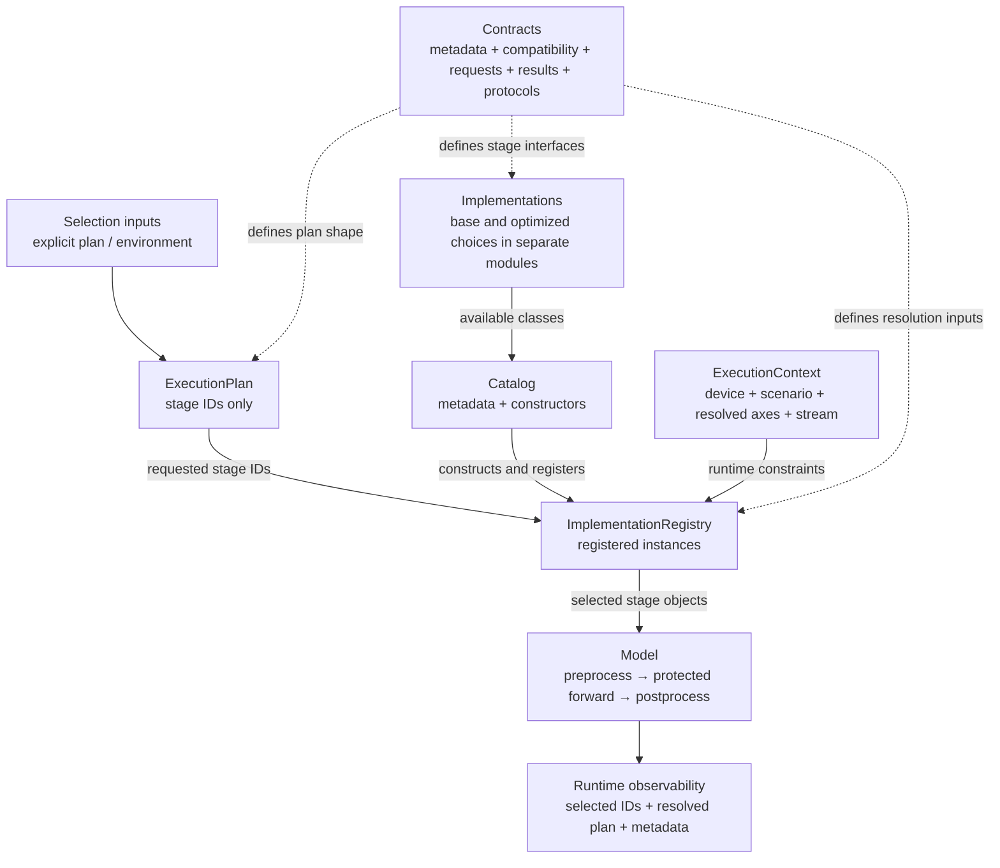
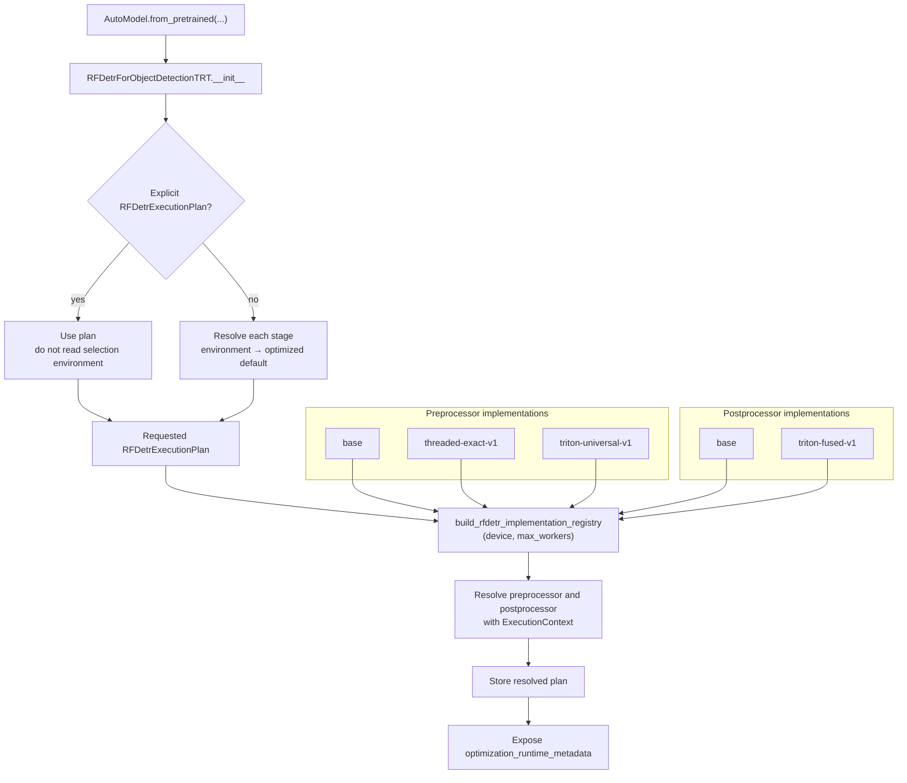
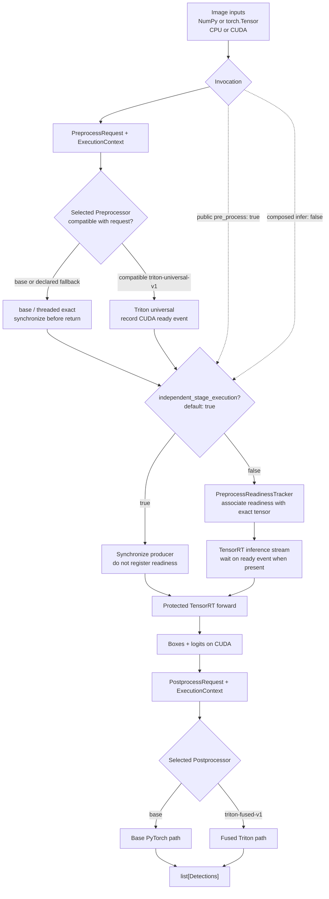

# Inference-Path Optimization Architecture

This guide explains how independently selectable inference-path implementations are
described, selected, and executed. It first describes the reusable architecture and
then maps it to the current RF-DETR TensorRT object-detection implementation.

The design keeps two concerns separate:

- **selection** decides which implementation is valid for a runtime;
- **execution** runs the selected implementation without changing the model's semantic
  forward pass.

## Component overview



### Contracts

Shared contracts define the stable language used by every optimized inference path.
They include:

- `OptimizationMetadata`, including the stable implementation ID, stage, version,
  target, input constraints, dependencies, numerical behavior, stream behavior,
  output contract, fallback ID, and validation history;
- `ExecutionContext`, which describes the actual device, scenario, resolved input
  axes, compute capability, and current stream;
- the common `InferenceStage` compatibility protocol.

Stage-specific requests, results, and protocols stay in the model namespace because
their signatures depend on that model's inputs and outputs.

Metadata is immutable and can be serialized with `to_dict()`. An implementation can
therefore be inspected without executing it, and the resolved runtime configuration
can be attached to profiling results.

### Catalog

The catalog is the inventory of available choices. It exposes read-only metadata maps
for introspection and constructs a registry containing the corresponding runtime
objects. It does not decide which choice should run.

Keeping construction in the catalog avoids importing one concrete implementation from
another and gives the model a single place to assemble all available stages.

### Execution plan

An execution plan is an immutable collection of implementation IDs, one per selectable
stage:

```python
RFDetrExecutionPlan(
    preprocessor_id="triton-universal-v1",
    buffer_strategy_id="base",
    scheduler_id="base",
    postprocessor_id="triton-fused-v1",
    engine_plugin_id="base",
    allow_compatibility_fallback=True,
)
```

The plan contains choices, not implementation objects or mutable runtime state. This
makes it suitable for configuration, logging, and comparison between profiling runs.

### Implementation registry

The registry owns the constructed stage objects and resolves a requested ID against an
`ExecutionContext`. Resolution follows these rules:

1. `base` selects the preserved reference implementation.
2. An explicit implementation ID selects that implementation when compatible. A
   declared compatibility miss may follow its observable `fallback_id`.
3. `auto` selects a compatible implementation only when it has a matching validated
   environment; otherwise it selects `base`.
4. Unknown IDs and failures during implementation execution never fall back.

Compatibility fallback is decided before execution and records the requested ID,
effective ID, and reason. It does not catch compilation, CUDA, allocation, or other
unexpected runtime failures.

The same policy applies to every selectable stage. Set
`allow_compatibility_fallback=False` when an explicitly requested implementation must
either run or raise. The default is `True`, which preserves the base inference path for
contracts that an optimized implementation declares unsupported.

The catalog answers **what exists**. The registry answers **what may run here**.

### Implementations

Each implementation lives in its own module and depends on the shared contracts. Base
implementations preserve the original behavior, while optimized implementations make
their own compatibility checks before performing work.

Implementation-local state may include streams, events, reusable buffers, or bounded
caches. That state belongs to the implementation object rather than the plan or
metadata.

### Runtime observability

The resolved plan is the model-level plan that actually runs. Models expose both
selected IDs and JSON-compatible selection metadata. The metadata records model-level
and latest per-request requested/effective IDs plus any fallback reason, so profiling
and validation output does not need to infer selection from environment variables or
log messages.

## Current RF-DETR integration

The current implementation applies this architecture to RF-DETR TensorRT object
detection. The TensorRT semantic forward pass remains protected and is not a selectable
implementation.

### Model initialization and selection



Environment management remains available for clients that cannot pass new model
arguments:

| Variable | Stage | Example value |
|---|---|---|
| `INFERENCE_MODELS_RFDETR_PREPROCESSOR` | preprocessing | `triton-universal-v1` |
| `INFERENCE_MODELS_RFDETR_PREPROCESSOR_MAX_WORKERS` | threaded preprocessing | `4` |
| `INFERENCE_MODELS_RFDETR_POSTPROCESSOR` | postprocessing | `triton-fused-v1` |

An explicit plan has the clearest provenance and takes precedence over environment
variables. Environment values are read only when no plan is supplied. When neither an
explicit plan nor environment overrides are present, RF-DETR selects
`triton-universal-v1` preprocessing and `triton-fused-v1` postprocessing. A declared
contract mismatch or unavailable Triton dependency follows the implementation's
`base` fallback before execution.

### Per-request execution



`PreprocessReadinessTracker` is deliberately separate from tensors. It uses the exact
tensor identity and a weak reference to transfer an optional CUDA event from
preprocessing to the TensorRT consumer without adding dynamic attributes to framework
tensors.

Public `pre_process()` calls default to `independent_stage_execution=True`: they
synchronize their producer before returning and do not add a tracker entry. Composed
`model(...)` and `infer()` calls explicitly pass `False`, allowing preprocessing to
return asynchronously after associating its CUDA event with the exact output tensor.
`forward()` always checks for such an entry and waits on its event when present; an
independently prepared ready tensor has no entry and proceeds normally.

The inference-server object-detection adapter composes the stages itself instead of
calling the model's `infer()`. It inspects the loaded model's explicit `pre_process()`
parameters once during initialization and passes `independent_stage_execution=False`
only when that parameter is declared. Models that merely accept generic `**kwargs` do
not receive the control.

```python
model = AutoModel.from_pretrained(
    "rfdetr-small",
    backend="trt",
)
preprocessed, metadata = model.pre_process(image)
raw_predictions = model.forward(preprocessed)
detections = model.post_process(raw_predictions, metadata)
```

This is an invocation-boundary policy rather than an implementation choice, so it is
not part of `InferenceExecutionPlan`. Safe standalone behavior is the public default;
the composed inference path opts into the optimized asynchronous handoff internally.

The preprocessing, inference, and postprocessing streams are reused. Events express
the GPU dependency at the consumer boundary; the protected TensorRT forward does not
need to know which preprocessor produced its input.

### RF-DETR files and responsibilities

| Path | Responsibility |
|---|---|
| `models/optimization/contracts.py` | Reusable metadata, compatibility, runtime context, and base stage protocol |
| `models/optimization/execution_plan.py` | Reusable immutable execution-plan representation |
| `models/optimization/fallback_warnings.py` | Thread-safe per-model de-duplication of request fallback warnings |
| `models/optimization/ids.py` | Conventional `base` and `auto` implementation IDs |
| `models/optimization/registry.py` | Strict explicit and conservative automatic resolution |
| `models/optimization/torch_readiness.py` | Generic one-shot state handoff tied to exact tensor identity |
| `models/rfdetr/optimization/contracts.py` | RF-DETR requests, results, and stage-specific protocols |
| `models/rfdetr/optimization/ids.py` | Stable implementation IDs and environment-variable names |
| `models/rfdetr/optimization/execution_plan.py` | RF-DETR environment resolution and supported-stage validation |
| `models/rfdetr/optimization/catalog.py` | Read-only metadata catalogs and registry construction |
| `models/rfdetr/optimization/readiness.py` | RF-DETR readiness payload and shared-tracker adapter |
| `models/rfdetr/optimization/preprocessors/` | One module per preprocessing choice |
| `models/rfdetr/optimization/postprocessors/` | One module per postprocessing choice |
| `models/rfdetr/rfdetr_object_detection_trt.py` | Plan integration and request-stage orchestration |

### Current boundaries

- Preprocessing and postprocessing have selectable implementations.
- Buffer strategy, scheduler, and engine-plugin slots exist in the plan but currently
  accept only `base`. Selecting an unimplemented value raises an error.
- `auto` remains on `base` until machine-readable validation records are added for a
  matching runtime environment.
- Static model incompatibilities resolve the stored plan through the implementation's
  declared fallback. Request-only incompatibilities use the fallback for that request.
- Fallback decisions are logged and carried with preprocessing readiness metadata;
  execution failures still propagate.
- Target-device profiling and output-snapshot parity checks remain required before an
  optimized choice is promoted for automatic selection.

## Adding another implementation

1. Give the implementation a stable ID in `ids.py`.
2. Add a separate implementation module that satisfies the stage protocol.
3. Declare immutable compatibility and behavioral metadata.
4. Reject unsupported explicit inputs with an actionable error.
5. Register the implementation in `catalog.py`.
6. Add contract, compatibility, numerical-parity, and selection tests.
7. Profile and compare snapshots on the target device.
8. Add validated environment records only after the target results justify automatic
   selection.

This sequence keeps a new optimization independently selectable, attributable in
profiling, and removable without changing the semantic model forward pass.
