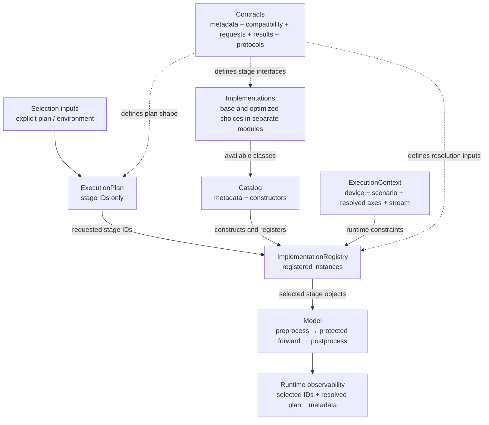

# Inference-Path Optimization Architecture

This guide explains how independently selectable inference-path implementations are
described, selected, and executed. The architecture is reusable across model paths;
each model-path integration defines its concrete stage contracts, implementations, and
defaults.

The design keeps two concerns separate:

- **selection** decides which implementation is valid for a runtime;
- **execution** runs the selected implementation without changing the model's semantic
  forward pass.

## Component overview


```mermaid
flowchart TD
    selection["Selection inputs<br/>explicit plan / environment"]
    plan["ExecutionPlan<br/>stage IDs only"]
    catalog["Catalog<br/>metadata + constructors"]
    registry["ImplementationRegistry<br/>registered instances"]
    context["ExecutionContext<br/>device + scenario + resolved axes + stream"]
    contracts["Contracts<br/>metadata + compatibility + requests + results + protocols"]
    implementations["Implementations<br/>base and optimized choices in separate modules"]
    model["Model<br/>preprocess → protected forward → postprocess"]
    observable["Runtime observability<br/>selected IDs + resolved plan + metadata"]

    selection --> plan
    plan -->|requested stage IDs| registry
    implementations -->|available classes| catalog
    catalog -->|constructs and registers| registry
    context -->|runtime constraints| registry
    registry -->|selected stage objects| model
    model --> observable

    contracts -.->|defines plan shape| plan
    contracts -.->|defines resolution inputs| registry
    contracts -.->|defines stage interfaces| implementations
```

### Contracts

Shared contracts define the stable language used by every optimized inference path.
They include:

- `OptimizationMetadata`, including the stable implementation ID, stage, version,
  target, input constraints, dependencies, numerical behavior, stream behavior,
  output contract, fallback ID, and validation history;
- `ExecutionContext`, which describes the actual device, scenario, resolved input
  axes, compute capability, available runtime components, and current stream;
- the common `InferenceStage` compatibility protocol.

Stage-specific requests, results, and protocols stay in the model namespace because
their signatures depend on that model's inputs and outputs.

Metadata is immutable and can be serialized with `to_dict()`. An implementation can
therefore be inspected without executing it, and the resolved runtime configuration
can be attached to profiling results.

### Catalog

The catalog is the inventory of available choices. It exposes read-only metadata maps
for introspection and registers metadata plus lazy implementation factories. It does
not construct every choice eagerly or decide which choice should run.

Keeping construction in the catalog avoids importing one concrete implementation from
another and gives the model a single place to assemble all available stages.

### Execution plan

An execution plan is an immutable collection of implementation IDs, one per selectable
stage. The current RF-DETR integration provides this base example:

```python
RFDetrExecutionPlan(
    preprocessor_id="triton-universal-v1",
    buffer_strategy_id="base",
    scheduler_id="base",
    postprocessor_id="triton-fused-v1",
    engine_plugin_id="base",
    allow_compatibility_fallback=True,
)
```

The plan contains choices, not implementation objects or mutable runtime state. This
makes it suitable for configuration, logging, and comparison between profiling runs.
A different model path may expose a different plan shape when its independently
selectable boundaries differ.

### Implementation registry

The registry resolves a requested ID against an `ExecutionContext`, then lazily
constructs only the effective compatible stage objects. Resolution follows these rules:

1. `base` selects the preserved reference implementation.
2. An explicit implementation ID selects that implementation when compatible. A
   declared compatibility miss may follow its observable `fallback_id`.
3. `auto` selects a compatible implementation only when it has a matching validated
   environment; otherwise it selects `base`.
4. Unknown IDs and failures during implementation execution never fall back.

Compatibility fallback is decided before execution and records the requested ID,
effective ID, and reason. It does not catch compilation, CUDA, allocation, or other
unexpected runtime failures.

Static target and runtime-component compatibility belongs to registry resolution.
Request selectors handle only constraints that depend on concrete request values, such
as input dtype, layout, shape, or preprocessing overrides.

The same policy applies to every selectable stage. Set
`allow_compatibility_fallback=False` when an explicitly requested implementation must
either run or raise. The default is `True`, which preserves the base inference path for
contracts that an optimized implementation declares unsupported.

The catalog answers **what exists**. The registry answers **what may run here**.

### Implementations

Each implementation lives in its own module and depends on the shared contracts. Base
implementations preserve the original behavior, while optimized implementations make
their own compatibility checks before performing work.

Implementation-local state may include streams, events, reusable buffers, or bounded
caches. That state belongs to the implementation object rather than the plan or
metadata.

### Runtime observability

The resolved plan is the model-level plan that actually runs. Models expose both
selected IDs and JSON-compatible selection metadata. The metadata records model-level
and latest per-request requested/effective IDs plus any fallback reason, so profiling
and validation output does not need to infer selection from environment variables or
log messages.

## Model-path integrations

- [RF-DETR TensorRT](inference-path-optimization-architectures/rfdetr.md) is the base
  example. It uses five independently selectable stage categories and currently
  provides optimized preprocessing and postprocessing implementations.

Model-path-specific defaults, environment configuration, request orchestration,
implementation inventory, and current limitations belong in the corresponding
integration document rather than this shared overview.

## Adding another implementation

1. Give the implementation a stable ID in `ids.py`.
2. Add a separate implementation module that satisfies the stage protocol.
3. Declare immutable compatibility and behavioral metadata.
4. Reject unsupported explicit inputs with an actionable error.
5. Register the implementation in `catalog.py`.
6. Add contract, compatibility, numerical-parity, and selection tests.
7. Profile and compare snapshots on the target device.
8. Add validated environment records only after the target results justify automatic
   selection.

This sequence keeps a new optimization independently selectable, attributable in
profiling, and removable without changing the semantic model forward pass.
