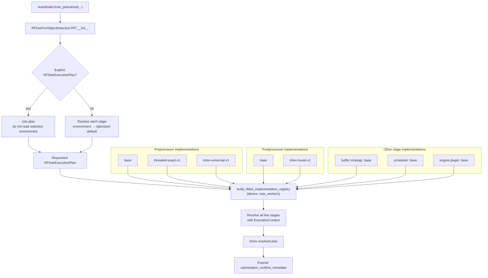
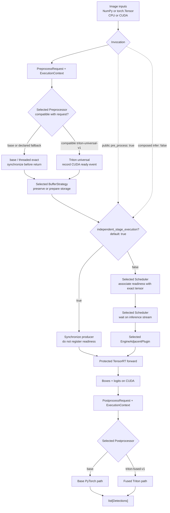

# Current RF-DETR Inference-Path Optimization Integration

Read the shared
[Inference-Path Optimization Architecture](../inference-path-optimization-architecture.md)
first. This document maps that reusable architecture to the current RF-DETR TensorRT
object-detection implementation.

The TensorRT semantic forward pass remains protected and is not a selectable
implementation.

## Model initialization and selection



Environment management remains available for clients that cannot pass new model
arguments:

| Variable | Stage | Example value |
|---|---|---|
| `INFERENCE_MODELS_RFDETR_PREPROCESSOR` | preprocessing | `triton-universal-v1` |
| `INFERENCE_MODELS_RFDETR_PREPROCESSOR_MAX_WORKERS` | threaded preprocessing | `4` |
| `INFERENCE_MODELS_RFDETR_POSTPROCESSOR` | postprocessing | `triton-fused-v1` |

An explicit plan has the clearest provenance and takes precedence over environment
variables. Environment values are read only when no plan is supplied. When neither an
explicit plan nor environment overrides are present, RF-DETR selects
`triton-universal-v1` preprocessing and `triton-fused-v1` postprocessing. A declared
contract mismatch or unavailable Triton dependency follows the implementation's
`base` fallback before execution.

## Per-request execution



The base buffer strategy preserves the exact preprocessing tensor, framework ownership,
and readiness event without a copy. The base scheduler owns
`PreprocessReadinessTracker`, which remains deliberately separate from tensors. It uses
the exact tensor identity and a weak reference to transfer an optional CUDA event from
preprocessing to the TensorRT consumer without adding dynamic attributes to framework
tensors.

Public `pre_process()` calls default to `independent_stage_execution=True`: they
synchronize their producer before returning and do not add a tracker entry. Composed
`model(...)` and `infer()` calls explicitly pass `False`, allowing preprocessing to
return asynchronously after associating its CUDA event with the exact output tensor.
`forward()` always checks for such an entry and waits on its event when present; an
independently prepared ready tensor has no entry and proceeds normally.

The inference-server object-detection adapter composes the stages itself instead of
calling the model's `infer()`. It inspects the loaded model's explicit `pre_process()`
parameters once during initialization and passes `independent_stage_execution=False`
only when that parameter is declared. Models that merely accept generic `**kwargs` do
not receive the control.

```python
model = AutoModel.from_pretrained(
    "rfdetr-small",
    backend="trt",
)
preprocessed, metadata = model.pre_process(image)
raw_predictions = model.forward(preprocessed)
detections = model.post_process(raw_predictions, metadata)
```

This is an invocation-boundary policy rather than an implementation choice, so it is
not part of `InferenceExecutionPlan`. Safe standalone behavior is the public default;
the composed inference path opts into the optimized asynchronous handoff internally.

The base scheduler reuses preprocessing, inference, and postprocessing streams. Events
express the GPU dependency at the consumer boundary. The base engine plugin delegates
to the existing TensorRT helper on the scheduler-provided stream, so the protected
TensorRT forward does not need to know which preprocessor produced its input.

## RF-DETR files and responsibilities

| Path | Responsibility |
|---|---|
| `models/optimization/contracts.py` | Reusable metadata, compatibility, runtime context, and base stage protocol |
| `models/optimization/execution_plan.py` | Reusable immutable execution-plan representation |
| `models/optimization/fallback_warnings.py` | Thread-safe per-model de-duplication of request fallback warnings |
| `models/optimization/ids.py` | Conventional `base` and `auto` implementation IDs |
| `models/optimization/registry.py` | Strict explicit and conservative automatic resolution |
| `models/optimization/torch_readiness.py` | Generic one-shot state handoff tied to exact tensor identity |
| `models/rfdetr/optimization/contracts.py` | RF-DETR requests, results, and stage-specific protocols |
| `models/rfdetr/optimization/ids.py` | Stable implementation IDs and environment-variable names |
| `models/rfdetr/optimization/execution_plan.py` | RF-DETR environment resolution and five-stage plan defaults |
| `models/rfdetr/optimization/catalog.py` | Read-only metadata catalogs and registry construction |
| `models/rfdetr/optimization/readiness.py` | RF-DETR readiness payload and shared-tracker adapter |
| `models/rfdetr/optimization/preprocessors/` | One module per preprocessing choice |
| `models/rfdetr/optimization/buffer_strategies/` | Intermediate storage ownership and readiness preservation |
| `models/rfdetr/optimization/schedulers/` | Stream reuse, event dependencies, and request coordination |
| `models/rfdetr/optimization/postprocessors/` | One module per postprocessing choice |
| `models/rfdetr/optimization/engine_plugins/` | TensorRT engine-boundary implementations |
| `models/rfdetr/rfdetr_object_detection_trt.py` | Plan integration and request-stage orchestration |

## Current boundaries

- All five execution-plan stages resolve through the registry and expose typed metadata.
- Preprocessing and postprocessing have optimized alternatives. Buffer strategy,
  scheduler, and engine plugin currently provide real `base` implementations that
  preserve the original storage, stream/event, and TensorRT-boundary behavior.
- `auto` resolves those base-only categories to `base`; an unknown explicit ID raises a
  registry error listing the available implementations.
- `auto` remains on `base` until machine-readable validation records are added for a
  matching runtime environment.
- Static model incompatibilities resolve the stored plan through the implementation's
  declared fallback. Request-only incompatibilities use the fallback for that request.
- Fallback decisions are logged and carried with preprocessing readiness metadata;
  execution failures still propagate.
- Target-device profiling and output-snapshot parity checks remain required before an
  optimized choice is promoted for automatic selection.
