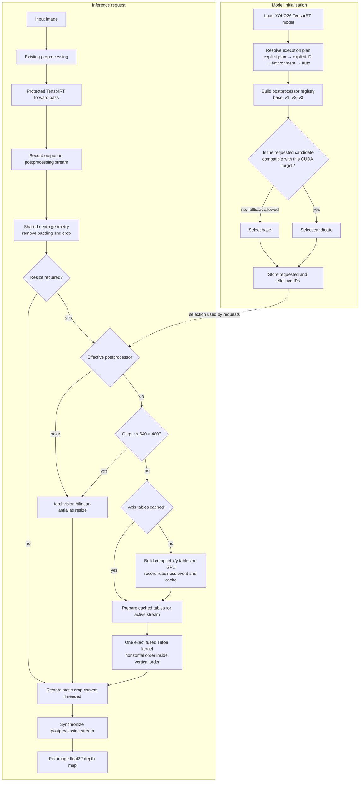

# YOLO26 depth postprocessing optimization journal

This journal records the reasoning and code evolution behind the YOLO26 TensorRT
depth-map postprocessing experiments. It deliberately omits benchmark result tables,
artifact inventories, and acceptance decisions; those are recorded with the profiling
runs. The focus here is why the work was attempted, what changed in each iteration, and
how the current code path operates.

## Scope and guardrails

The work was deliberately limited to postprocessing:

- The TensorRT model, weights, precision, and semantic forward pass were not changed.
- The original torchvision implementation remains available as `base`.
- Alternatives have stable implementation IDs and are selected through the shared
  optimization registry.
- Both the normal camera shape and the large camera shape must execute correctly.
- The final numerical contract is bit-for-bit equality with the original output.
- CUDA work runs on the caller's postprocessing stream and declares its compatibility,
  allocation, fallback, and output behavior.

The main implementation is split across:

- [`optimization/postprocessors.py`](../../inference_models/models/yolo26/optimization/postprocessors.py),
  which describes and registers selectable postprocessors.
- [`triton_depth_postprocess.py`](../../inference_models/models/yolo26/triton_depth_postprocess.py),
  which contains table construction, caching, dispatch, and Triton resize kernels.
- [`optimization/execution_plan.py`](../../inference_models/models/yolo26/optimization/execution_plan.py),
  which resolves explicit, environment, and `auto` selection.
- [`yolo26_depth_estimation_trt.py`](../../inference_models/models/yolo26/yolo26_depth_estimation_trt.py),
  which resolves the implementation once and invokes it on the postprocessing stream.
- [`post_processing.py`](../../inference_models/models/common/roboflow/post_processing.py),
  which retains the shared crop, resize, and output-canvas geometry pipeline.

## Evidence that led to the idea

The baseline trace showed a scale-dependent bottleneck after the model forward pass:

1. Model-forward time was approximately flat between the normal and large inputs. The
   additional large-input latency therefore did not originate in TensorRT inference.
2. Postprocessing grew sharply with output resolution, while preprocessing changed much
   less.
3. Within postprocessing, the CUDA bilinear-antialias upsample accounted for nearly all
   of the scale-dependent GPU work. It was one localized operation with enough cost to
   explain most of the end-to-end gap.
4. The normal workload performed the same operation on far fewer pixels, making it a
   fixed-overhead-sensitive regression guard rather than a good target for a custom
   kernel.
5. Host telemetry showed stable clocks, no throttling, and comparable thermal and power
   conditions. This made the resize operation, rather than machine-state drift, the
   strongest explanation for the trace difference.

This evidence suggested a bounded hypothesis: keep the shared depth geometry and model
forward intact, but replace only the expensive large depth-map resize with a CUDA
implementation that performs less intermediate work.

## Experiment 1: direct fused Triton resize

**Commit:** `9e1a857b9` — `triton-aa-resize-v1`

### Idea

The first candidate translated bilinear-antialias resizing into one Triton kernel. It
precomputed compact per-axis source starts, filter sizes, and interpolation weights,
then used those tables to calculate every output pixel directly.

### Plain-language change

Instead of asking torchvision to resize the depth map, the candidate gave each output
pixel to a GPU program. That program looked up the small group of source pixels that
contributed to the result, multiplied them by cached weights, and wrote the final depth
value in one pass.

The same change introduced the surrounding selection architecture:

- `base` and the candidate became named postprocessor implementations.
- Compatibility metadata constrained the candidate to supported CUDA inputs.
- The effective implementation became visible in logs, runtime metadata, and NVTX.
- The shared postprocessing function accepted a resize callback, so geometry logic did
  not need to be duplicated.

### What this iteration taught us

The operation was fast enough to confirm that resizing was the right target, but a
mathematically equivalent interpolation formula was not sufficient for exact output.
Small changes in weight generation and floating-point accumulation order changed bits.
The next iteration therefore had to reproduce the reference implementation's actual
arithmetic order, not merely the same interpolation equation.

## Selection update: make the strategy resolvable through `auto`

**Commit:** `4c573e1db`

The execution plan default changed from requiring a model-loader argument to requesting
`auto`. Model construction now resolves selection in this order:

1. a complete explicit execution plan;
2. an explicit postprocessor implementation ID;
3. the YOLO26 depth postprocessor environment variable;
4. `auto`.

The registry evaluates compatibility before constructing the effective implementation
and can use the declared `base` fallback when fallback is allowed. Explicit IDs and
effective IDs remain available in runtime metadata for provenance.

## Experiment 2: exact separable Triton resize

**Commit:** `499fde115` — `triton-aa-resize-exact-v2`

### Idea

The second candidate treated torchvision as the source of truth for interpolation
weights. On first use, it resized basis vectors with torchvision, extracted the exact
target-device weights, and cached compact tables. Steady-state resizing then ran as two
ordered Triton kernels:

1. a horizontal pass into a temporary workspace;
2. a vertical pass from that workspace into the output.

### Plain-language change

Rather than approximating how torchvision chooses and combines pixels, the code asked
torchvision to reveal the exact weights it would use. Triton then replayed the same
horizontal-then-vertical sequence, preserving the order of float32 additions and
multiplications.

### What this iteration taught us

Replaying the reference arithmetic solved the numerical problem, but the mechanism was
too expensive at first use and too costly for small outputs:

- Building weights from full identity matrices and resized basis tensors created large
  temporary allocations.
- Every resize allocated a horizontal workspace in addition to the final output.
- Two kernel launches introduced fixed overhead even when the native small resize was
  already cheap.

The next iteration needed to preserve the exact arithmetic while eliminating dense
table-generation tensors, the horizontal workspace, and the small-shape launch penalty.

## Experiment 3: exact fused, shape-aware resize

**Commit:** `b2d151608` — `triton-aa-resize-exact-fused-v3`

### Idea

The third candidate combines three changes:

1. **Shape-aware dispatch.** Outputs of at most `640 × 480` pixels use the original
   torchvision CUDA resize. Larger outputs use Triton.
2. **Compact table generation.** A small Triton kernel creates only the required source
   starts, filter sizes, and normalized weights directly on the GPU. IEEE-style
   `tl.div_rn` division and the target float32 operation order reproduce the reference
   weight formula.
3. **One fused resize launch.** The large path performs horizontal accumulation for each
   contributing row and immediately folds it into the vertical accumulation. It writes
   the final output directly and does not allocate a horizontal image workspace.

### Plain-language change

The current strategy avoids using a custom kernel where it cannot help. Small depth maps
continue through the well-tuned original operation. For large maps, the code creates a
tiny reusable description of how source pixels map to output pixels, then one GPU kernel
uses that description to produce the final map without storing a full intermediate
image.

Axis tables are cached by `(input_size, output_size)` in a bounded LRU cache. A CUDA
event records when each new table is ready. A consuming stream waits only the first time
it sees that table; subsequent calls record the cached tensors on the active stream
without adding the same wait again.

The earlier `v1`, `v2`, and `v3` implementations remain registered for explicit
comparison and provenance. The `auto` preference list is empty after `v3` failed the
complete latency and memory acceptance contract, so the preserved implementation
remains the effective default.

## Current code flow

## Current design properties

- The optimization boundary is narrow: only depth-map resizing is replaceable.
- The original implementation is preserved and selectable.
- Unsupported targets can fall back before request execution when fallback is allowed.
- Request-time output geometry remains shared across all implementations.
- The small-output path deliberately prefers lower fixed overhead over custom-kernel
  dispatch.
- The large-output path has one output allocation and no full-size intermediate
  workspace.
- Cached tables are immutable after construction, bounded in count, and made safe across
  CUDA streams with readiness events and `record_stream`.
- Exactness depends on preserving both interpolation weights and float32 accumulation
  order; algebraic equivalence alone is not treated as sufficient.

## V3 target validation and next bounded candidate

Target validation on the Jetson AGX Orin showed that `v3` preserved exact model-output
snapshot parity. The frozen base workload stayed within its guard: median latency changed
by `+0.96%` and incremental device memory by `+0.37%`. The large workload improved to
`8.392 ms` (`-10.86%`) but missed the required `≤8.003 ms` threshold, and its incremental
device memory increased by `7.72%`. `v3` therefore remains explicit-only.

The diagnostic trace localized the remaining bounded opportunity:

- large depth resize fell from `1.697 ms` to `0.405 ms`;
- large postprocessing fell from `2.179 ms` to `1.447 ms`;
- preprocessing remained approximately `2.5–2.7 ms`;
- each large inference still transferred approximately `0.995 MB` H2D and `7.078 MB`
  D2D during preprocessing.

The next candidate is the explicit preprocessor
`triton-cv2-resize-fused-convert-v1`. It keeps the exact CPU OpenCV resize, then replaces
the GPU channel reorder, uint8-to-float32 scaling, NCHW materialization, and batch-one
concatenation with one Triton launch that reads the uint8 HWC staging tensor and writes
the final contiguous float32 NCHW engine input. The kernel uses `tl.div_rn` for the
division by `255` and supports both preserved and reversed RGB/BGR channel order.

The candidate is deliberately shape-aware:

- source images at or below `640 × 480` use the preserved preprocessing path;
- the frozen `3840 × 2160` batch-one numpy workload uses the fused path;
- unsupported explicit inputs raise an actionable compatibility error;
- `auto` remains on the preserved preprocessor until target latency, memory, trace, and
  exact snapshot validation pass.

This round changes only preprocessing. Validation should compare the new preprocessor
against the already measured `v3` execution plan to attribute its effect, then compare
the composed preprocessor plus `v3` postprocessor against the original base acceptance
threshold.

## Fused-convert validation and pinned event-handoff revision

The corrected `triton-cv2-resize-fused-convert-v1` campaign executed the intended
candidate and preserved exact input/output snapshot parity. It did not meet the complete
acceptance gate:

- base median latency changed by `+1.00%`, but incremental device memory increased by
  `5.27%`;
- large median latency was `8.553 ms`, a `9.15%` improvement over the original base but
  a `1.92%` regression from the `v3` plan and short of the required `8.003 ms`;
- large incremental device memory improved by `0.64%` relative to the original base.

Nsight confirmed that the fused conversion removed the intended layout/conversion
traffic. The remaining large path still spent approximately `1.335 ms` in CPU OpenCV
resize, while preprocessing synchronization increased by approximately `0.290 ms`.
Moving that wait to an event without changing staging would mostly relocate the
dependency in synchronous `infer()`, so the next revision pairs two inseparable pieces:

- `triton-cv2-resize-pinned-fused-convert-v2` retains OpenCV pixels and metadata, writes
  into a bounded pool of pinned target-image slots, and performs non-blocking H2D before
  the existing exact Triton conversion;
- `cuda-event-handoff-v1` records readiness for the exact returned tensor and makes the
  serialized TensorRT stream wait on that event during composed inference.

Direct `pre_process()` calls remain synchronous. The base source-shape dispatch remains
on the preserved preprocessor and does not initialize the pinned large-path pool. Host
slots are not reused until their H2D event completes, CUDA staging/output tensors remain
per call, and neither implementation participates in `auto`.

The expected trace change is a pinned H2D transfer, lower transient host allocation/copy
work around OpenCV, no blocking preprocessing-stream synchronization in composed
inference, and one TensorRT-stream event dependency. Validation must still require exact
snapshots, the base latency/memory guard, bounded pinned-host residency, and the original
large-latency target.
