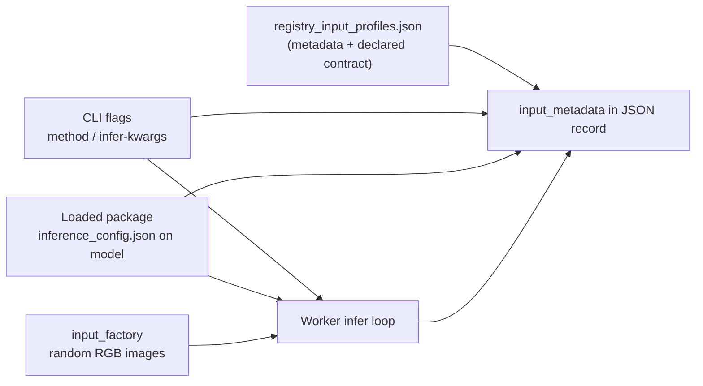

# Input profiles and package resolution

This note summarizes how memory profiling connects **registry input profiles** to
**synthetic inputs at run time**, and how **profile tiers** relate to **fetching model
packages**. It reflects the design discussed for the smart memory profiling work
(`MemoryProfileRecord` schema 1.1) and the current implementation under
`profiling/memory/`.

See also [`description.md`](description.md) for admission metrics, harness workflows,
and the normalized result schema.

## Two different meanings of “profile”

| Term | What it is |
|------|------------|
| **Input profile** | Contract for *what* goes into `infer` / `prompt` / etc. and which axes affect GPU memory (batch, H×W, prompts, decode length). |
| **Profile tier** (`--profile-tier`) | Label on a profiling *run* (`customer`, `registry_template`, `validation`) describing *why* the envelope was produced and how much to trust it for admission. |

They are independent today: tier does not change which inputs are built or how packages are downloaded.

---

## Input profile architecture

Input contracts live in
[`registry_input_profiles.json`](../registry_input_profiles.json) (schema v2). The file
has three layers:

### 1. `backend_package_input_profiles`

Documents where **spatial and batch shapes** come from on disk, per package backend:

- **`onnx`**, **`torch-script`**, **`trt`**: Roboflow exports — mainly `inference_config.json`; TRT also uses `trt_config.json` for batch bounds.
- **`torch`**: native PyTorch checkpoints (Roboflow `inference_config.json` or package-specific JSON, e.g. SAM).
- **`hugging-face`**: HF checkpoints; generation limits may come from `generation_config.json`.

Each dimension (`batch_size`, `height`, `width`) is described as **static** (single value from a JSON path) or **dynamic** (bounded range; profiling should use the **maximum** bound for worst-case admission).

This section is the **shape policy catalog**. It does not run at profiling time by itself; it tells humans and future automation which artifacts to read.

### 2. `task_inference_profiles`

Documents the **inference API surface** and **non-image inputs** that affect memory:

| Profile (examples) | `profiling_method` | Typical inputs |
|--------------------|--------------------|----------------|
| `vision_infer` | `infer` | `images` (batch of RGB arrays) |
| `vlm_prompt` | `prompt` | `images`, `prompt`, kwargs like `max_new_tokens` |
| `sam_embed_then_segment` | multi-step | images + prompt geometry (declared; workflow not fully automated yet) |

Fields include `memory_impact` per input/kwarg and hints such as `shape_from_backend_package: true` (meaning H/W/batch should follow the package profile, not arbitrary CLI defaults).

### 3. `registry_entries`

One row per `REGISTERED_MODELS` key, linking:

- `architecture`, `task_type`, `backend` (registry backend: `onnx`, `torch-script`, `hugging-face`, …)
- `module_name` / `class_name` (resolved automatically by the CLI from architecture + task + harness backend — see [`backend_registry.py`](../backend_registry.py))
- `task_inference_profile` → name in `task_inference_profiles`
- `package_input_backend` → which `backend_package_input_profiles` block applies when reading package files

Regenerate after registry changes:

```bash
cd inference_models
uv run python profiling/memory/scripts/generate_registry_input_profiles.py
```

Inspect constraints for a local or downloaded package:

```bash
cd inference_models
uv run python profiling/memory/scripts/inspect_package_input_profile.py \
  --package-path /tmp/inference_model_packages/…/… \
  --architecture yolov8 --task-type object-detection --backend onnx

# Shows resolved_profiling_shapes for the package
uv run python profiling/memory/scripts/inspect_package_input_profile.py \
  --package-path …
```

Programmatic API: ``describe_package_input_profile``, ``shape_spec_from_package_dir``,
``validate_profiling_image_shapes_for_package_dir`` in
[`package_input_profile.py`](../package_input_profile.py).

Lookup at runtime: [`registry_profiles.py`](../registry_profiles.py) (`resolve_registry_input_context`).

---

## How input profiles connect to profiling inputs (today)



### What the harness actually runs

1. **Automatic shape resolution** — The profiling CLI always resolves batch / H / W from package artifacts via [`resolve_profiling_image_shapes`](../package_input_profile.py): static values from `inference_config.json` / `trt_config.json`, or worst-case bounds for dynamic batch (`max_dynamic_batch_size`, `dynamic_batch_size_max`) and dynamic spatial reference sizes (`training_input_size`). Unconstrained packages fall back to harness defaults (1×640×640).

2. **Worker shape check** — After model load, workers re-validate the resolved shapes against static package constraints (`InputProfileMismatchError` if the payload disagrees).

3. **Synthetic tensors** — [`build_random_rgb_images`](../input_factory.py) builds deterministic `uint8` HWC images for the **effective** batch and size.

4. **Method and kwargs** — The CLI resolves `profiling_method` via [`resolve_profiling_method`](../profiling_inputs.py) (override with `--method`) and builds the worker payload `infer_kwargs` via [`build_profiling_infer_kwargs`](../profiling_inputs.py) (registry defaults merged with `--infer-kwargs-json`). Workers pass `config.infer_kwargs` to the model method unchanged.

5. **Registry metadata** — [`build_input_metadata_with_registry`](../metadata.py) attaches:
   - `task_inference_profile`, `profiling_method`
   - `inputs` for every exercised input (`images` plus non-image inputs present in `infer_kwargs`)
   - `declared_inputs` for the full task contract; non-image inputs are marked `profiled: true` when supplied via `--infer-kwargs-json` / `--infer-kwargs-path` (including method kwargs such as `max_new_tokens`)

So for standard vision models, the **connection is implemented** for `images`: package-resolved shapes → synthetic arrays → measured loop. VLMs and open-vocabulary models receive registry-driven defaults (prompt text, classes, `max_new_tokens`, etc.) without manual CLI kwargs; override via `--infer-kwargs-json` when needed. After model load, metadata records `prompt_token_length` when the loaded model exposes a tokenizer.

### What is not wired yet (planned)

- **`profiling_workflow`** — multi-step profiles (SAM embed → segment) still default to a single `method_name`; workflow arrays in metadata are preparatory.
- **Package fetch backend vs harness backend** — the CLI harness uses `--backend torch|onnx|trt`, while Roboflow packages are keyed by registry backends (`torch-script`, `hugging-face`, …). Class resolution uses the harness mapping in `backend_registry.py`; **package download** still filters `ModelPackageMetadata` with the harness `BackendType` literal. Ensure the registry package exists for the harness backend you pass until selection uses `package_input_backend` from the resolved registry row.

---

## Example: YOLOv8 object detection (torch harness)

| Stage | Source | Result |
|-------|--------|--------|
| Registry row | `architecture=yolov8`, `task_type=object-detection`, harness `torch` | Class `YOLOv8ForObjectDetectionTorchScript`, profile `vision_infer`, package backend `torch-script` |
| Resolved shape | Package artifacts via `resolve_profiling_image_shapes` | Inspect: `uv run python profiling/memory/scripts/inspect_package_input_profile.py --package-path …` |
| Profiled shape | Same resolved values sent to workers | `input_metadata.inputs.images` records `value`, `resolution`, `source` |
| Tensor data | `input_factory` | Random RGB at profiled shape |
| Record | `input_metadata.inputs.images` | `value`, `resolution: static`, `source` from package artifacts when constrained |

---

## Profile tiers and model packages

`ProfileTier` ([`metadata.py`](../metadata.py)) tags each `MemoryProfileRecord`:

| Tier | Value | Intent |
|------|-------|--------|
| **Customer** | `customer` | Worst-case envelope for a **specific** registered model + package used in production admission. |
| **Registry template** | `registry_template` | Standardized baseline for an architecture/task/backend (template or canonical package), not tied to one customer deployment. |
| **Validation** | `validation` | QA / regression re-run after `inference_models` or package changes. |

**Today:** `--profile-tier` is stored on the record and shown in CLI summaries; it does **not** branch fetch logic, harness behavior, or shape defaults ([`PROFILE_TIER_DESCRIPTIONS`](../metadata.py) notes this explicitly).

### How packages are fetched (all tiers, current code)

Packages are resolved in [`package_resolve.py`](../package_resolve.py) via `resolve_package_directory`:

1. **Identify the model** — `get_model_from_provider(model_id, provider=..., api_key=...)` loads Roboflow (or other) metadata.
2. **Validate identity** — `model_architecture` and `task_type` must match `--architecture` and `--task-type`.
3. **Select one package** — `select_package` filters `metadata.model_packages` by:
   - `backend` (`BackendType` from CLI `--backend`)
   - optional `--package-id`
   - `--quantization` (required on the profiling CLI)
4. **Local layout** — `{packages_target_dir}/{model_id}/{package_id}/`
5. **Download** — artifacts download when the local directory is missing; pass `--force-download` to re-fetch and overwrite an existing cache.

Entry points:

- **Profiling CLI** — `--model-id` triggers provider metadata lookup and resolves the local package under `--packages-target-dir`; reuses cached artifacts unless missing or `--force-download`.
- **Standalone helper** — `profiling/scripts/fetch_model_package.py` always passes `force_download=True`.

Environment: `ROBOFLOW_API_KEY` when using the Roboflow provider.

### Intended use by tier (operational model)

| Tier | Typical `model_id` / package | Fetch strategy (intended) |
|------|------------------------------|---------------------------|
| **Customer** | Customer’s registered model id; optional explicit `--package-id` | Fetch or reuse that customer’s package under `--packages-target-dir`; record `model_id`, `package_id`, variant, and quantization for admission lookup. |
| **Registry template** | Canonical or internal “template” model per registry row (or shared benchmark weights) | Same machinery, but operators choose a **known reference package** per `(architecture, task_type, registry backend)` so envelopes are comparable across GPUs without customer data. Tier marks records as generic baselines, not customer-specific. |
| **Validation** | Same id/package as a prior customer or template run | Re-fetch or refresh local cache to detect drift; tier signals the envelope is for regression gates, not first-time admission. |

Future work may wire tier to:

- defaulting `--model-id` / template package tables for `registry_template`
- stricter reproducibility (pinned `package_id`, CI fetch policies)
- using `package_input_backend` from the resolved registry row for `select_package` when harness `torch` maps to `torch-script` or `hugging-face` packages

---

## Quick reference: files

| File | Role |
|------|------|
| `registry_input_profiles.json` | Machine-readable contracts (shapes + API + registry links) |
| `registry_profiles.py` | Load JSON; resolve entry + task profile for metadata |
| `input_factory.py` | Synthetic images |
| `profiling_inputs.py` | Registry task-profile method + infer kwargs defaults |
| `worker_common.py` | Package shape alignment; shared metadata builders |
| `package_resolve.py` | Download/select Roboflow packages |
| `package_input_profile.py` | Shape spec resolution, validation, `describe_package_input_profile` |
| `scripts/inspect_package_input_profile.py` | CLI to inspect constraints and registry task profile for a package |
| `cli.py` | Orchestrates resolve, payload, tier label, subprocess workers |
| `workers/{torch,onnx,trt}.py` | Measure memory; emit `MemoryProfileRecord` |
