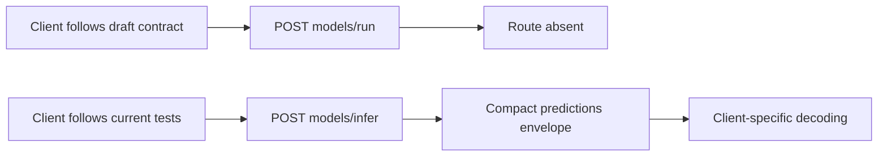
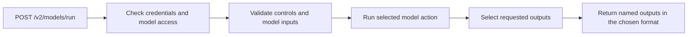
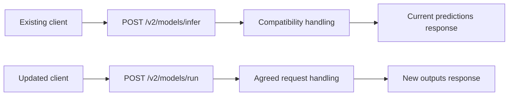
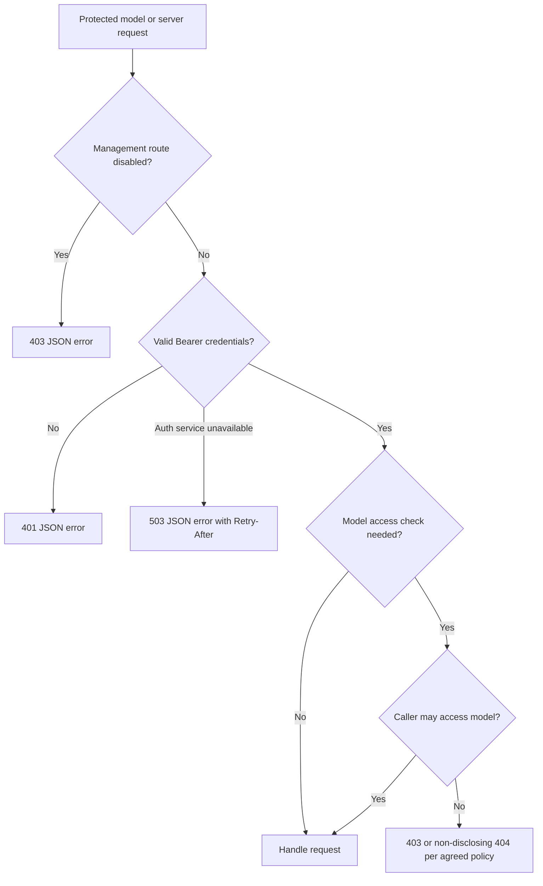

# V2 API shared contract plan

**Author:** Damian Kosowski, with an agent-prepared draft for review.

**Status:** Proposed plan. The recommendations and examples below are not agreed contracts. This draft PR contains the plan only; it does not implement the API, schema catalogue or fixture suite.

**Scope update:** PR 01 covers model and server contracts only. The new Workflows functionality is not yet included, as clarified by Damian. All V2 Workflows routes and their contracts, schemas, fixtures and direct-inference parity are offloaded to separate roadmap PRs 12 and 13 and are **on hold**. They do not block this plan or active model/server implementation. Resume that work only once the new functionality is included and the team explicitly agrees to resume.

**Related work:** [Gap report PR 3088](https://github.com/roboflow/inference/pull/3088), [roadmap PR 01][roadmap], [design PR 2277](https://github.com/roboflow/inference/pull/2277).

## 1. What problem are we solving?

Developers implementing the V2 roadmap need a shared contract before changing model/server routes, loaders and serializers. Today the draft design and the integration branch disagree on public paths, response defaults and layout. Some shared choices have never been specified precisely. Implementing each feature independently would force later PRs to revisit the same decisions and could give clients incompatible interpretations of V2.

For example, a client following the design posts to `/v2/models/run` and expects a rich response containing `outputs`. The current server executes at `/v2/models/infer`, defaults to compact and returns `predictions`. Both documents/code use `roboflow-inference-server-response-v1` for these different layouts. A client cannot safely use that identifier alone to choose its decoder. [Design][design-models], [dispatch][dispatch], [detection response][detection]

PR 01 should establish the shared conventions, valid examples and a small offline validation suite. Later PRs implement the agreed behavior in their assigned areas. Successful fixture validation will establish internal consistency of the contract, not conformance of the existing server.

### Evidence checked

The integration branch was fetched while preparing this plan and still points to `3d45b8712cc428eb01b714f3609346be7c92acc4`. Design PR 2277 still points to `de634b98bac204c96caa98a15dd7559dded361d5`. This plan rechecks the model/server routers, dispatch, authentication middleware, error helper, detection response serializer and SDK version selection against that public revision.

The [report][report] and [review follow-up][followup] retain their evidence snapshot at report-branch commit `6dcada6ace296522d4be9451f8764b81eb5c8411`. The [roadmap][roadmap] is pinned to `74756313e3e425829fd3915d5840e7734d83ce57`, including the Workflows hold and the guidance to write plans in plain language with concrete examples. Discussion guidance remains the snapshot recorded in the follow-up: loading controls, score/decision separation, rich/compact distinction and V1 safeguard parity have support; naming, defaults, optional metadata and several policies remain open. This plan does not claim newer team agreement.

The earlier private-runtime audit is contextual evidence only. No new private backend or deployed-client audit was performed for this shared-contract plan. The local SDK exposes V0/V1 selection, while server tests call experimental V2 paths. That search does not establish that external or private clients have no V2 dependencies. [SDK][sdk], [server integration tests][integration-tests]

## 2. How will the behaviour change?

### Recommended solution

Maintain one versioned model/server V2 contract alongside the integration branch, separating intended capability from implemented capability. Future reuse by Workflows is a design consideration, not a requirement to settle workflow semantics now. Agree the decisions in section 3 before making schemas and examples part of the required contract. Review those artifacts in this same draft PR before considering PR 01 complete.

Recommend `design/00_inference_api_v2/` as the contract home, preserving PR 2277's established document layout and authorship/provenance. Reconcile its preface, model/server API structure and model proposal into the integration branch deliberately; mark the Workflows surface as on hold and leave its detailed contract to PRs 12 and 13. Do not import `03-workflows.md` as an active contract, merge unrelated history or maintain two competing specifications. Keep this plan under `plans/v2-api/`. Documentation should link to the contract rather than duplicate it.

### Before

A model client must reconcile the draft route and response with a different implementation and hand-written handler descriptions.



For a one-image detection request with no results, the current serializer's structure is represented by this illustrative example:

```json
{
  "type": "roboflow-inference-server-response-v1",
  "model_info": {"model_id": "example/1", "task": "object-detection"},
  "usage": {},
  "predictions": [
    {
      "type": "roboflow-object-detection-compact-v1",
      "class_names": ["cat"],
      "xyxy": [],
      "class_id": [],
      "confidence": []
    }
  ]
}
```

This is a source-derived example, not a newly captured model response. [Detection serializer][detection], [typed serializers][typed]

### After

PR 01 itself leaves runtime behavior unchanged. Once the later implementation PRs adopt the approved contract, clients can construct and decode requests using the agreed model/server conventions.



Recommended target example for the same one-image request, subject to D2–D4 below:

```http
POST /v2/models/run?model_id=example%2F1&response_style=rich&response_format=json
Authorization: Bearer <api_key>
Content-Type: application/json
```

```json
{
  "inputs": {
    "image": {"type": "url", "value": "https://example.com/image.jpg"}
  }
}
```

```json
{
  "type": "roboflow-inference-server-response-v2",
  "inference_id": "opaque-execution-id",
  "outputs": [
    {
      "name": "predictions",
      "value": [
        {
          "type": "roboflow-object-detection-rich-v1",
          "detections": []
        }
      ]
    }
  ]
}
```

The explicit `name`/`value` fields, envelope version and top-level `inference_id` are proposed clarifications/changes to the draft, whose example uses dynamic output keys and output-level IDs. They need approval; they are not presented as existing design requirements. An empty detection result remains a typed empty result. Workflow skipped-output/null semantics are reserved for the held workflow plan; this example does not settle them.

### Shared scope

| Area | Proposed PR 01 deliverable | Later implementation |
|---|---|---|
| Surface and access | Model/server method/path/access inventory, migration policy, public-probe exceptions | Roadmap 02, 05, 14 |
| Requests | Model controls, defaults, repetition and precedence rules; input format skeletons | 02–05, 11 |
| Responses | Model response body, output names and batch sizes, optional metadata, IDs, model/server errors | Active model/server PRs from 05 onward |
| Discovery | Model document structure, actions, representation references, filters and supported-capability rules | 10 |
| Compatibility | Rules for changing type identifiers and schemas and experimental-client migration requirements | Every affected PR |
| Evidence | Valid/invalid fixtures, reference checks and shared semantic assertions | Extended with each feature |

Include the ten active model/server routes in the contract inventory: six model routes and four server routes. D2 resolves their disputed semantics and migration. The six proposed Workflows routes are tracked separately below as on hold and are excluded from PR 01 decisions and acceptance:

| Group | Method and path |
|---|---|
| Models | `POST /v2/models/run`; `GET /v2/models/interface`; `GET /v2/models/compatibility`; `GET /v2/models/loaded`; `POST /v2/models/load`; `DELETE /v2/models/unload` |
| Server | `GET /v2/server/health`; `GET /v2/server/ready`; `GET /v2/server/info`; `GET /v2/server/metrics` |

**Workflows routes on hold in separate PRs:** PR 12 owns `POST /v2/workflows/interface`, `POST /v2/workflows/validate`, `GET /v2/workflows/system/blocks`, `GET /v2/workflows/system/definition-schema` and `GET /v2/workflows/system/engine-versions`. PR 13 owns `POST /v2/workflows/run` and direct/workflow parity. Their route details, access rules and representations must be revisited against the new functionality after resumption.

The execution envelope in this plan applies to successful model runs, not automatically to lifecycle responses, discovery, probes or Prometheus text. Those operations have endpoint-specific success schemas and the shared JSON error convention where an HTTP response can still be sent. This is a proposed clarification to the design's broad “all responses” wording.

### Implementation boundaries

PR 01 will contain model/server specification, schemas, examples and their offline checks after agreement. It will not change routers, authentication, gateways, model loading, serializers or workflow execution. It will not generate a static schema for every model or claim that the draft contract is already available at runtime.

Classification field names/threshold algorithms, exact loader options/cache identity, architecture compatibility contents, mask encoding and tensor shapes, OCR layout, and binary encoding details stay in their later model plans. All workflow contract work, including identifiers, discovery/validation, batching, null positions, execution IDs, usage and readiness, is on hold for PRs 12 and 13. PR 01 reserves extension points for later model details without using permissive placeholder schemas as evidence of full conformance; it does not define the held workflow contracts.

## 3. Decisions to make before writing the contract

All six decisions are **Open**. The examples show the recommendation, not agreed or implemented behavior. Start with D1–D3, then review D4–D6. Record each answer and its discussion link before turning the examples into required behavior.

### D1 Where should the contract live and how should we check it

**What we found:** The design lives on PR 2277, separate from the integration branch. It refers to both OpenAPI and JSON Schema without choosing a schema version. A schema is a machine-readable description of allowed fields and values. [Design structure][design-structure], [interface proposal][design-models]

**Recommendation:** Keep the model/server contract in `design/00_inference_api_v2/`. Bring across the relevant proposal text and preserve its authorship. Keep Workflows marked on hold. Use JSON Schema Draft 7 to check examples, preserving the proposal's `definitions` reference format. Treat the model interface description as a separate document from FastAPI's generated OpenAPI page.

For example, this small schema checks only the two response options:

```json
{
  "$schema": "http://json-schema.org/draft-07/schema#",
  "type": "object",
  "properties": {
    "response_style": {"enum": ["rich", "compact"]},
    "response_format": {"enum": ["json", "multipart"]}
  }
}
```

`{"response_style":"rich"}` passes; `{"response_style":"verbose"}` fails. This excerpt does not describe every request control, apply defaults, or claim that multipart is implemented. The complete schemas would have stable IDs and local references so checks can run without network access. Choose the test validator after checking existing dependency conventions; do not add a runtime dependency for this work.

**Decision needed:** Can we use this directory and Draft 7, or does an existing consumer require another schema version? Also agree with PR 2277's author how that draft will point to the reconciled contract. This plan does not close or edit that PR.

### D2 Which URLs should clients call and what happens to old clients

**What we found:** The server and design use different paths. DELETE unload has tentative support; loaded-model naming/filtering is still open. Local SDK code selects V0/V1, but that does not prove private or deployed V2 clients do not exist. [Routes][routes], [follow-up][followup], [SDK][sdk]

**Recommendation:** Use these paths for the agreed contract:

| Operation | Current path | Proposed path |
|---|---|---|
| Run a model | `POST /v2/models/infer` | `POST /v2/models/run` |
| List loaded models | `GET /v2/models` | `GET /v2/models/loaded` |
| Unload one | `POST /v2/models/unload?model_id=example%2F1` | `DELETE /v2/models/unload?model_id=example%2F1` |
| Unload all | `DELETE /v2/models` | `DELETE /v2/models/unload` |

`/loaded` should contain only loaded entries. For example, a model still loading would not appear there. If clients need loading/error states, PR 02 should specify that separately, along with cancellation and partial unload failures.

Keep old experimental paths **and their current response shape** through an announced migration release. Changing an old path to return the new body can still break its clients:



This is a behavior sketch for later implementation PRs, not a requirement for separate model execution code. Keep V1 unchanged. Remove experimental compatibility after identifying and migrating its consumers; no sunset date is assumed here. For routes whose URL stays the same, such as `/interface`, coordinate the response change with consumers before switching it. Do not add a permanent second API or a new version-selection mechanism in this plan.

**Decision needed:** Do these paths and the loaded-only list match what we want? Which clients need the old responses, and what migration release can they use? If there are no compatibility commitments, a coordinated breaking experimental release is simpler than adapters; until that is established, preserving existing clients is the recommendation.

### D3 What should one result or a batch look like

**What we found:** The draft does not fully define output naming and batch nesting. Current handlers return `predictions`, while some family serializers also add `batch` wrappers. [Model design][design-models], [typed serializers][typed]

**Recommendation:** Give each output a name and a value. A batch-aligned output has one value per input, in input order. One image gives a one-element list; two images give two elements. Do not add another `batch` wrapper inside each item.

For two images with no detections, the proposed response is:

```json
{
  "type": "roboflow-inference-server-response-v2",
  "inference_id": "execution-a",
  "outputs": [
    {
      "name": "predictions",
      "value": [
        {"type": "roboflow-object-detection-rich-v1", "detections": []},
        {"type": "roboflow-object-detection-rich-v1", "detections": []}
      ]
    }
  ]
}
```

The first result belongs to the first image, even though it is empty. `predictions` is the default name for a single prediction output; other action outputs declare their names in the interface. Each output appears once. Filtering outputs keeps their declared order, regardless of filter order.

The interface must say whether a value follows the input batch. An embedding vector such as `[0.1, 0.2]` must not be mistaken for results from two images. Scalar/object outputs that are not batch-aligned use their own declared shape. Missing/nullable model results must also be described explicitly. Workflow skipped-output and `null` rules remain on hold.

Use one top-level `inference_id` for a successful model execution, shared by all returned outputs. A later execution, including a retry, gets its own ID; sending a request again does not promise reuse of its previous result. The ID does not identify individual detections. Workflow execution/step IDs and direct/workflow equivalence remain in held PR 13.

**Decision needed:** Should we use named outputs, one list entry per input, and one ID per execution as shown? Does tracing or usage require the draft's output-level IDs instead? The explicit `name`/`value` fields and ID placement change the draft example and need agreement.

### D4 Where do parameters go and which value wins

**What we found:** The implementation defaults to compact, accepts a `style` alias, drops repeated values from some extra query parameters, and forwards some proposed HTTP controls to the model. The draft defaults to rich/JSON. Rich/compact support and visible effective thresholds have support; the exact rules are open. [Dispatch][dispatch], [follow-up][followup]

**Recommendation:** Put model identity, optional package ID, `action`, response options and `requested_output` in the URL query. Put model inputs in the chosen input format. Use Bearer authentication in the header. Default to `response_style=rich` and `response_format=json`. Keep deprecated `style` only on the old compatibility paths. PR 02 specifies the reserved loading controls.

For example, do not silently choose between these conflicting confidence values:

```http
POST /v2/models/run?model_id=example%2F1&confidence=0.5
Authorization: Bearer <api_key>
Content-Type: application/json
```

```json
{
  "inputs": {
    "image": {"type": "url", "value": "https://example.com/image.jpg"},
    "confidence": 0.3
  }
}
```

Proposed result: HTTP 400, using the existing general error code rather than defining a new code just for this example:

```json
{
  "error_code": "INVALID_PARAM",
  "description": "confidence was supplied with conflicting values in query and inputs"
}
```

Repeated singleton controls are errors too. `requested_output` is intentionally repeatable: `requested_output=predictions&requested_output=predictions` selects that output once. An unknown output name is an error; omitting the filter returns all outputs. Declared list-valued model inputs and image batches are still allowed.

An output may include `effective_parameters` containing values actually applied by the model. For example, if the caller omits a threshold and the model uses `0.5`, the reported value is `0.5`, not a copy of the absent request field. Family PRs decide which settings must be reported. Omit unavailable metadata and usage rather than inventing values or reporting unknown usage as zero. Use `null` only when the field's definition explains what it means. This applies to either response style; usage implementation remains separate.

**Decision needed:** Accept rich/JSON defaults, errors for conflicting values, repeatable output selection, and effective settings on each output? Confirm the usage integration boundary before making those fields required.

### D5 Who can call each route and what should errors look like

**What we found:** Health/readiness are public; management and info/metrics are disabled by default. Middleware often returns plain text, while handlers return JSON errors. Loaded model-interface lookup skips the per-model check used by the unloaded path. This source finding is not a tested cross-workspace leak. [Middleware][app], [error helper][errors], [interface route][routes]

**Recommendation:** Keep health/readiness public with minimal, non-sensitive responses. Keep management and info/metrics disabled by default on both new and compatibility paths. Require authentication for discovery, plus the same model-access check whether or not a model is loaded. Disabling management routes does not disable automatic loading during inference; changing that policy is separate work.

This sketch shows the proposed protected request path. Public probes bypass it:



Return the same error fields whether middleware, routing or a handler rejects the request. A Pydantic sketch makes the fields and optional values explicit:

```python
from pydantic import BaseModel, Field


class ApiError(BaseModel):
    """Describe an error returned by a V2 model or server route."""

    error_code: str = Field(
        description="Stable code that a client can handle.",
        examples=["INVALID_PARAM"],
    )
    description: str = Field(
        description="Safe explanation of what went wrong.",
        examples=["response_style must be rich or compact"],
    )
    actionable_follow_up: str | None = Field(
        default=None,
        description="Optional action the caller can take.",
    )
    help_url: str | None = Field(
        default=None,
        description="Optional documentation link.",
    )
```

This illustrates the existing JSON fields; it does not select Pydantic as the implementation or define how schemas are generated. In this proposal, serialization omits absent optional fields, for example with `model_dump(exclude_none=True)` if Pydantic is used. Do not put errors in successful `outputs` or return JSON success when requested multipart is unsupported.

| Situation | Proposed status |
|---|---|
| Malformed input or invalid parameter | 400 |
| Missing/invalid credentials | 401 |
| Authenticated denial or disabled operation | 403 |
| Missing resource, or hidden resource existence | 404 |
| Wrong method | 405, retaining `Allow` |
| Input too large | 413 |
| Unsupported request media type | 415 |
| Known capability not implemented | 501 |
| Temporary service failure | 503, with `Retry-After` where appropriate |
| Execution timeout | 504 |

Keep authentication-challenge headers where appropriate. Log internal failure details rather than returning them. A disconnected client may receive no response. This proposal changes today's mixed 401/403 and plain-text behavior, so compatibility needs review.

**Decision needed:** Accept these public-probe exceptions, checks and error shape/statuses? Settle when access denial should hide a resource with 404 rather than return 403, and identify operators relying on existing error/probe bodies. Separate ports/credentials and manual-loading-only operation remain outside PR 01.

### D6 How does a client discover supported outputs and recognize a changed format

**What we found:** The design describes inputs, outputs and schema references, but does not settle versioning. Loaded and unloaded interface responses differ. The current and proposed execution bodies use the same type identifier for different structures. [Interface proposal][design-models], [routes][routes], [detection response][detection]

**Recommendation:** Describe common HTTP controls and formats once, then list each supported action's inputs and outputs. Declare one default action. An output description needs to tell clients its name, whether it follows the input batch, and which representations are supported. A small Python sketch shows those responsibilities:

```python
from dataclasses import dataclass


@dataclass(frozen=True)
class OutputDescription:
    """Describe a named output and its supported representations."""

    name: str
    batch_aligned: bool
    representation_ids: tuple[str, ...]


predictions = OutputDescription(
    name="predictions",
    batch_aligned=True,
    representation_ids=(
        "roboflow-object-detection-rich-v1",
        "roboflow-object-detection-compact-v1",
    ),
)
```

This is an illustrative interface, not a new runtime class or final discovery JSON. The full document would place `model_inputs`/`model_outputs` under named actions, refer to shared schema `definitions`, and map each representation to its request format, response style and response format. That action grouping extends the draft's per-model sketch and needs agreement.

A filter such as `response_style=rich` removes compact representations and unused definitions from the description; it must not change what a rich response means. Unknown filter values are errors. A valid combination with no supported representation returns an explicit unsupported-combination error. Advertise only verified actions and implemented formats, not everything supported by the broader task family. PR 10 implements the full catalogue and consistent loaded/unloaded lookup. Workflows discovery remains on hold.

For versioning, a client should not have to guess which body a type identifies:

| Example change | Recommendation |
|---|---|
| Add an optional field that old readers can ignore | Keep the representation's major version |
| Rename/remove a field or change its meaning | Increase that representation's major version |
| Replace top-level `predictions` with named `outputs` | Use `roboflow-inference-server-response-v2` |
| Leave detection item fields unchanged | Keep their existing detection type IDs |

The type suffix describes the data format; it is separate from the `/v2` URL. Response readers tolerate new optional fields, while request-control validation stays strict. D2 governs migration and removal; no promise is made to serve every old type indefinitely or add a version-selection mechanism.

**Decision needed:** Accept the action grouping, batch/representation descriptions and versioning examples? Identify existing clients with version-selection requirements. Classification field names and other family-specific changes remain for their own plans.

## 4. Planned artifacts and validation

After the decisions are recorded, author the following artifacts in this PR. These paths are proposed deliverables, not files already present:

| Artifact | Purpose |
|---|---|
| `design/00_inference_api_v2/README.md` and reconciled model/server proposal sections | Canonical entry point, agreed model/server rules, provenance, endpoint ownership, deferred family details and a Workflows hold notice |
| `design/00_inference_api_v2/schemas/` | Declared-dialect schemas for model request controls, model execution envelopes, model/server errors and model discovery structure |
| `design/00_inference_api_v2/examples/` | Paired valid/invalid examples with explicit expected outcomes and owning schema |
| `design/00_inference_api_v2/decisions.md` | D1–D6 answers, discussion references, migration obligations and later-PR boundaries |
| `inference_server/tests/contract/` | Offline schema/reference checks and semantic assertions for the shared contract, without importing model weights or starting MMP |

The fixture suite should cover all three input format skeletons, rich/compact response selection, singleton and multi-item model batches, typed empty model output, multiple named outputs, repeated output selection, optional metadata, common errors and discovery filters. Validate JSON inside multipart `inputs` with quoted `$part.<name>` references. Correct mask-example array lengths, but do not claim that a placeholder RLE object establishes the final mask contract.

Schema validation alone is insufficient. Add focused semantic checks for unique output names, batch-position preservation, checking that every schema reference resolves, filter behavior and parameter conflicts. Include negative fixtures that demonstrate these checks fail for the intended reason. Validate schemas and resolve references offline; no remote schema retrieval. Maintain a route/access inventory covering the ten active model/server endpoints and their explicit compatibility surface without asserting those routes exist at runtime yet. The six held Workflows routes require no schemas, examples or acceptance checks in PR 01.

Record the actual validation command when the tooling is implemented. Later feature PRs add live HTTP conformance tests against the same approved examples, plus real-model/backend evidence appropriate to their scope. Existing implementation tests and the earlier audit's passing checks are not substitutes for these new contract checks.

## 5. Sequencing and acceptance

1. Review this plan and resolve D1–D3, then D4–D6. Capture the contributor-owned recommendations and maintainer agreement using the [repository plan process](../../.github/implementation-plan-template.md), including the required discussion in `#discuss-inference-release` before substantial implementation. This draft does not send that message.
2. Reconcile the canonical documents and record agreed decisions. Check them against the roadmap so no later family decision is accidentally marked settled.
3. Add the shared schemas, valid/invalid examples and offline checks. Review the examples as client contracts, not merely as test input.
4. Verify reference integrity, fixture validity and semantic assertions; document consumer compatibility and unresolved later-PR boundaries. Keep this PR draft until that review is complete.
5. Mark PR 01 complete only when the model/server decisions and artifacts are accepted; no workflow decision or parity test is a completion gate. Then prepare the PR 02 loading/lifecycle plan. Runtime API implementation remains in the later roadmap PRs.

Verification for this plan covers source/reference inspection, Markdown whitespace/link checks, parsing the illustrative JSON and Python, and checking diagrams against the described behavior. The diagrams have not been rendered in this check. No product code or runtime test was changed or executed. The plan is ready for decision review; the shared-contract deliverable itself is still pending.

[roadmap]: https://github.com/roboflow/inference/blob/74756313e3e425829fd3915d5840e7734d83ce57/reports/v2-api-gap-2026-09-30/ROADMAP.md
[report]: https://github.com/roboflow/inference/blob/6dcada6ace296522d4be9451f8764b81eb5c8411/reports/v2-api-gap-2026-09-30/REPORT.md
[followup]: https://github.com/roboflow/inference/blob/6dcada6ace296522d4be9451f8764b81eb5c8411/reports/v2-api-gap-2026-09-30/REVIEW_COMMENT_FOLLOWUP.md
[design-structure]: https://github.com/roboflow/inference/blob/de634b98bac204c96caa98a15dd7559dded361d5/design/00_inference_api_v2/01-general-api-structure.md
[design-models]: https://github.com/roboflow/inference/blob/de634b98bac204c96caa98a15dd7559dded361d5/design/00_inference_api_v2/02-models-endpoints.md
[routes]: https://github.com/roboflow/inference/blob/3d45b8712cc428eb01b714f3609346be7c92acc4/inference_server/inference_server/routers/v2_models.py
[dispatch]: https://github.com/roboflow/inference/blob/3d45b8712cc428eb01b714f3609346be7c92acc4/inference_server/inference_server/framework/dispatch.py
[app]: https://github.com/roboflow/inference/blob/3d45b8712cc428eb01b714f3609346be7c92acc4/inference_server/inference_server/app.py
[errors]: https://github.com/roboflow/inference/blob/3d45b8712cc428eb01b714f3609346be7c92acc4/inference_server/inference_server/errors.py
[detection]: https://github.com/roboflow/inference/blob/3d45b8712cc428eb01b714f3609346be7c92acc4/inference_server/inference_server/handlers/object_detection/output_serializer.py
[typed]: https://github.com/roboflow/inference/blob/3d45b8712cc428eb01b714f3609346be7c92acc4/inference_model_manager/inference_model_manager/serializers_typed.py
[sdk]: https://github.com/roboflow/inference/blob/3d45b8712cc428eb01b714f3609346be7c92acc4/inference_sdk/http/client.py
[integration-tests]: https://github.com/roboflow/inference/blob/3d45b8712cc428eb01b714f3609346be7c92acc4/inference_server/tests/integration_tests/test_dispatch_v2_infer.py
