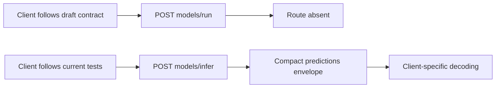
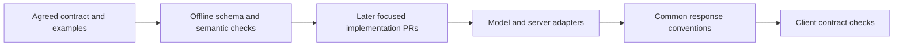

# V2 API shared contract plan

**Author:** Damian Kosowski, with an agent-prepared draft for review.

**Status:** Proposed plan. The recommendations and examples below are not agreed contracts. This draft PR contains the plan only; it does not implement the API, schema catalogue or fixture suite.

**Scope update:** PR 01 covers model and server contracts only. The new Workflows functionality is not yet included, as clarified by Damian. All V2 Workflows routes and their contracts, schemas, fixtures and direct-inference parity are offloaded to separate roadmap PRs 12 and 13 and are **on hold**. They do not block this plan or active model/server implementation. Resume that work only once the new functionality is included and the team explicitly agrees to resume.

**Related work:** [Gap report PR 3088](https://github.com/roboflow/inference/pull/3088), [roadmap PR 01][roadmap], [design PR 2277](https://github.com/roboflow/inference/pull/2277).

## 1. What problem are we solving?

Developers implementing the V2 roadmap need a shared contract before changing model/server routes, loaders and serializers. Today the draft design and the integration branch disagree on public paths, response defaults and layout. Some shared choices have never been specified precisely. Implementing each feature independently would force later PRs to revisit the same decisions and could give clients incompatible interpretations of V2.

For example, a client following the design posts to `/v2/models/run` and expects a rich response containing `outputs`. The current server executes at `/v2/models/infer`, defaults to compact and returns `predictions`. Both documents/code use `roboflow-inference-server-response-v1` for these different layouts. A client cannot safely use that identifier alone to choose its decoder. [Design][design-models], [dispatch][dispatch], [detection response][detection]

PR 01 should establish the shared conventions, valid examples and a small offline validation suite. Later PRs implement the agreed behavior in their assigned areas. Successful fixture validation will establish internal consistency of the contract, not conformance of the existing server.

### Evidence checked

The integration branch was fetched while preparing this plan and still points to `3d45b8712cc428eb01b714f3609346be7c92acc4`. Design PR 2277 still points to `de634b98bac204c96caa98a15dd7559dded361d5`. This plan rechecks the model/server routers, dispatch, authentication middleware, error helper, detection response serializer and SDK version selection against that public revision.

The [report][report] and [review follow-up][followup] retain their evidence snapshot at report-branch commit `6dcada6ace296522d4be9451f8764b81eb5c8411`. The [roadmap][roadmap] is pinned to the Workflows hold update at `fc08dddf0b05942bc86f578fbfdcceef46e6d2d7`. Discussion guidance remains the snapshot recorded in the follow-up: loading controls, score/decision separation, rich/compact distinction and V1 safeguard parity have support; naming, defaults, optional metadata and several policies remain open. This plan does not claim newer team agreement.

The earlier private-runtime audit is contextual evidence only. No new private backend or deployed-client audit was performed for this shared-contract plan. The local SDK exposes V0/V1 selection, while server tests call experimental V2 paths. That search does not establish that external or private clients have no V2 dependencies. [SDK][sdk], [server integration tests][integration-tests]

## 2. How will the behaviour change?

### Recommended solution

Maintain one versioned model/server V2 contract alongside the integration branch, separating intended capability from implemented capability. Future reuse by Workflows is a design consideration, not a requirement to settle workflow semantics now. Agree the decisions in section 3 before authoring the normative schemas and examples. Review those artifacts in this same draft PR before considering PR 01 complete.

Recommend `design/00_inference_api_v2/` as the contract home, preserving PR 2277's established document layout and authorship/provenance. Reconcile its preface, model/server API structure and model proposal into the integration branch deliberately; mark the Workflows surface as on hold and leave its normative contract to PRs 12 and 13. Do not import `03-workflows.md` as an active contract, merge unrelated history or maintain two competing specifications. Keep this plan under `plans/v2-api/`. Documentation should link to the contract rather than duplicate it.

### Before

A model client must reconcile the draft route and response with a different implementation and hand-written handler descriptions.



For a one-image detection request with no results, the current serializer's structure is represented by this illustrative example:

```json
{
  "type": "roboflow-inference-server-response-v1",
  "model_info": {"model_id": "example/1", "task": "object-detection"},
  "usage": {},
  "predictions": [
    {
      "type": "roboflow-object-detection-compact-v1",
      "class_names": ["cat"],
      "xyxy": [],
      "class_id": [],
      "confidence": []
    }
  ]
}
```

This is a source-derived example, not a newly captured model response. [Detection serializer][detection], [typed serializers][typed]

### After

PR 01 itself leaves runtime behavior unchanged. Once the later implementation PRs adopt the approved contract, clients can construct and decode requests using the agreed model/server conventions.



Recommended target example for the same one-image request, subject to D2–D4 below:

```http
POST /v2/models/run?model_id=example%2F1&response_style=rich&response_format=json
Authorization: Bearer <api_key>
Content-Type: application/json
```

```json
{
  "inputs": {
    "image": {"type": "url", "value": "https://example.com/image.jpg"}
  }
}
```

```json
{
  "type": "roboflow-inference-server-response-v2",
  "inference_id": "opaque-execution-id",
  "outputs": [
    {
      "name": "predictions",
      "value": [
        {
          "type": "roboflow-object-detection-rich-v1",
          "detections": []
        }
      ]
    }
  ]
}
```

The explicit `name`/`value` fields, envelope version and top-level `inference_id` are proposed clarifications/changes to the draft, whose example uses dynamic output keys and output-level IDs. They need approval; they are not presented as existing design requirements. An empty detection result remains a typed empty result. Workflow skipped-output/null semantics are reserved for the held workflow plan; this example does not settle them.

### Shared scope

| Area | Proposed PR 01 deliverable | Later implementation |
|---|---|---|
| Surface and access | Model/server method/path/access inventory, migration policy, public-probe exceptions | Roadmap 02, 05, 14 |
| Requests | Model controls, defaults, repetition and precedence rules; input format skeletons | 02–05, 11 |
| Responses | Model execution envelope, output names/cardinality, optional metadata, IDs, model/server errors | Active model/server PRs from 05 onward |
| Discovery | Model document structure, actions, representation references, filters and supported-capability rules | 10 |
| Compatibility | Type/schema evolution rules and experimental-client migration requirements | Every affected PR |
| Evidence | Valid/invalid fixtures, reference checks and shared semantic assertions | Extended with each feature |

Include the ten active model/server routes in the contract inventory: six model routes and four server routes. D2 resolves their disputed semantics and migration. The six proposed Workflows routes are tracked separately below as on hold and are excluded from PR 01 decisions and acceptance:

| Group | Method and path |
|---|---|
| Models | `POST /v2/models/run`; `GET /v2/models/interface`; `GET /v2/models/compatibility`; `GET /v2/models/loaded`; `POST /v2/models/load`; `DELETE /v2/models/unload` |
| Server | `GET /v2/server/health`; `GET /v2/server/ready`; `GET /v2/server/info`; `GET /v2/server/metrics` |

**Workflows routes on hold in separate PRs:** PR 12 owns `POST /v2/workflows/interface`, `POST /v2/workflows/validate`, `GET /v2/workflows/system/blocks`, `GET /v2/workflows/system/definition-schema` and `GET /v2/workflows/system/engine-versions`. PR 13 owns `POST /v2/workflows/run` and direct/workflow parity. Their route details, access rules and representations must be revisited against the new functionality after resumption.

The execution envelope in this plan applies to successful model runs, not automatically to lifecycle responses, discovery, probes or Prometheus text. Those operations have endpoint-specific success schemas and the shared JSON error convention where an HTTP response can still be sent. This is a proposed clarification to the design's broad “all responses” wording.

### Implementation boundaries

PR 01 will contain model/server specification, schemas, examples and their offline checks after agreement. It will not change routers, authentication, gateways, model loading, serializers or workflow execution. It will not generate a static schema for every model or claim that the draft contract is already available at runtime.

Classification field names/threshold algorithms, exact loader options/cache identity, architecture compatibility contents, mask encoding and tensor shapes, OCR layout, and binary encoding details stay in their later model plans. All workflow contract work, including identifiers, discovery/validation, batching, null positions, execution IDs, usage and readiness, is on hold for PRs 12 and 13. PR 01 reserves extension points for later model details without using permissive placeholder schemas as evidence of full conformance; it does not define the held workflow contracts.

## 3. Uncertainties and decisions needing input

All decisions below are **Open**. Each blocks finalizing the affected shared contract and its normative fixtures; none prevents reviewing this plan. Record the agreed answer and discussion reference beside each decision before implementing it. Start with D1–D3 because they determine where and in what shape the remaining artifacts are written.

### D1 Contract home and schema dialect

**Question:** Where is the authoritative contract, and which schema dialect will its fixtures and consumers use?

**Investigation:** The four design documents exist on PR 2277 but not on the integration branch. The discovery proposal mixes “OpenAPI/JSON-Schema” descriptions and `#/definitions/...` references without selecting a dialect. [Design structure][design-structure], [interface proposal][design-models]

**Recommendation:** Reconcile the model/server proposal under `design/00_inference_api_v2/` in this PR after agreement. Use explicitly declared JSON Schema Draft 7 for representation fragments and fixture validation, retaining `definitions` reference spelling; keep the custom discovery document distinct from FastAPI's OpenAPI output. Give each standalone schema a stable ID and resolve references locally in validation. Pin a compatible validator in the relevant test tooling after inspecting existing dependency conventions, without introducing a new runtime dependency or package.

**Input needed:** Confirm the home and dialect, and whether existing client/schema tooling imposes another dialect. A demonstrated requirement for another dialect should change this recommendation before fixtures are authored. Coordinate with the author of PR 2277 on how the old draft points to the reconciled contract; this plan does not close or edit that PR.

### D2 Canonical routes and migration

**Question:** Adopt the proposed routes, and what compatibility obligation exists for experimental V2 clients?

**Investigation:** Current routes are `/infer`, `GET /models`, `POST /models/unload` and `DELETE /models`; the latter lists every manager entry and returns a partial-result body on failures. The follow-up tentatively supports DELETE, while loaded-model naming/filtering remains open. The SDK search is not a deployed consumer inventory. [Routes][routes], [follow-up][followup], [SDK][sdk]

**Recommendation:** Adopt `/run`, `/loaded` and `DELETE /unload`, with a supplied `model_id` unloading one model and omission unloading all. Define `/loaded` as actually loaded entries, not compatible architectures or a hidden all-state listing. Reserve richer state listing/filtering for the lifecycle plan rather than making `state=loading` contradict this path. PR 02 must settle cancellation/partial-failure details and whether inventory is needed during loading.

Preserve existing experimental paths and their current response contract through an explicitly announced migration release, implemented as compatibility adapters where necessary; simply aliasing an old path to a breaking new response is insufficient. Keep V1 unchanged. Remove experimental compatibility only after affected consumers have been identified and migrated; do not invent a sunset date here. Existing same-path routes such as `/interface` need an explicit transition too: retain current behavior until consumer migration is coordinated, then announce the response/version change. Do not silently add a second permanent API or a new version-negotiation mechanism.

**Input needed:** Confirm the canonical routes and loaded-only meaning; identify known internal/external V2 consumers, release constraints and the acceptable same-path transition. If maintainers establish that there are no compatibility commitments, a coordinated experimental breaking release is simpler than adapters. Until then, preserving current consumers is the recommended assumption.

### D3 Execution envelope and batch identity

**Question:** How are output names, batch dimensions and inference IDs represented consistently?

**Investigation:** The model proposal leaves output names and batch structure underspecified. Current handlers emit `predictions` and family serializers can also emit their own `batch` arrays. The original workflow prose is background only; its batching and skipped-position rules are not adopted into this active model contract. [Model design][design-models], [typed serializers][typed]

**Recommendation:** Use the target example above: ordered `outputs` entries with explicit unique `name` and `value`, with names declared by interface discovery. Default direct-model output is `predictions` when the action has a single prediction output; other names are declared, not guessed. Batched outputs always hold a list aligned with input batch positions, including a singleton list for one item. Non-batched outputs use their declared scalar/object schema; discovery explicitly states the distinction, so an embedding vector is not mistaken for a request batch. Do not add a second family-level batch wrapper for an already batched output. Preserve typed empty model results. Any model-specific nullable result must be declared by its schema; workflow skipped-position behavior remains on hold.

Use one opaque top-level `inference_id` per successful top-level model execution. It identifies the execution, not each object, output, model invocation or retry; it provides no idempotency guarantee. Workflow execution/step IDs and the definition of direct/workflow equivalence belong to held PR 13; this decision does not settle them. Output filtering preserves declaration order, not filter parameter order.

**Input needed:** Confirm explicit output entries and top-level execution identity, or identify an existing tracing/usage requirement that needs the draft's per-output IDs. Confirm model batch cardinality rules; all workflow batching and identity questions remain on hold in roadmap PR 13. This decision deliberately changes the draft example and needs explicit agreement.

### D4 Controls and effective metadata

**Question:** What belongs to the HTTP contract, and how are defaults and conflicting inputs handled?

**Investigation:** Dispatch defaults to compact, recognizes a `style` alias, reduces extra query parameters to single values, and forwards some proposed HTTP controls to model invocation. The draft defaults to rich/JSON. The team supports rich/compact distinction and threshold visibility but has not settled all details. [Dispatch][dispatch], [follow-up][followup]

**Recommendation:** Canonical endpoints default to `response_style=rich` and `response_format=json`. Keep identity (`model_id` and optional package ID), `action`, style/format and `requested_output` in query controls, with Bearer authentication only in headers. Loading-specific controls are reserved now but fully specified in PR 02. Model inputs belong in the selected transport's input mapping; conflicting duplicate input locations and repeated singleton controls return a client error rather than silently overriding. Repeated `requested_output` values form a deduplicated selection of declared outputs; unknown names are errors. Absent selection means all outputs. Deprecated `style` remains only on the compatibility surface.

Reserve an optional `effective_parameters` map on each output entry so later model families can report their actual applied values in either style. Omit unavailable optional metadata; never fabricate values. Use `null` only where the schema gives it a semantic meaning. Family PRs define which effective settings are mandatory; requested settings are not evidence that they were applied. Omit unavailable usage rather than representing unknown usage as zero. Usage implementation stays in its existing workstream.

**Input needed:** Confirm defaults, conflict handling, metadata placement and the usage integration boundary. Parameter-level exceptions for actual multi-valued model inputs must be declared in discovery; this rule does not ban image batches or list-valued model parameters.

### D5 Access and error conventions

**Question:** Which endpoints are public or gated, and what error contract applies before and after routing?

**Investigation:** Health/readiness bypass authentication; management plus info/metrics are disabled by default. Middleware returns plain text for several errors, whereas route errors use `error_code` and `description`. Loaded interface discovery returns gateway metadata without the per-model check used by fallback. These are source findings, not evidence of a tested cross-workspace leak. [Middleware][app], [error helper][errors], [interface route][routes]

**Recommendation:** Retain public health/readiness as explicitly documented exceptions with minimal, non-sensitive responses. Retain default-disabled lifecycle/info/metrics operations, including their canonical and compatibility paths. Authenticated discovery remains available without enabling the control plane, but model-specific discovery must apply the same model-access policy before and after loading. Model loading still occurs automatically on inference until the separately planned management/prediction separation changes that behavior; disabling control-plane routes does not disable automatic loading.

Use the existing structured error shape (`error_code`, `description`, optional `actionable_follow_up`/`help_url`) throughout the active model/server V2 surface, including middleware, missing routes, method errors and parameter validation. Recommend 400 for malformed/invalid input, 401 for absent/invalid credentials, 403 for an authenticated denial or disabled operation, 404 for a non-disclosing missing/inaccessible resource, 405 for unsupported method, 413 for size limits, 415 for unsupported request media type, 501 for a known but unimplemented capability, 503 for transient unavailability and 504 for execution timeout. Preserve appropriate `Allow`, authentication-challenge and `Retry-After` headers. Keep internal details in logs; an error response does not imply execution succeeded. Transport disconnects may prevent any response.

These recommendations require reconciling today's mixed 401/403 behavior and middleware ordering. The disabled-route gate can retain 403 before authentication, provided the policy is documented consistently. Do not place errors inside successful `outputs` or advertise unsupported multipart as silently fulfilled JSON.

**Input needed:** Confirm access exceptions, per-model metadata authorization, non-disclosure policy and error mapping. Confirm whether operators rely on existing plain-text probe/error details. Separate ports, independent credentials and manual-loading-only mode remain outside PR 01.

### D6 Discovery and evolution

**Question:** How does discovery describe actions/representations honestly, and how are breaking wire changes identified?

**Investigation:** The proposal defines common controls, transports, input/output mappings and references but leaves catalogue versioning open. Current loaded/unloaded action descriptions differ. Both old and proposed execution layouts claim the same envelope type. [Interface proposal][design-models], [routes][routes], [detection response][detection]

**Recommendation:** Define common controls, request format definitions and a shared `definitions` catalogue at document level; put concrete `model_inputs` and `model_outputs` under each named action, with one declared default action. This explicit action structure extends the draft's per-model sketch to support the existing multi-action surface. Workflow discovery descriptors (`workflow_inputs`/`workflow_outputs`) remain on hold for PR 12; future reuse must be assessed against the new functionality. A descriptor selects representations by transport/style/format and declares output batch cardinality. Filters trim supported representations and referenced definitions without changing meaning; unknown filters are errors and valid combinations with no supported representation return an explicit unsupported-combination error.

Advertise only verified model actions and available representations; label unavailable capabilities or fail discovery explicitly rather than inferring every task-level action is supported. Distinguish contract target capabilities from the runtime capability set. The full catalogue and loaded/unloaded resolution algorithm belong to PR 10.

Use a new envelope identifier (`roboflow-inference-server-response-v2`) for the breaking layout in this recommendation. Preserve existing type IDs for unchanged family payloads; increment their major suffix when fields or semantics change incompatibly. Allow additive optional fields within a major version and require tolerant response readers; request-control validation remains strict. Type suffixes identify representations, not the `/v2` API path. Do not promise indefinite servicing of all previous type versions; support/removal follows D2's explicit migration policy. Same-path discovery changes need the coordinated transition described there.

**Input needed:** Confirm the action structure, new envelope identifier and additive/breaking rules. Confirm whether consumers already rely on a particular type/version selection mechanism before adding any such mechanism. Family naming choices, including classification singular/plural and predicted/detected, remain open for their dedicated plans.

## 4. Planned artifacts and validation

After the decisions are recorded, author the following artifacts in this PR. These paths are proposed deliverables, not files already present:

| Artifact | Purpose |
|---|---|
| `design/00_inference_api_v2/README.md` and reconciled model/server proposal sections | Canonical entry point, agreed model/server rules, provenance, endpoint ownership, deferred family details and a Workflows hold notice |
| `design/00_inference_api_v2/schemas/` | Declared-dialect schemas for model request controls, model execution envelopes, model/server errors and model discovery structure |
| `design/00_inference_api_v2/examples/` | Paired valid/invalid examples with explicit expected outcomes and owning schema |
| `design/00_inference_api_v2/decisions.md` | D1–D6 answers, discussion references, migration obligations and later-PR boundaries |
| `inference_server/tests/contract/` | Offline schema/reference checks and semantic assertions for the shared contract, without importing model weights or starting MMP |

The fixture suite should cover all three input format skeletons, rich/compact response selection, singleton and multi-item model batches, typed empty model output, multiple named outputs, repeated output selection, optional metadata, common errors and discovery filters. Validate JSON inside multipart `inputs` with quoted `$part.<name>` references. Correct mask-example array lengths, but do not claim that a placeholder RLE object establishes the final mask contract.

Schema validation alone is insufficient. Add focused semantic checks for unique output names, batch-position preservation, reference closure, filter behavior and parameter conflicts. Include negative fixtures that demonstrate these checks fail for the intended reason. Validate schemas and resolve references offline; no remote schema retrieval. Maintain a route/access inventory covering the ten active model/server endpoints and their explicit compatibility surface without asserting those routes exist at runtime yet. The six held Workflows routes require no normative schemas, fixtures or acceptance checks in PR 01.

Record the actual validation command when the tooling is implemented. Later feature PRs add live HTTP conformance tests against the same approved examples, plus real-model/backend evidence appropriate to their scope. Existing implementation tests and the earlier audit's passing checks are not substitutes for these new contract checks.

## 5. Sequencing and acceptance

1. Review this plan and resolve D1–D3, then D4–D6. Capture the contributor-owned recommendations and maintainer agreement using the [repository plan process](../../.github/implementation-plan-template.md), including the required discussion in `#discuss-inference-release` before substantial implementation. This draft does not send that message.
2. Reconcile the canonical documents and record agreed decisions. Check them against the roadmap so no later family decision is accidentally marked settled.
3. Add the shared schemas, valid/invalid examples and offline checks. Review the examples as client contracts, not merely as test input.
4. Verify reference integrity, fixture validity and semantic assertions; document consumer compatibility and unresolved later-PR boundaries. Keep this PR draft until that review is complete.
5. Mark PR 01 complete only when the model/server decisions and artifacts are accepted; no workflow decision or parity test is a completion gate. Then prepare the PR 02 loading/lifecycle plan. Runtime API implementation remains in the later roadmap PRs.

For this initial plan submission, verification is limited to source/reference inspection, Markdown whitespace/link checks and parsing the illustrative JSON. No product code or runtime test was changed or executed. The plan is ready for decision review; the shared-contract deliverable itself is still pending.

[roadmap]: https://github.com/roboflow/inference/blob/fc08dddf0b05942bc86f578fbfdcceef46e6d2d7/reports/v2-api-gap-2026-09-30/ROADMAP.md
[report]: https://github.com/roboflow/inference/blob/6dcada6ace296522d4be9451f8764b81eb5c8411/reports/v2-api-gap-2026-09-30/REPORT.md
[followup]: https://github.com/roboflow/inference/blob/6dcada6ace296522d4be9451f8764b81eb5c8411/reports/v2-api-gap-2026-09-30/REVIEW_COMMENT_FOLLOWUP.md
[design-structure]: https://github.com/roboflow/inference/blob/de634b98bac204c96caa98a15dd7559dded361d5/design/00_inference_api_v2/01-general-api-structure.md
[design-models]: https://github.com/roboflow/inference/blob/de634b98bac204c96caa98a15dd7559dded361d5/design/00_inference_api_v2/02-models-endpoints.md
[routes]: https://github.com/roboflow/inference/blob/3d45b8712cc428eb01b714f3609346be7c92acc4/inference_server/inference_server/routers/v2_models.py
[dispatch]: https://github.com/roboflow/inference/blob/3d45b8712cc428eb01b714f3609346be7c92acc4/inference_server/inference_server/framework/dispatch.py
[app]: https://github.com/roboflow/inference/blob/3d45b8712cc428eb01b714f3609346be7c92acc4/inference_server/inference_server/app.py
[errors]: https://github.com/roboflow/inference/blob/3d45b8712cc428eb01b714f3609346be7c92acc4/inference_server/inference_server/errors.py
[detection]: https://github.com/roboflow/inference/blob/3d45b8712cc428eb01b714f3609346be7c92acc4/inference_server/inference_server/handlers/object_detection/output_serializer.py
[typed]: https://github.com/roboflow/inference/blob/3d45b8712cc428eb01b714f3609346be7c92acc4/inference_model_manager/inference_model_manager/serializers_typed.py
[sdk]: https://github.com/roboflow/inference/blob/3d45b8712cc428eb01b714f3609346be7c92acc4/inference_sdk/http/client.py
[integration-tests]: https://github.com/roboflow/inference/blob/3d45b8712cc428eb01b714f3609346be7c92acc4/inference_server/tests/integration_tests/test_dispatch_v2_infer.py
