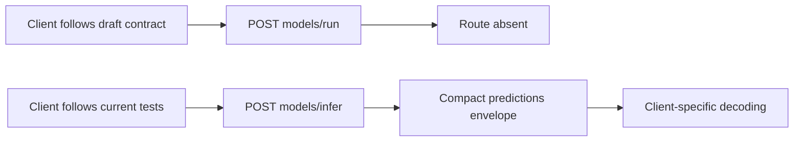
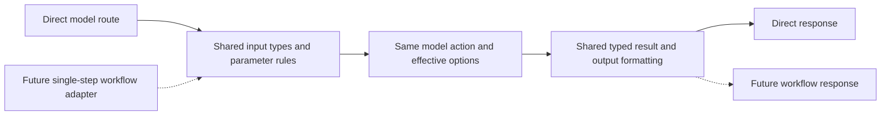
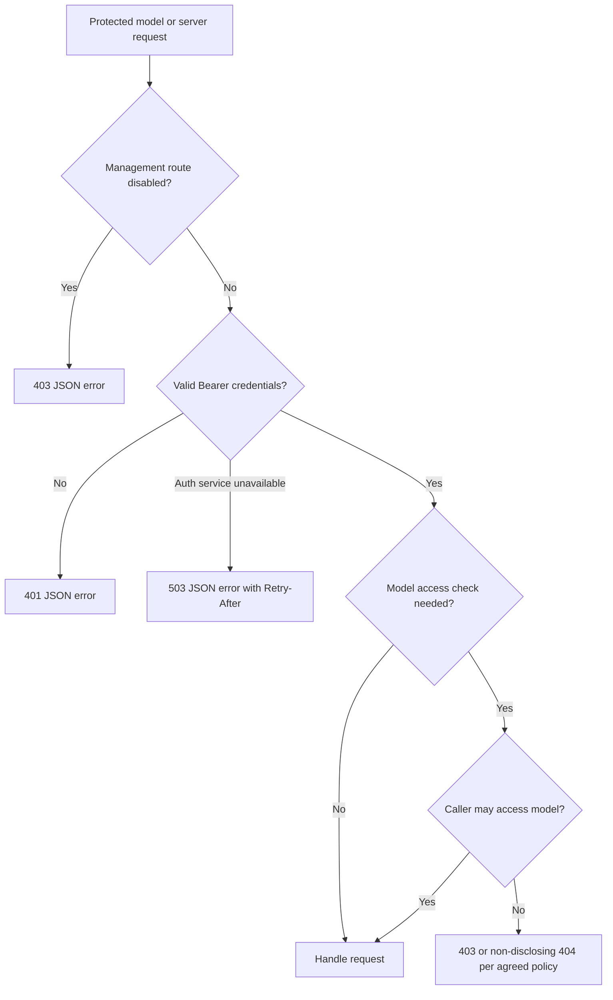

# V2 API shared contract plan

**Author:** Damian Kosowski, with an agent-prepared draft for review.

**Status:** Proposed plan. D2 records Damian's confirmed paths and permission to replace undeployed V2 behavior directly. D3 records the confirmed flat `outputs` list, a server-generated top-level `inference_id` per direct model inference batch, separate HTTP correlation through `X-Request-ID`, and optional client-provided per-image `source_id`. D2 and D3 are decided for this plan. D4 now records accepted defaults, conflict errors, effective-setting reporting and metadata omission, with output selection extracted to PR 15; remaining D4 request details and D1/D5/D6 remain open. This draft PR contains the plan only; it does not implement the API, schema catalogue or fixture suite.

**Scope update:** PR 01 covers model and server contracts only. The new Workflows functionality is not yet included, as clarified by Damian. V2 Workflows routes, their route-specific contracts/schemas, executable fixtures and live direct-inference parity checks are offloaded to separate roadmap PRs 12 and 13 and are **on hold**. The design's shared input/result requirement still constrains the model contract; D3 reviews that requirement using illustrative examples. They do not block this plan or active model/server implementation. Resume that work only once the new functionality is included and the team explicitly agrees to resume.

**Related work:** [Gap report PR 3088](https://github.com/roboflow/inference/pull/3088), [roadmap PR 01][roadmap], [design PR 2277](https://github.com/roboflow/inference/pull/2277).

## 1. What problem are we solving?

Developers implementing the V2 roadmap need a shared contract before changing model/server routes, loaders and serializers. Today the draft design and the integration branch disagree on public paths, response defaults and layout. Some shared choices have never been specified precisely. Implementing each feature independently would force later PRs to revisit the same decisions and could give clients incompatible interpretations of V2.

For example, a client following the design posts to `/v2/models/run` and expects a rich response containing `outputs`. The current server executes at `/v2/models/infer`, defaults to compact and returns `predictions`. Both documents/code use `roboflow-inference-server-response-v1` for these different layouts. A client cannot safely use that identifier alone to choose its decoder. [Design][design-models], [dispatch][dispatch], [detection response][detection]

PR 01 should establish the shared conventions, valid examples and a small offline validation suite. Later PRs implement the agreed behavior in their assigned areas. Successful fixture validation will establish internal consistency of the contract, not conformance of the existing server.

### Evidence checked

The integration branch was fetched while preparing this plan and still points to `3d45b8712cc428eb01b714f3609346be7c92acc4`. Design PR 2277 still points to `de634b98bac204c96caa98a15dd7559dded361d5`. This plan rechecks the model/server routers, dispatch, authentication middleware, error helper, detection response serializer and SDK version selection against that public revision. The D3 follow-up also checks the current PR 2277 preface/workflow proposal and the legacy workflow response entities, provider, execution wrapper and test expectations; it does not run a workflow.

The [report][report] and [review follow-up][followup] retain their evidence snapshot at report-branch commit `6dcada6ace296522d4be9451f8764b81eb5c8411`. The [roadmap][roadmap] is pinned to `a4be67c129e7137bd90bfa8e5219d3b5889c258f`, including the Workflows hold, plain-language planning guidance and updated D2 pre-deployment compatibility decision and the D3 flat-result-list decision and shared-result design constraint, plus the D4 decisions and separate output-selection follow-up PR 15. Discussion guidance remains the snapshot recorded in the follow-up: loading controls, score/decision separation, rich/compact distinction and V1 safeguard parity have support; naming, defaults, optional metadata and several policies remain open. This plan does not claim newer team agreement.

The earlier private-runtime audit is contextual evidence only. No new private backend or deployed-client audit was performed for this shared-contract plan. The local SDK exposes V0/V1 selection, while server tests call experimental V2 paths. That search alone did not establish deployment status; Damian has now confirmed that V2 is not deployed and its existing integration tests can be adjusted. [SDK][sdk], [server integration tests][integration-tests]

## 2. How will the behaviour change?

### Recommended solution

Maintain one versioned model/server V2 contract alongside the integration branch, separating intended capability from implemented capability. The model contract must respect the design's same-inputs/same-results requirement for an equivalent single-step workflow. Review that shared boundary now without implementing Workflows routes or settling detailed workflow semantics. Agree the decisions in section 3 before making schemas and examples part of the required contract. Review those artifacts in this same draft PR before considering PR 01 complete.

Recommend `design/00_inference_api_v2/` as the contract home, preserving PR 2277's established document layout and authorship/provenance. Reconcile its preface, model/server API structure and model proposal into the integration branch deliberately; mark the Workflows surface as on hold and leave its detailed contract to PRs 12 and 13. Do not import `03-workflows.md` as an active contract, merge unrelated history or maintain two competing specifications. Keep this plan under `plans/v2-api/`. Documentation should link to the contract rather than duplicate it.

### Before

A model client must reconcile the draft route and response with a different implementation and hand-written handler descriptions.



For a one-image detection request with no results, the current serializer's structure is represented by this illustrative example:

```json
{
  "type": "roboflow-inference-server-response-v1",
  "model_info": {"model_id": "example/1", "task": "object-detection"},
  "usage": {},
  "predictions": [
    {
      "type": "roboflow-object-detection-compact-v1",
      "class_names": ["cat"],
      "xyxy": [],
      "class_id": [],
      "confidence": []
    }
  ]
}
```

This is a source-derived example, not a newly captured model response. [Detection serializer][detection], [typed serializers][typed]

### After

PR 01 itself leaves runtime behavior unchanged. Once the later implementation PRs adopt the approved contract, clients can construct and decode requests using the agreed model/server conventions.


Recommended target example for the same one-image request, subject to D2–D4 below:

```http
POST /v2/models/run?model_id=example%2F1&response_style=rich&response_format=json
Authorization: Bearer <api_key>
Content-Type: application/json
```

```json
{
  "inputs": {
    "image": {"type": "url", "value": "https://example.com/image.jpg"}
  }
}
```

```json
{
  "type": "roboflow-inference-server-response-v1",
  "inference_id": "batch-123",
  "outputs": [
    {
      "type": "roboflow-object-detection-rich-v1",
      "detections": []
    }
  ]
}
```

This shows the flat result list chosen by Damian. There is no named-output wrapper or `batch` key. The [draft response example][design-models] wrapping results under `model_results`/`predictions` is incorrect and must be replaced when reconciling the design. The top-level `inference_id` identifies the model batch; `X-Request-ID` is returned separately in HTTP headers as described in D3. Workflow skipped-output/null semantics remain in the held workflow plan.

### Shared scope

| Area | Proposed PR 01 deliverable | Later implementation |
|---|---|---|
| Surface and access | Model/server method/path/access inventory, direct V2 replacement policy, public-probe exceptions | Roadmap 02, 05, 14 |
| Requests | Model controls, defaults, repetition and precedence rules; input format skeletons | 02–05, 11 |
| Responses | Model response body, flat result list and input/result alignment, optional metadata, IDs, model/server errors | Active model/server PRs from 05 onward |
| Discovery | Model document structure, actions, representation references, filters and supported-capability rules | 10 |
| Versioning | Rules for final type identifiers and future schema changes; no experimental V2 compatibility layer | Every affected PR |
| Evidence | Valid/invalid fixtures, reference checks and shared semantic assertions | Extended with each feature |

Include the ten active model/server routes in the contract inventory: six model routes and four server routes. D2 records the chosen paths and direct replacement policy; later plans settle endpoint-specific details. The six proposed Workflows routes are tracked separately below as on hold and are excluded from PR 01 decisions and acceptance:

| Group | Method and path |
|---|---|
| Models | `POST /v2/models/run`; `GET /v2/models/interface`; `GET /v2/models/compatibility`; `GET /v2/models/loaded`; `POST /v2/models/load`; `DELETE /v2/models/unload` |
| Server | `GET /v2/server/health`; `GET /v2/server/ready`; `GET /v2/server/info`; `GET /v2/server/metrics` |

**Workflows routes on hold in separate PRs:** PR 12 owns `POST /v2/workflows/interface`, `POST /v2/workflows/validate`, `GET /v2/workflows/system/blocks`, `GET /v2/workflows/system/definition-schema` and `GET /v2/workflows/system/engine-versions`. PR 13 owns `POST /v2/workflows/run` and direct/workflow parity. Their route details, access rules and representations must be revisited against the new functionality after resumption.

The execution envelope in this plan applies to successful model runs, not automatically to lifecycle responses, discovery, probes or Prometheus text. Those operations have endpoint-specific success schemas and the shared JSON error convention where an HTTP response can still be sent. This is a proposed clarification to the design's broad “all responses” wording.

### Implementation boundaries

PR 01 will contain model/server specification, schemas, examples and their offline checks after agreement. It will not change routers, authentication, gateways, model loading, serializers or workflow execution. It will not generate a static schema for every model or claim that the draft contract is already available at runtime.

Classification field names/threshold algorithms, exact loader options/cache identity, architecture compatibility contents, mask encoding and tensor shapes, OCR layout, and binary encoding details stay in their later model plans. Workflow-specific identifiers, discovery/validation, advanced batching, null positions, step IDs, usage and readiness remain on hold for PRs 12 and 13. D3 records the agreed shared input/result structure and the distinction between prediction data and execution metadata. PR 01 reserves extension points for later model details without using permissive placeholder schemas as evidence of full conformance; it does not define the held workflow contracts.

## 3. Decisions to make before writing the contract

**D2 is decided by Damian for this plan:** use the proposed paths and replace existing V2 behavior directly because V2 is not deployed. Update affected integration tests; no old-V2 compatibility or migration layer is required. Assess loading/error-state listing in PR 02 planning, with the option to defer it further. **D3 shape and ID scope are also decided by Damian:** a flat `outputs` list without named wrappers or a `batch` key, and one `inference_id` per batch for a specific model inference, shared by that batch's results. The linked draft response example is incorrect. The direct response carries a server-generated `inference_id` at the top level; HTTP correlation uses `X-Request-ID`. A client-provided per-image `source_id` is echoed when supplied and omitted when absent; the server does not generate it. D3 is **Decided** for PR 01, including the metadata/parity boundaries below. D4 has accepted decisions recorded below, while its remaining request details and D1/D5/D6 remain **Open**. Review those remaining questions without reopening the chosen shape or ID scope. Record each answer and its discussion reference before turning examples into required behavior.

### D1 Where should the contract live and how should we check it

**What we found:** The design lives on PR 2277, separate from the integration branch. It refers to both OpenAPI and JSON Schema without choosing a schema version. A schema is a machine-readable description of allowed fields and values. [Design structure][design-structure], [interface proposal][design-models]

**Recommendation:** Keep the model/server contract in `design/00_inference_api_v2/`. Bring across the relevant proposal text and preserve its authorship. Keep Workflows marked on hold. Use JSON Schema Draft 7 to check examples, preserving the proposal's `definitions` reference format. Treat the model interface description as a separate document from FastAPI's generated OpenAPI page.

For example, this small schema checks only the two response options:

```json
{
  "$schema": "http://json-schema.org/draft-07/schema#",
  "type": "object",
  "properties": {
    "response_style": {"enum": ["rich", "compact"]},
    "response_format": {"enum": ["json", "multipart"]}
  }
}
```

`{"response_style":"rich"}` passes; `{"response_style":"verbose"}` fails. This excerpt does not describe every request control, apply defaults, or claim that multipart is implemented. The complete schemas would have stable IDs and local references so checks can run without network access. Choose the test validator after checking existing dependency conventions; do not add a runtime dependency for this work.

**Decision needed:** Can we use this directory and Draft 7, or does an existing consumer require another schema version? Also agree with PR 2277's author how that draft will point to the reconciled contract. This plan does not close or edit that PR.

### D2 Which URLs should clients call

**Confirmed by Damian in this planning discussion:** V2 is not deployed, so breaking changes to its current endpoints are acceptable. Use the proposed paths and update integration tests that still expect the old V2 behavior. This supersedes the earlier temporary-adapter proposal; it does not change V1 compatibility requirements.

| Operation | Current V2 path to replace | Chosen path |
|---|---|---|
| Run a model | `POST /v2/models/infer` | `POST /v2/models/run` |
| List loaded models | `GET /v2/models` | `GET /v2/models/loaded` |
| Unload one | `POST /v2/models/unload?model_id=example%2F1` | `DELETE /v2/models/unload?model_id=example%2F1` |
| Unload all | `DELETE /v2/models` | `DELETE /v2/models/unload` |

`/loaded` describes loaded entries. Additional listing/filtering for loading or error states is a PR 02 planning question, not a required PR 02 deliverable; it may be postponed further. That does not defer correct load-operation errors, cancellation/partial-failure decisions or internal lifecycle handling.

**Implementation consequence:** Replace old V2 paths and response shapes as the relevant implementation PRs land. Do not add aliases, compatibility adapters, migration windows, deprecation/removal tasks or a new version header/query parameter to preserve the experimental behavior. Same-path endpoints such as `/v2/models/interface` can also change directly once their new contract is agreed.


For example, a test posting to `/v2/models/infer` and expecting `predictions` should be changed to the chosen route and the response shape agreed in D3. Investigate each failure: update an outdated expectation, fix a real regression, and retain meaningful validation/error coverage. Do not merely loosen assertions to make tests pass. No runtime code or tests change in this plan-only PR.

**Remaining decisions:** None about preserving old experimental V2 behavior. D3 settles the shared result and identity rules; D4–D6 still settle controls, metadata fields, access and versioning. Keep V1 behavior and existing non-V2 consumers of shared code covered by regression checks. Workflows remains on hold.

### D3 What should direct inference and an equivalent single-step workflow return

**Confirmed by Damian on 1 October 2026:** Use a flat list of results directly under `outputs`. The response example in [PR 2277's model document][design-models], with entries wrapped under `model_results` and `predictions`, is incorrect. This supersedes my `name`/`value` proposal and the later dictionary alternative. We found no current V2 model action returning separate prediction and embedding outputs that require those wrappers. [Embedding response][embedding-response], [separate embedding/segmentation actions][sam-actions]

**Design principle retained:** Direct inference and a single-step workflow wrapping the same model accept the same inputs and produce the same results. The preface identifies differences in fields, nesting and parent metadata as problems. Keep that requirement while correcting the example; do not treat the draft's named-output prose as authority to reintroduce the rejected model wrappers. Workflows implementation stays on hold. [Preface][design-preface], [workflow proposal][design-workflows]

**What the existing code tells us:** Current legacy workflow tests read `outputs[0]["predictions"]["predictions"][0]["class"]`, while the direct V2 path uses a typed detection response. The workflow provider repacks model results through legacy conversions before workflow serialization. Sharing the gateway therefore does not establish equal HTTP results today. These are source/test-code observations, not a new live parity test. The legacy response is evidence of the mismatch; it is not the future V2 response we must preserve. [Legacy workflow test][workflow-test], [workflow provider][workflow-provider], [workflow execution][workflow-execution], [direct response][detection]

#### Use the same runtime inputs

For the comparison, select the same model package/action and effective loading/inference options. The single-step workflow must simply forward the inputs and expose the model result unchanged, without resizing, filtering or adding other processing. This is a proposed equivalence case, not a complete workflow definition.

Both calls should accept the following runtime input body with the same meaning:

```json
{
  "inputs": {
    "image": [
      {"type": "url", "value": "https://example.com/first.jpg"},
      {"type": "url", "value": "https://example.com/second.jpg", "source_id": "camera-7/frame-1043"}
    ],
    "confidence": 0.5
  }
}
```

Direct inference selects the model in its URL; a predefined workflow selects the workflow and its definition selects the same model. An inline workflow additionally supplies its definition. Those routing/setup fields differ; the caller should not have to re-encode the images or rename `confidence` inside `inputs`. Input validation, default values, threshold meaning and rich/compact/transport choices must match. When a value is omitted, the workflow wrapper must not silently introduce a different default. Per-item model parameter overrides remain outside scope; `source_id` is correlation metadata, not an inference option.

#### Return a flat list of model results

**Confirmed by Damian:** `outputs` is the result list itself. It is not a list of named output slots, and it is not a dictionary keyed by `predictions` or `embeddings`. A result goes directly into the list, with no `name`/`value`, `model_results` or `predictions` wrapper and no `batch` key.

For the two-image example, the direct response should have this shape. An equivalent simple single-step workflow must preserve the same `outputs` result structure; its ID exposure is part of held PR 13:

```json
{
  "type": "roboflow-inference-server-response-v1",
  "inference_id": "batch-123",
  "outputs": [
    {
      "type": "roboflow-object-detection-rich-v1",
      "detections": [
        {
          "left_top": [1, 1],
          "right_bottom": [3, 5],
          "confidence": 0.9,
          "class_id": 0,
          "class_name": "cat"
        }
      ]
    },
    {
      "type": "roboflow-object-detection-rich-v1",
      "source_id": "camera-7/frame-1043",
      "detections": []
    }
  ]
}
```

This is a synthetic direct-response example, not an executed workflow response. `batch-123` stands for a server-generated ID. Additional metadata fields are omitted here; D4 owns their inclusion and placement. The illustrative envelope identifier is `response-v1`; D6 still owns the final type/version policy.

`outputs[0]` belongs to the first image and `outputs[1]` to the second. A one-image request returns one result in the list. An image with no detections keeps its empty typed result, so result positions do not shift. The client reads `response["outputs"][0]["detections"]` directly.

Flatten only the result containers. Do not concatenate detections from different images or flatten an embedding's vector/tensor dimensions. Different model actions can return different result types, but that does not mean one current action needs separate named prediction and embedding slots. Action-specific input/result alignment must still be described by discovery; do not mistake tensor dimensions for the request batch.

An equivalent single-step workflow must preserve this result structure under the unified-execution requirement. How general workflows expose multiple declared outputs, filters, short-circuits or skipped positions remains in the held workflow plan; those broader cases do not justify a named wrapper in the current model response. The workflow draft's output-keying prose must be reconciled with this clarification when workflow planning resumes, rather than overriding this decision.

#### Optional client image correlation

**Confirmed by Damian:** `source_id` is optional, client-provided image correlation metadata, independent of `X-Request-ID` and `inference_id`. Echo a supplied value unchanged on the corresponding image result, including an empty prediction result. When the client omits it, omit it from the result: do not generate a value or emit `null`. The two-image example above intentionally mixes an image without a source ID and one with a source ID whose result has no detections.

Batch order remains authoritative: `inputs.image[i]` maps to `outputs[i]`. Without a source ID, the client can identify the result by `inference_id` plus its batch index. A source ID does not select a stored image, prove equal image content, or deduplicate requests. Clients can carry their correlation value across retries or model calls. It is not the Roboflow dataset upload `sourceId` contract.

The same rule applies to URL/base64 image descriptors and multipart images. The multipart part reference locates bytes within a request; it is not automatically a source ID. For example, this proposed `inputs` part represents the same ordered batch as the JSON request above:

```json
{
  "image": [
    {"type": "multipart", "value": "$part.photo_a"},
    {
      "type": "multipart",
      "value": "$part.photo_b",
      "source_id": "camera-7/frame-1043"
    }
  ],
  "confidence": 0.5
}
```

Binary parts named `photo_a` and `photo_b` hold the two images. This descriptor spelling extends the original draft's bare `$part.<name>` references and remains an illustrative proposal for the input-format contract. Simple image parts or references without `source_id` remain without a public source ID; do not derive one from a filename, URL, multipart name or image hash. D4 must settle query-format mapping and source-ID validation limits when finalizing the request representations; the omission/echo rule is already decided.

Keep the metadata on each result regardless of rich/compact formatting, including the JSON envelope of a multipart response, without adding a result wrapper. Workflow lineage remains separate. Handling source IDs for derived crops, and exposing them through general workflows, stays in held PR 13.

#### Keep execution metadata separate from predictions

**Confirmed parity and metadata boundaries (Damian, 2026-10-01):**

| Concern | Agreed rule and owner |
|---|---|
| Prediction results | Equivalent direct and single-step workflow calls preserve input meaning, result structure, classes and input/result alignment. Deterministic fake-result tests compare exactly. Real-model tests may use explicitly justified model/backend numerical tolerances. |
| `inference_id` | Separate executed model batches receive distinct server-generated IDs. Their literal values are not part of result-equivalence comparisons. |
| `X-Request-ID` | Independent HTTP correlation; values may differ or be reused by the caller. |
| `source_id` | Echo supplied values exactly on corresponding image results; omit absent values. Correlation metadata does not excuse changing or dropping these values. |
| Timing | May differ between executions if exposed. Field names and measurement boundaries belong in the relevant implementation plan. |
| Model information, effective parameters and usage | D4 owns their inclusion and placement. Family plans define relevant parameter details; usage implementation remains separate. |
| Workflow lineage, batch-ID exposure and tracing | Remain in held PR 13 and do not block D3 for PR 01. |

For example, a real-model comparison may allow `confidence=0.9000001` versus `0.9000002` when an explicit backend/model tolerance justifies it. This is a test comparison rule, not response rounding or a change to the prediction contract. Do not use it to automatically accept missing detections or changed classes. Do not use a broad “ignore metadata” rule to hide an extra result wrapper, a changed source ID or workflow-only `parent_id` inside a prediction.

**Confirmed ID scope (Damian, 2026-10-01):** `inference_id` identifies a batch submitted for a specific model inference. All image results from that batch share the ID. It does not identify an individual image, detection, workflow step definition or entire multi-model workflow. A separate inference batch gets a separate ID, including when the same model is invoked again. Image positions and workflow image ancestry serve different purposes; do not generate a fresh inference ID merely when iterating over the batch's image results.

For example, consider detection followed by classification of the detected crops:

| Model inference | Results | Inference IDs |
|---|---|---|
| Detect objects in two images in one batch | Two image results | Both share `det-123` |
| Classify five crops in one batch | Five crop results | All share `cls-456` |
| Classify the crops through two separate inference batches | Results from each batch | Each batch has its own ID |

These labels illustrate identity relationships, not an ID format. A workflow step can submit multiple batches; its name is not an inference ID. The earlier proposal to use `inference_id` for a whole workflow execution is superseded. If an overall workflow execution ID is exposed, it must be a separate concept; its public contract remains in the held workflow work.

**Existing behavior is inconsistent:** direct V1 model requests copy `request.id` across their batch, while some tensor-native workflow blocks currently generate IDs per image after a batched model call. V2 must follow the agreed batch scope rather than preserve that inconsistency. V1 behavior remains unchanged. [Direct V1 assignment][v1-inference-id], [per-image workflow generation][workflow-inference-id]

**Held PR 13 follow-up:** change V2 workflow model execution to obtain one ID for each model inference batch and preserve it through result conversion and serialization. Add parity checks for direct and equivalent single-step inference, multiple models, repeated batches for one model, and empty image results. Align monitoring records, dataset uploads and custom metadata with the same IDs; changing only the HTTP response is insufficient. Include batching boundaries and retry behavior in PR 13 contract review before implementation. This work remains **on hold** with the new Workflows functionality and does not add workflow runtime changes to PR 01.

**Confirmed direct-response identity and HTTP correlation (Damian, 2026-10-01):** return one server-generated `inference_id` at the top level of the direct model response, alongside the flat `outputs` list. It identifies the batch represented by all those results; do not repeat it on each image result. Generate it independently of caller-supplied correlation data.

Use `X-Request-ID` for HTTP request correlation. Accept the caller's value when supplied, generate one when absent, return it in response headers, and include it in request logs. A caller may reuse it to correlate retry attempts, but it neither selects the `inference_id` nor deduplicates execution. A new submitted inference that executes receives a new `inference_id`. Define header validation limits and error-response coverage in the HTTP implementation plan.

For example, the client sends:

```http
POST /v2/models/run?model_id=example%2F1
Authorization: Bearer <api_key>
X-Request-ID: client-request-123
Content-Type: application/json
```

The server returns this header, alongside a JSON body containing its independently generated `inference_id`:

```http
HTTP/1.1 200 OK
Content-Type: application/json
X-Request-ID: client-request-123
```

A future workflow HTTP request likewise has one request correlation value, while each model inference batch has its own `inference_id`. How a multi-model workflow exposes those batch IDs remains in held PR 13; do not assign one model batch's ID to the entire workflow. Detailed multi-step tracing stays on hold. Neither identifier provides an idempotency guarantee.

#### Share processing without routing direct calls through Workflows

A suggested architecture is shared input normalization, model execution semantics and result serialization, with separate route/engine adapters. The principle does not require a direct request to start the workflow engine:



Dashed paths are future Workflows work. Model-side schemas and illustrative input/result examples can be reviewed now. In held PR 13, use the same fixtures to check live direct/workflow parity after the new functionality is available. Deterministic fake results can establish exact structure and decoding; real-model comparisons must account for documented numerical/stochastic behavior with explicit tolerances where needed. No workflow routes or executable parity suite are added in PR 01.

**D3 status: Decided for PR 01.** The flat result list, input/result alignment, direct-response ID placement and generation, per-model-batch scope, `X-Request-ID` correlation, optional client `source_id`, and the parity/metadata boundaries above are agreed. D4 owns additional metadata fields and placement, plus final request-representation details for source IDs; D6 owns representation versioning. Workflow propagation, lineage and detailed batching/retry rules belong to held PR 13. These follow-ups do not reopen the chosen result shape or identity semantics.

### D4 Where do parameters go and which value wins

**What we found:** The implementation defaults to compact, accepts a `style` alias, drops repeated values from some extra query parameters, and forwards some proposed HTTP controls to the model. The draft defaults to rich/JSON. The decisions below settle the defaults and effective-setting reporting rules; request details are identified separately. [Dispatch][dispatch], [follow-up][followup]

**Recommendation:** Put model identity, optional package ID, `action`, response options in the URL query. `requested_output` is extracted to follow-up PR 15 below. Put model inputs in the chosen input format. Use Bearer authentication in the header. The accepted defaults are `response_style=rich` and `response_format=json`. Use `response_style` as the chosen control; retaining the experimental `style` alias is not required. PR 02 specifies the reserved loading controls.

For example, do not silently choose between these conflicting confidence values:

```http
POST /v2/models/run?model_id=example%2F1&confidence=0.5
Authorization: Bearer <api_key>
Content-Type: application/json
```

```json
{
  "inputs": {
    "image": {"type": "url", "value": "https://example.com/image.jpg"},
    "confidence": 0.3
  }
}
```

Accepted conflict behavior: HTTP 400, illustrated with the existing general error code rather than a new code just for this example:

```json
{
  "error_code": "INVALID_PARAM",
  "description": "confidence was supplied with conflicting values in query and inputs"
}
```

**Confirmed D4 decisions (Damian, 2026-10-06):**

| Concern | Agreed behavior |
|---|---|
| Response defaults | Use `response_style=rich` and `response_format=json` when omitted. |
| Conflicting values | Return an error instead of silently choosing a value, whether conflicts occur across query/body or in repeated single-value controls. |
| Effective settings | Report the actual value used in the setting's standard response field, whether supplied by the client or resolved from a default. |
| Unavailable metadata and usage | Omit unavailable values. Do not invent them or report unknown usage as zero. Use `null` only when the field definition gives it an explicit meaning. Apply this to rich and compact responses; usage implementation remains separate. |
| Output selection | Extract `requested_output` to separate roadmap PR 15. Decide its contract and whether to introduce it during that PR's planning, including opportunities to avoid processing for unrequested output parts. |

For singleton controls, `?response_style=rich&response_style=compact` is a conflict and must fail. Rejecting even identical duplicates such as `?response_style=rich&response_style=rich` remains a recommendation to settle with request normalization. Declared list-valued model inputs and image batches are still allowed.

#### Effective settings use the same response fields

Defaulting must not change where a client reads the effective setting. For a model whose default confidence threshold is `0.5`:

| Request | Actual threshold used | Value in the standard effective-threshold response field |
|---|---|---|
| Threshold omitted | `0.5` | `0.5` |
| Threshold explicitly set to `0.5` | `0.5` | `0.5`, at exactly the same location |
| Threshold explicitly set to `0.3` | `0.3` | `0.3`, at exactly the same location |

The field describes the configured threshold, not an individual prediction's confidence score. Family plans establish the reported settings and their standard schema locations. Do not create a separate `defaults` section, move defaulted values to another nesting level, or add an output wrapper just because the client omitted a parameter. Report resolved values, not merely an echo of the request. If an optional metadata value is unavailable, follow the omission rule above rather than fabricate it.

#### Separate PR 15: output selection and avoiding work

The original draft lists repeatable `requested_output` without a sufficiently concrete model-side selection contract. A flat result list does not inherently prevent selection of optional result components, but it does not define that behavior either. PR 15 will identify a concrete use case and decide what can be selected, how omitted selections behave, and which dependencies must still be computed.

The value to investigate is avoiding output-specific work, not just deleting fields from an already completed response. For example, assess whether an unrequested mask representation can avoid construction/encoding while preserving requested results; do not assume this avoids shared model computation. Validate the processing reduction and measure representative benefit before deciding the final scope. The PR owns selection errors, discovery, and consistency across styles/transports, coordinated with affected family PRs. This is a separate follow-up, not a prerequisite for PR 01 or PR 05.

Until supported, explicitly reject the reserved `requested_output` control rather than forward it to the model or silently ignore it. Do not interpret it as selecting batch positions or invent named `predictions`/`embeddings` wrappers. Workflow output selection remains in the held workflow work.

**D4 status: Partly decided.** The defaults, conflict handling, effective-setting reporting, unavailable-metadata policy and PR 15 extraction above are accepted. Remaining request-contract details are parameter placement/normalization (including identical singleton duplicates), the exact multipart source-ID descriptor, query-format source-ID mapping and validation limits. Family plans own concrete effective-setting fields; usage remains an independent implementation workstream. Do not reopen the accepted reporting/omission rules when defining those fields.

### D5 Who can call each route and what should errors look like

**What we found:** Health/readiness are public; management and info/metrics are disabled by default. Middleware often returns plain text, while handlers return JSON errors. Loaded model-interface lookup skips the per-model check used by the unloaded path. This source finding is not a tested cross-workspace leak. [Middleware][app], [error helper][errors], [interface route][routes]

**Recommendation:** Keep health/readiness public with minimal, non-sensitive responses. Keep management and info/metrics disabled by default on the chosen paths. Require authentication for discovery, plus the same model-access check whether or not a model is loaded. Disabling management routes does not disable automatic loading during inference; changing that policy is separate work.

This sketch shows the proposed protected request path. Public probes bypass it:



Return the same error fields whether middleware, routing or a handler rejects the request. A Pydantic sketch makes the fields and optional values explicit:

```python
from pydantic import BaseModel, Field


class ApiError(BaseModel):
    """Describe an error returned by a V2 model or server route."""

    error_code: str = Field(
        description="Stable code that a client can handle.",
        examples=["INVALID_PARAM"],
    )
    description: str = Field(
        description="Safe explanation of what went wrong.",
        examples=["response_style must be rich or compact"],
    )
    actionable_follow_up: str | None = Field(
        default=None,
        description="Optional action the caller can take.",
    )
    help_url: str | None = Field(
        default=None,
        description="Optional documentation link.",
    )
```

This illustrates the existing JSON fields; it does not select Pydantic as the implementation or define how schemas are generated. In this proposal, serialization omits absent optional fields, for example with `model_dump(exclude_none=True)` if Pydantic is used. Do not put errors in successful `outputs` or return JSON success when requested multipart is unsupported.

| Situation | Proposed status |
|---|---|
| Malformed input or invalid parameter | 400 |
| Missing/invalid credentials | 401 |
| Authenticated denial or disabled operation | 403 |
| Missing resource, or hidden resource existence | 404 |
| Wrong method | 405, retaining `Allow` |
| Input too large | 413 |
| Unsupported request media type | 415 |
| Known capability not implemented | 501 |
| Temporary service failure | 503, with `Retry-After` where appropriate |
| Execution timeout | 504 |

Keep authentication-challenge headers where appropriate. Log internal failure details rather than returning them. A disconnected client may receive no response. This proposal changes today's mixed 401/403 and plain-text V2 behavior; D2 allows that change, with integration tests updated after the mapping is agreed.

**Decision needed:** Accept these public-probe exceptions, checks and error shape/statuses? Settle when access denial should hide a resource with 404 rather than return 403, and confirm the intended operator-facing probe/error details. Separate ports/credentials and manual-loading-only operation remain outside PR 01.

### D6 How does a client discover supported outputs and recognize a changed format

**What we found:** The design describes inputs, outputs and schema references, but does not settle versioning. Loaded and unloaded interface responses differ. The current and proposed execution bodies use the same type identifier for different structures. [Interface proposal][design-models], [routes][routes], [detection response][detection]

**Recommendation:** Describe common HTTP controls and formats once, then list each supported action's inputs and outputs. Declare one default action. Describe the result item for each action and how list positions relate to inputs. No output-slot name is needed for the chosen model response. A small Python sketch shows those responsibilities:

```python
from dataclasses import dataclass


@dataclass(frozen=True)
class ResultDescription:
    """Describe result alignment and supported item representations."""

    aligned_with_input_items: bool
    representation_ids: tuple[str, ...]


detection_result = ResultDescription(
    aligned_with_input_items=True,
    representation_ids=(
        "roboflow-object-detection-rich-v1",
        "roboflow-object-detection-compact-v1",
    ),
)
```

This is an illustrative interface, not a new runtime class or final discovery JSON. The full document would describe `model_inputs` and the flat-list result item under each action (the discovery field names remain to settle), refer to shared schema `definitions`, and map each representation to its request format, response style and response format. That action grouping extends the draft's per-model sketch and needs agreement.

A filter such as `response_style=rich` removes compact representations and unused definitions from the description; it must not change what a rich response means. Unknown filter values are errors. A valid combination with no supported representation returns an explicit unsupported-combination error. Advertise only verified actions and implemented formats, not everything supported by the broader task family. PR 10 implements the full catalogue and consistent loaded/unloaded lookup. Workflows discovery remains on hold.

For versioning, a client should not have to guess which body a type identifies:

| Example change | Recommendation |
|---|---|
| Add an optional field that old readers can ignore | Keep the representation's major version |
| Rename/remove a field or change its meaning | Increase that representation's major version |
| Replace top-level `predictions` with the flat `outputs` list before deployment | Choose the final type identifier in D6; no bump is required solely to preserve the undeployed layout |
| Leave detection item fields unchanged | Keep their existing detection type IDs |

The type suffix describes the data format; it is separate from the `/v2` URL. Response readers tolerate new optional fields, while request-control validation stays strict. D2 allows replacing experimental types directly before deployment. The `response-v1` identifier in the examples follows the draft; finalizing it remains a D6 decision, not a reason to preserve the incorrect response shape. Agree a final identifier before release; the additive/breaking rules above describe future changes after that contract is established. No new version-selection mechanism is needed.

**Decision needed:** Accept the action grouping, batch/representation descriptions and versioning examples? Confirm the final pre-release identifier and the rules for later changes. Classification field names and other family-specific changes remain for their own plans.

## 4. Planned artifacts and validation

After the decisions are recorded, author the following artifacts in this PR. These paths are proposed deliverables, not files already present:

| Artifact | Purpose |
|---|---|
| `design/00_inference_api_v2/README.md` and reconciled model/server proposal sections | Canonical entry point, agreed model/server rules, provenance, endpoint ownership, deferred family details and a Workflows hold notice |
| `design/00_inference_api_v2/schemas/` | Declared-dialect schemas for model request controls, model execution envelopes, model/server errors and model discovery structure |
| `design/00_inference_api_v2/examples/` | Paired valid/invalid examples with explicit expected outcomes and owning schema |
| `design/00_inference_api_v2/decisions.md` | D1–D6 answers, discussion references, the pre-deployment replacement decision and later-PR boundaries |
| `inference_server/tests/contract/` | Offline schema/reference checks and semantic assertions for the shared contract, without importing model weights or starting MMP |

The fixture suite should cover all three input format skeletons, rich/compact response selection, singleton and multi-item model batches, typed empty model results, mixed present/absent source IDs, preserved inner detection/tensor structure, explicit unsupported-control behavior, optional metadata, common errors and discovery filters. Validate JSON inside multipart `inputs` with quoted `$part.<name>` references. Correct mask-example array lengths, but do not claim that a placeholder RLE object establishes the final mask contract.

Schema validation alone is insufficient. Add focused semantic checks for a flat outer result list with no named wrappers or `batch` key, input/result-position preservation, checking that every schema reference resolves, filter behavior and parameter conflicts. Check rich/JSON defaults and that defaulted and explicitly supplied effective settings use the same response location; unavailable metadata/usage must be omitted, not replaced with zero or undefined `null` values. Check that the direct response has one top-level `inference_id` for all image results, including empty results; a distinct executed batch has a distinct ID. Cover supplied/generated `X-Request-ID`, response-header echo, and repeated correlation values with independent inference IDs in later HTTP checks. Check exact per-image source-ID echo and omission for JSON and multipart inputs, including empty results, without server generation or `null` placeholders. Verify monitoring, dataset upload and custom metadata preserve the same batch inference identity; do not substitute `source_id` for `inference_id`. Include negative fixtures that demonstrate these checks fail for the intended reason. Validate schemas and resolve references offline; no remote schema retrieval. Maintain a route/access inventory covering the ten active model/server endpoints. Do not add old-V2 compatibility routes or claim that the planned routes exist at runtime yet. The six held Workflows routes require no route schemas or executable acceptance tests in PR 01. D3 includes an illustrative equivalent-input/result case to check the model contract against the original design principle.

Record the actual validation command when the tooling is implemented. Later feature PRs add live HTTP conformance tests against the same approved examples, plus real-model/backend evidence appropriate to their scope. Existing implementation tests and the earlier audit's passing checks are not substitutes for these new contract checks.

## 5. Sequencing and acceptance

1. Review the recorded D2/D3 and accepted D4 decisions, then resolve D1, the remaining D4 request details, and D5/D6. Capture the contributor-owned recommendations and maintainer agreement using the [repository plan process](../../.github/implementation-plan-template.md), including the required discussion in `#discuss-inference-release` before substantial implementation. This draft does not send that message.
2. Reconcile the canonical documents and record agreed decisions. Check them against the roadmap so no later family decision is accidentally marked settled.
3. Add the shared schemas, valid/invalid examples and offline checks. Review the examples as client contracts, not merely as test input.
4. Verify reference integrity, fixture validity and semantic assertions; document the agreed V2 replacement behavior, V1 regression coverage and unresolved later-PR boundaries. Keep this PR draft until that review is complete.
5. Mark PR 01 complete only when the model/server decisions and artifacts are accepted, including D3's review against the shared input/result principle. Workflow-specific route decisions and live parity tests remain outside its completion gates. Then prepare the PR 02 loading/lifecycle plan. Runtime API implementation remains in the later roadmap PRs.

Verification for this plan covers source/reference inspection, Markdown whitespace/link checks, parsing the illustrative JSON and Python, and checking diagrams against the described behavior. The diagrams have not been rendered in this check. No product code or runtime test was changed or executed. The plan is ready for decision review; the shared-contract deliverable itself is still pending.

[roadmap]: https://github.com/roboflow/inference/blob/a4be67c129e7137bd90bfa8e5219d3b5889c258f/reports/v2-api-gap-2026-09-30/ROADMAP.md
[report]: https://github.com/roboflow/inference/blob/6dcada6ace296522d4be9451f8764b81eb5c8411/reports/v2-api-gap-2026-09-30/REPORT.md
[followup]: https://github.com/roboflow/inference/blob/6dcada6ace296522d4be9451f8764b81eb5c8411/reports/v2-api-gap-2026-09-30/REVIEW_COMMENT_FOLLOWUP.md
[design-structure]: https://github.com/roboflow/inference/blob/de634b98bac204c96caa98a15dd7559dded361d5/design/00_inference_api_v2/01-general-api-structure.md
[design-models]: https://github.com/roboflow/inference/blob/de634b98bac204c96caa98a15dd7559dded361d5/design/00_inference_api_v2/02-models-endpoints.md
[routes]: https://github.com/roboflow/inference/blob/3d45b8712cc428eb01b714f3609346be7c92acc4/inference_server/inference_server/routers/v2_models.py
[dispatch]: https://github.com/roboflow/inference/blob/3d45b8712cc428eb01b714f3609346be7c92acc4/inference_server/inference_server/framework/dispatch.py
[app]: https://github.com/roboflow/inference/blob/3d45b8712cc428eb01b714f3609346be7c92acc4/inference_server/inference_server/app.py
[errors]: https://github.com/roboflow/inference/blob/3d45b8712cc428eb01b714f3609346be7c92acc4/inference_server/inference_server/errors.py
[detection]: https://github.com/roboflow/inference/blob/3d45b8712cc428eb01b714f3609346be7c92acc4/inference_server/inference_server/handlers/object_detection/output_serializer.py
[typed]: https://github.com/roboflow/inference/blob/3d45b8712cc428eb01b714f3609346be7c92acc4/inference_model_manager/inference_model_manager/serializers_typed.py
[sdk]: https://github.com/roboflow/inference/blob/3d45b8712cc428eb01b714f3609346be7c92acc4/inference_sdk/http/client.py
[integration-tests]: https://github.com/roboflow/inference/blob/3d45b8712cc428eb01b714f3609346be7c92acc4/inference_server/tests/integration_tests/test_dispatch_v2_infer.py

[design-preface]: https://github.com/roboflow/inference/blob/de634b98bac204c96caa98a15dd7559dded361d5/design/00_inference_api_v2/00-preface.md
[design-workflows]: https://github.com/roboflow/inference/blob/de634b98bac204c96caa98a15dd7559dded361d5/design/00_inference_api_v2/03-workflows.md
[workflow-test]: https://github.com/roboflow/inference/blob/3d45b8712cc428eb01b714f3609346be7c92acc4/inference_server/tests/unit_tests/workflows/test_router.py#L61
[workflow-provider]: https://github.com/roboflow/inference/blob/3d45b8712cc428eb01b714f3609346be7c92acc4/inference_server/inference_server/workflows/models_provider.py#L620
[workflow-execution]: https://github.com/roboflow/inference/blob/3d45b8712cc428eb01b714f3609346be7c92acc4/inference_server/inference_server/workflows/execution.py#L62

[embedding-response]: https://github.com/roboflow/inference/blob/3d45b8712cc428eb01b714f3609346be7c92acc4/inference_server/inference_server/handlers/embeddings/output_serializer.py#L12
[sam-actions]: https://github.com/roboflow/inference/blob/3d45b8712cc428eb01b714f3609346be7c92acc4/inference_server/inference_server/handlers/interactive_instance_segmentation/description.py#L52
[v1-inference-id]: https://github.com/roboflow/inference/blob/3d45b8712cc428eb01b714f3609346be7c92acc4/inference/core/models/base.py#L198
[workflow-inference-id]: https://github.com/roboflow/inference/blob/3d45b8712cc428eb01b714f3609346be7c92acc4/workflows/roboflow_workflows/core_steps/models/roboflow/multi_class_classification/v2_tensor.py#L299
